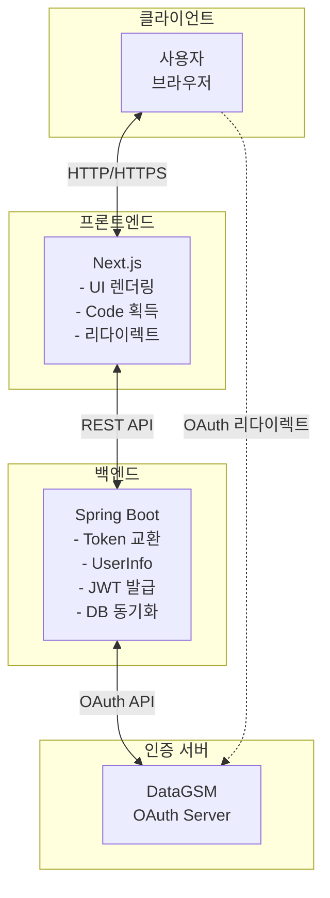
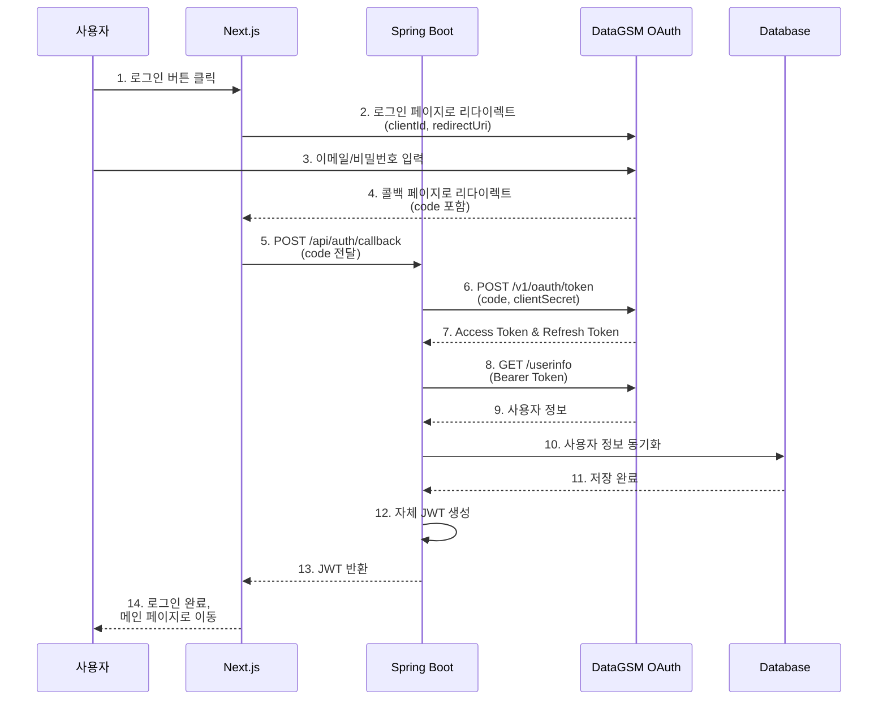
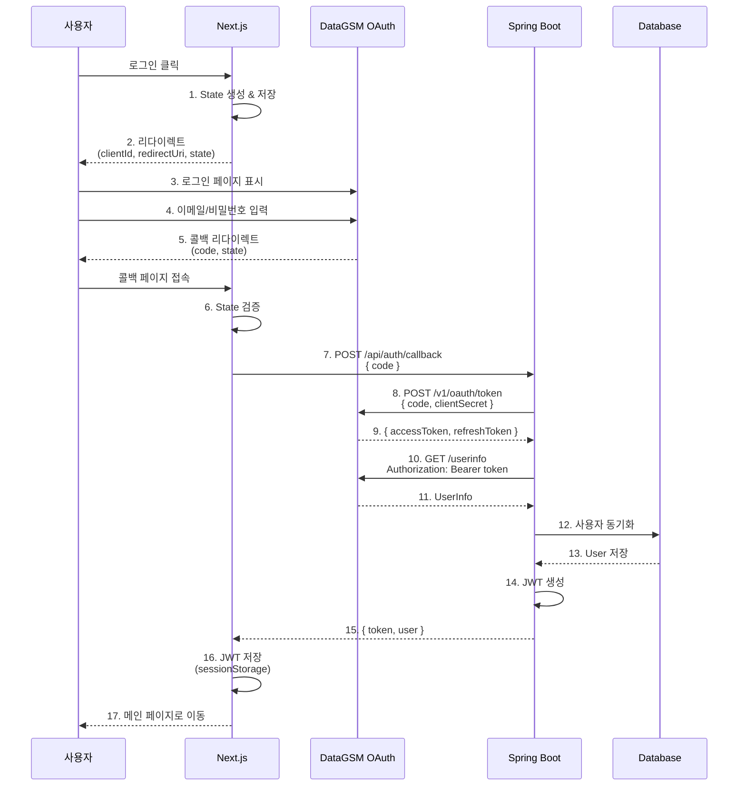
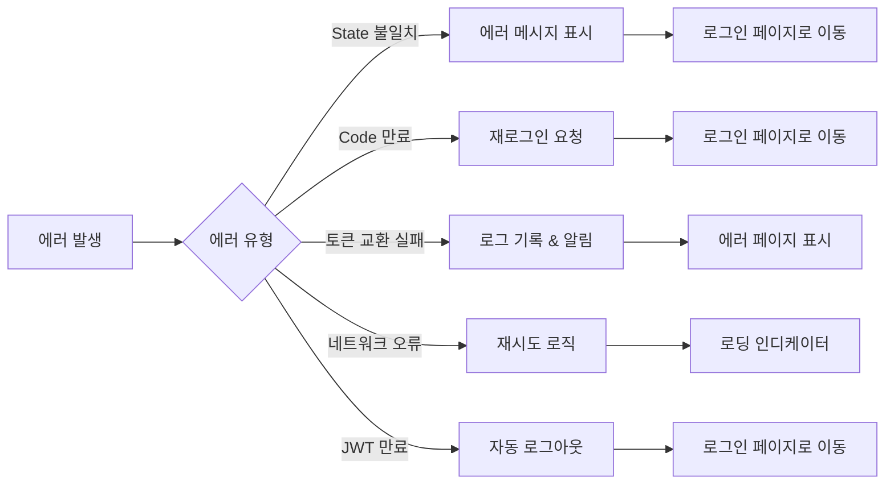

# Next.js + Spring Boot OAuth 구현

### 시나리오

프론트엔드(Next.js)에서 Authorization Code까지 획득하고, 서버(Spring Boot)에서 Token 교환 및 사용자 정보 조회 후 자체 JWT 발급하는 완전한 OAuth 구현 예제입니다.

이 방식은 Client Secret을 완전히 보호하면서 서버 측에서 사용자 인증을 완전히 제어할 수 있는 가장 안전한 구현 방식입니다.

## 아키텍처 개요

### 시스템 구성도



### 데이터 플로우

전체 인증 프로세스는 다음 순서로 진행됩니다.



### 책임 분리

각 레이어의 명확한 책임 분리로 보안과 유지보수성을 확보합니다.

#### 프론트엔드 (Next.js)

| 책임 | 설명 |
| --- | --- |
| **UI 렌더링** | 로그인 페이지, 로딩 상태, 에러 처리 UI |
| **리다이렉트 처리** | DataGSM 로그인 페이지로 이동 및 콜백 받기 |
| **Authorization Code 획득** | URL 파라미터에서 code 추출 |
| **백엔드 API 호출** | Code를 서버로 전달하고 JWT 받기 |
| **토큰 관리** | JWT를 sessionStorage에 저장 및 관리 |
| **인증 상태 관리** | 로그인 여부에 따른 UI 분기 처리 |

#### 백엔드 (Spring Boot)

| 책임 | 설명 |
| --- | --- |
| **Client Secret 보호** | 환경 변수로 안전하게 관리 |
| **토큰 교환** | Authorization Code → Access Token 변환 |
| **사용자 정보 조회** | DataGSM API에서 사용자 정보 획득 |
| **DB 동기화** | 사용자 정보를 자체 DB에 저장/업데이트 |
| **자체 JWT 발급** | 애플리케이션 인증용 JWT 생성 |
| **비즈니스 로직** | 사용자 권한 관리, 리소스 접근 제어 |

### 보안 고려사항

이 아키텍처에서 구현된 주요 보안 요소입니다.

| 보안 요소 | 구현 위치 | 설명 |
| --- | --- | --- |
| **Client Secret 보호** | Spring Boot | 서버 환경 변수로만 관리, 절대 프론트엔드 노출 금지 |
| **HTTPS 강제** | 전체 시스템 | 프로덕션에서 모든 통신은 HTTPS 사용 |
| **State 파라미터** | Next.js | CSRF 공격 방지를 위한 랜덤 토큰 생성 및 검증 |
| **토큰 분리** | 양쪽 | DataGSM Access Token은 서버만, 자체 JWT는 프론트엔드에서 관리 |
| **HttpOnly Cookie** | Spring Boot | Refresh Token을 XSS로부터 보호 |
| **JWT 검증** | Spring Boot | 모든 API 요청에서 JWT 서명 및 만료 검증 |

## Step 1: 프론트엔드 (Next.js)

### 로그인 페이지

사용자가 로그인 버튼을 클릭하면 DataGSM OAuth 서버로 리다이렉트합니다.

<CodeTabs>
  <CodeTab label="pages/login.tsx" language="typescript" code={`import { useRouter } from 'next/router';
import { useState } from 'react';

const LoginPage = () => {
  const router = useRouter();
  const [isLoading, setIsLoading] = useState(false);

  const handleLogin = () => {
    setIsLoading(true);

    // State 파라미터 생성 (CSRF 방지)
    const state = Math.random().toString(36).substring(2, 15);
    sessionStorage.setItem('oauth_state', state);

    // 환경 변수에서 설정 가져오기
    const clientId = process.env.NEXT_PUBLIC_DATAGSM_CLIENT_ID;
    const redirectUri = process.env.NEXT_PUBLIC_REDIRECT_URI;

    // DataGSM 로그인 페이지로 리다이렉트
    const authUrl = new URL('https://oauth.datagsm.com/login');
    authUrl.searchParams.append('client_id', clientId);
    authUrl.searchParams.append('redirect_uri', redirectUri);
    authUrl.searchParams.append('state', state);

    window.location.href = authUrl.toString();
  };

  return (
    <div className="min-h-screen flex items-center justify-center bg-gray-50">
      <div className="max-w-md w-full space-y-8 p-8 bg-white rounded-lg shadow-md">
        <div>
          <h2 className="mt-6 text-center text-3xl font-extrabold text-gray-900">
            로그인
          </h2>
          <p className="mt-2 text-center text-sm text-gray-600">
            DataGSM 계정으로 로그인하세요
          </p>
        </div>
        <div>
          <button
            onClick={handleLogin}
            disabled={isLoading}
            className="w-full flex justify-center py-3 px-4 border border-transparent
                     rounded-md shadow-sm text-sm font-medium text-white
                     bg-blue-600 hover:bg-blue-700 focus:outline-none
                     focus:ring-2 focus:ring-offset-2 focus:ring-blue-500
                     disabled:bg-gray-400 disabled:cursor-not-allowed"
          >
            {isLoading ? (
              <span className="flex items-center">
                <svg className="animate-spin -ml-1 mr-3 h-5 w-5 text-white"
                     xmlns="http://www.w3.org/2000/svg" fill="none"
                     viewBox="0 0 24 24">
                  <circle className="opacity-25" cx="12" cy="12" r="10"
                          stroke="currentColor" strokeWidth="4"></circle>
                  <path className="opacity-75" fill="currentColor"
                        d="M4 12a8 8 0 018-8V0C5.373 0 0 5.373 0 12h4zm2 5.291A7.962 7.962 0 014 12H0c0 3.042 1.135 5.824 3 7.938l3-2.647z">
                  </path>
                </svg>
                처리 중...
              </span>
            ) : (
              'DataGSM으로 로그인'
            )}
          </button>
        </div>
      </div>
    </div>
  );
};

export default LoginPage;`} />
</CodeTabs>

### OAuth 콜백 페이지

DataGSM 인증 후 리다이렉트되는 페이지에서 Authorization Code를 추출하고 백엔드로 전달합니다.

<CodeTabs>
  <CodeTab label="pages/callback.tsx" language="typescript" code={`import { useRouter } from 'next/router';
import { useEffect, useState } from 'react';

const CallbackPage = () => {
  const router = useRouter();
  const [error, setError] = useState<string | null>(null);

  useEffect(() => {
    const handleCallback = async () => {
      try {
        // URL에서 code와 state 추출
        const { code, state } = router.query;

        if (!code || typeof code !== 'string') {
          throw new Error('Authorization code가 없습니다.');
        }

        // State 검증 (CSRF 방지)
        const savedState = sessionStorage.getItem('oauth_state');
        if (state !== savedState) {
          throw new Error('State 파라미터가 일치하지 않습니다.');
        }

        // State 제거 (일회용)
        sessionStorage.removeItem('oauth_state');

        // 백엔드에 code 전달하여 JWT 받기
        const response = await fetch('/api/auth/callback', {
          method: 'POST',
          headers: {
            'Content-Type': 'application/json',
          },
          body: JSON.stringify({ code }),
        });

        if (!response.ok) {
          const errorData = await response.json();
          throw new Error(errorData.message || '로그인에 실패했습니다.');
        }

        const { token, user } = await response.json();

        // JWT를 sessionStorage에 저장
        sessionStorage.setItem('auth_token', token);
        sessionStorage.setItem('user', JSON.stringify(user));

        // 메인 페이지로 이동
        router.push('/');
      } catch (err) {
        console.error('OAuth callback error:', err);
        setError(err instanceof Error ? err.message : '알 수 없는 오류가 발생했습니다.');

        // 3초 후 로그인 페이지로 이동
        setTimeout(() => {
          router.push('/login');
        }, 3000);
      }
    };

    if (router.isReady) {
      handleCallback();
    }
  }, [router.isReady, router.query]);

  if (error) {
    return (
      <div className="min-h-screen flex items-center justify-center bg-gray-50">
        <div className="max-w-md w-full p-8 bg-white rounded-lg shadow-md">
          <div className="text-center">
            <div className="mx-auto flex items-center justify-center h-12 w-12 rounded-full bg-red-100">
              <svg className="h-6 w-6 text-red-600" fill="none" viewBox="0 0 24 24" stroke="currentColor">
                <path strokeLinecap="round" strokeLinejoin="round" strokeWidth="2" d="M6 18L18 6M6 6l12 12" />
              </svg>
            </div>
            <h3 className="mt-4 text-lg font-medium text-gray-900">로그인 실패</h3>
            <p className="mt-2 text-sm text-gray-500">{error}</p>
            <p className="mt-2 text-xs text-gray-400">잠시 후 로그인 페이지로 이동합니다...</p>
          </div>
        </div>
      </div>
    );
  }

  return (
    <div className="min-h-screen flex items-center justify-center bg-gray-50">
      <div className="max-w-md w-full p-8 bg-white rounded-lg shadow-md">
        <div className="text-center">
          <svg className="animate-spin mx-auto h-12 w-12 text-blue-600"
               xmlns="http://www.w3.org/2000/svg" fill="none" viewBox="0 0 24 24">
            <circle className="opacity-25" cx="12" cy="12" r="10"
                    stroke="currentColor" strokeWidth="4"></circle>
            <path className="opacity-75" fill="currentColor"
                  d="M4 12a8 8 0 018-8V0C5.373 0 0 5.373 0 12h4zm2 5.291A7.962 7.962 0 014 12H0c0 3.042 1.135 5.824 3 7.938l3-2.647z">
            </path>
          </svg>
          <h3 className="mt-4 text-lg font-medium text-gray-900">로그인 처리 중</h3>
          <p className="mt-2 text-sm text-gray-500">잠시만 기다려 주세요...</p>
        </div>
      </div>
    </div>
  );
};

export default CallbackPage;`} />
</CodeTabs>

### API 라우트 핸들러

Next.js API Routes를 사용하여 Spring Boot 백엔드와 통신합니다.

<CodeTabs>
  <CodeTab label="pages/api/auth/callback.ts" language="typescript" code={`import type { NextApiRequest, NextApiResponse } from 'next';

interface CallbackRequestBody {
  code: string;
}

interface BackendResponse {
  token: string;
  user: {
    id: number;
    email: string;
    name: string;
    grade: number;
    classNum: number;
    number: number;
  };
}

export default async function handler(
  req: NextApiRequest,
  res: NextApiResponse
) {
  if (req.method !== 'POST') {
    return res.status(405).json({ message: 'Method not allowed' });
  }

  try {
    const { code } = req.body as CallbackRequestBody;

    if (!code) {
      return res.status(400).json({ message: 'Authorization code is required' });
    }

    // Spring Boot 백엔드 API 호출
    const backendUrl = process.env.BACKEND_URL || 'http://localhost:8080';
    const response = await fetch(backendUrl + '/api/auth/oauth/callback', {
      method: 'POST',
      headers: {
        'Content-Type': 'application/json',
      },
      body: JSON.stringify({ code }),
    });

    if (!response.ok) {
      const errorData = await response.json();
      return res.status(response.status).json({
        message: errorData.message || '백엔드 인증 처리에 실패했습니다.',
      });
    }

    const data: BackendResponse = await response.json();

    return res.status(200).json(data);
  } catch (error) {
    console.error('OAuth callback error:', error);
    return res.status(500).json({
      message: '서버 오류가 발생했습니다.',
    });
  }
}`} />

  <CodeTab label="pages/api/auth/me.ts" language="typescript" code={`import type { NextApiRequest, NextApiResponse } from 'next';

export default async function handler(
  req: NextApiRequest,
  res: NextApiResponse
) {
  if (req.method !== 'GET') {
    return res.status(405).json({ message: 'Method not allowed' });
  }

  try {
    // Authorization 헤더에서 JWT 추출
    const authHeader = req.headers.authorization;
    if (!authHeader || !authHeader.startsWith('Bearer ')) {
      return res.status(401).json({ message: '인증 토큰이 없습니다.' });
    }

    const token = authHeader.substring(7);

    // Spring Boot 백엔드에 JWT로 사용자 정보 조회
    const backendUrl = process.env.BACKEND_URL || 'http://localhost:8080';
    const response = await fetch(backendUrl + '/api/auth/me', {
      method: 'GET',
      headers: {
        'Authorization': 'Bearer ' + token,
      },
    });

    if (!response.ok) {
      if (response.status === 401) {
        return res.status(401).json({ message: '인증이 만료되었습니다.' });
      }
      throw new Error('Failed to fetch user info');
    }

    const user = await response.json();
    return res.status(200).json(user);
  } catch (error) {
    console.error('Get user info error:', error);
    return res.status(500).json({
      message: '서버 오류가 발생했습니다.',
    });
  }
}`} />
</CodeTabs>

## Step 2: 백엔드 (Spring Boot - Java)

### 프로젝트 구조

```
src/main/java/com/example/app/
├── config/
│   ├── SecurityConfig.java         # Spring Security 설정
│   └── JwtConfig.java              # JWT 설정
├── controller/
│   └── AuthController.java         # OAuth 인증 컨트롤러
├── service/
│   ├── OAuthService.java           # OAuth 비즈니스 로직
│   ├── UserService.java            # 사용자 관리 서비스
│   └── JwtService.java             # JWT 발급/검증 서비스
├── dto/
│   ├── OAuthCallbackRequest.java   # 콜백 요청 DTO
│   ├── TokenResponse.java          # 토큰 응답 DTO
│   └── UserInfoResponse.java       # 사용자 정보 DTO
├── entity/
│   └── User.java                   # 사용자 엔티티
└── repository/
    └── UserRepository.java         # 사용자 레포지토리
```

### AuthController

OAuth 인증 플로우를 처리하는 컨트롤러입니다.

<CodeTabs>
  <CodeTab label="AuthController.java" language="java" code={`package com.example.app.controller;

import com.example.app.dto.OAuthCallbackRequest;
import com.example.app.dto.AuthResponse;
import com.example.app.service.OAuthService;
import lombok.RequiredArgsConstructor;
import org.springframework.http.ResponseEntity;
import org.springframework.web.bind.annotation.*;

@RestController
@RequestMapping("/api/auth")
@RequiredArgsConstructor
public class AuthController {

    private final OAuthService oAuthService;

    /**
     * OAuth 콜백 처리 및 JWT 발급
     *
     * @param request Authorization Code를 포함한 요청
     * @return JWT 토큰 및 사용자 정보
     */
    @PostMapping("/oauth/callback")
    public ResponseEntity<AuthResponse> handleOAuthCallback(
            @RequestBody OAuthCallbackRequest request) {

        try {
            // Authorization Code로 토큰 교환 및 사용자 정보 조회
            AuthResponse response = oAuthService.processOAuthCallback(request.getCode());

            return ResponseEntity.ok(response);
        } catch (IllegalArgumentException e) {
            return ResponseEntity.badRequest().build();
        } catch (Exception e) {
            return ResponseEntity.internalServerError().build();
        }
    }

    /**
     * 현재 로그인한 사용자 정보 조회
     *
     * @param authHeader Authorization 헤더 (Bearer 토큰)
     * @return 사용자 정보
     */
    @GetMapping("/me")
    public ResponseEntity<?> getCurrentUser(
            @RequestHeader("Authorization") String authHeader) {

        try {
            if (!authHeader.startsWith("Bearer ")) {
                return ResponseEntity.status(401).body("Invalid token format");
            }

            String token = authHeader.substring(7);
            var user = oAuthService.getUserFromToken(token);

            return ResponseEntity.ok(user);
        } catch (Exception e) {
            return ResponseEntity.status(401).body("Invalid or expired token");
        }
    }

    /**
     * 로그아웃
     *
     * @param authHeader Authorization 헤더
     * @return 성공 메시지
     */
    @PostMapping("/logout")
    public ResponseEntity<?> logout(
            @RequestHeader("Authorization") String authHeader) {

        try {
            String token = authHeader.substring(7);
            oAuthService.invalidateToken(token);

            return ResponseEntity.ok().body("Logged out successfully");
        } catch (Exception e) {
            return ResponseEntity.badRequest().build();
        }
    }
}`} />
</CodeTabs>

### OAuthService

OAuth 토큰 교환 및 사용자 정보 조회를 담당하는 핵심 서비스입니다.

<CodeTabs>
  <CodeTab label="OAuthService.java" language="java" code={`package com.example.app.service;

import com.example.app.dto.*;
import com.example.app.entity.User;
import com.fasterxml.jackson.databind.ObjectMapper;
import lombok.RequiredArgsConstructor;
import lombok.extern.slf4j.Slf4j;
import org.springframework.beans.factory.annotation.Value;
import org.springframework.stereotype.Service;
import org.springframework.transaction.annotation.Transactional;

import java.net.URI;
import java.net.http.HttpClient;
import java.net.http.HttpRequest;
import java.net.http.HttpResponse;
import java.util.Map;

@Slf4j
@Service
@RequiredArgsConstructor
public class OAuthService {

    private final UserService userService;
    private final JwtService jwtService;
    private final HttpClient httpClient = HttpClient.newHttpClient();
    private final ObjectMapper objectMapper = new ObjectMapper();

    @Value("\${datagsm.oauth.client-secret}")
    private String clientSecret;

    @Value("\${datagsm.oauth.token-url:https://oauth.datagsm.com/v1/oauth/token}")
    private String tokenUrl;

    @Value("\${datagsm.oauth.userinfo-url:https://oauth.datagsm.com/userinfo}")
    private String userInfoUrl;

    /**
     * OAuth 콜백 처리: Code → Token → UserInfo → JWT 발급
     */
    @Transactional
    public AuthResponse processOAuthCallback(String code) throws Exception {
        // 1. Authorization Code를 Access Token으로 교환
        TokenResponse tokenResponse = exchangeCodeForToken(code);

        // 2. Access Token으로 사용자 정보 조회
        DataGsmUserInfo userInfo = fetchUserInfo(tokenResponse.getAccessToken());

        // 3. DB에 사용자 정보 저장/업데이트
        User user = userService.syncUser(userInfo);

        // 4. 자체 JWT 발급
        String jwt = jwtService.generateToken(user);

        // 5. 응답 생성
        return AuthResponse.builder()
                .token(jwt)
                .user(UserInfoResponse.from(user))
                .build();
    }

    /**
     * Authorization Code를 Access Token으로 교환
     */
    private TokenResponse exchangeCodeForToken(String code) throws Exception {
        // 요청 본문 생성
        Map<String, String> requestBody = Map.of(
            "code", code,
            "clientSecret", clientSecret
        );

        String requestBodyJson = objectMapper.writeValueAsString(requestBody);

        // HTTP 요청 생성
        HttpRequest request = HttpRequest.newBuilder()
                .uri(URI.create(tokenUrl))
                .header("Content-Type", "application/json")
                .POST(HttpRequest.BodyPublishers.ofString(requestBodyJson))
                .build();

        // 요청 전송
        HttpResponse<String> response = httpClient.send(
                request,
                HttpResponse.BodyHandlers.ofString()
        );

        if (response.statusCode() != 200) {
            log.error("Failed to exchange token: {}", response.body());
            throw new RuntimeException("Token exchange failed: " + response.body());
        }

        // 응답 파싱
        return objectMapper.readValue(response.body(), TokenResponse.class);
    }

    /**
     * Access Token으로 DataGSM 사용자 정보 조회
     */
    private DataGsmUserInfo fetchUserInfo(String accessToken) throws Exception {
        HttpRequest request = HttpRequest.newBuilder()
                .uri(URI.create(userInfoUrl))
                .header("Authorization", "Bearer " + accessToken)
                .GET()
                .build();

        HttpResponse<String> response = httpClient.send(
                request,
                HttpResponse.BodyHandlers.ofString()
        );

        if (response.statusCode() != 200) {
            log.error("Failed to fetch user info: {}", response.body());
            throw new RuntimeException("Failed to fetch user info: " + response.body());
        }

        return objectMapper.readValue(response.body(), DataGsmUserInfo.class);
    }

    /**
     * JWT에서 사용자 정보 추출
     */
    public UserInfoResponse getUserFromToken(String token) {
        Long userId = jwtService.extractUserId(token);
        User user = userService.findById(userId);
        return UserInfoResponse.from(user);
    }

    /**
     * 토큰 무효화 (로그아웃)
     */
    public void invalidateToken(String token) {
        // JWT는 stateless하므로 블랙리스트에 추가하거나
        // Redis 같은 캐시에 만료 처리할 수 있습니다.
        // 여기서는 간단히 로그만 남깁니다.
        log.info("Token invalidated");
    }
}`} />
</CodeTabs>

### UserService

사용자 정보를 DB에 동기화하고 관리하는 서비스입니다.

<CodeTabs>
  <CodeTab label="UserService.java" language="java" code={`package com.example.app.service;

import com.example.app.dto.DataGsmUserInfo;
import com.example.app.entity.User;
import com.example.app.repository.UserRepository;
import lombok.RequiredArgsConstructor;
import lombok.extern.slf4j.Slf4j;
import org.springframework.stereotype.Service;
import org.springframework.transaction.annotation.Transactional;

import java.time.LocalDateTime;

@Slf4j
@Service
@RequiredArgsConstructor
public class UserService {

    private final UserRepository userRepository;

    /**
     * DataGSM 사용자 정보를 DB에 동기화
     *
     * - 신규 사용자: 생성
     * - 기존 사용자: 정보 업데이트
     */
    @Transactional
    public User syncUser(DataGsmUserInfo userInfo) {
        return userRepository.findByEmail(userInfo.getEmail())
                .map(existingUser -> updateUser(existingUser, userInfo))
                .orElseGet(() -> createUser(userInfo));
    }

    /**
     * 신규 사용자 생성
     */
    private User createUser(DataGsmUserInfo userInfo) {
        User user = User.builder()
                .email(userInfo.getEmail())
                .name(userInfo.getName())
                .grade(userInfo.getGrade())
                .classNum(userInfo.getClassNum())
                .number(userInfo.getNumber())
                .profileImage(userInfo.getProfileImage())
                .createdAt(LocalDateTime.now())
                .updatedAt(LocalDateTime.now())
                .build();

        User saved = userRepository.save(user);
        log.info("Created new user: {}", saved.getEmail());
        return saved;
    }

    /**
     * 기존 사용자 정보 업데이트
     */
    private User updateUser(User user, DataGsmUserInfo userInfo) {
        user.setName(userInfo.getName());
        user.setGrade(userInfo.getGrade());
        user.setClassNum(userInfo.getClassNum());
        user.setNumber(userInfo.getNumber());
        user.setProfileImage(userInfo.getProfileImage());
        user.setUpdatedAt(LocalDateTime.now());

        User updated = userRepository.save(user);
        log.info("Updated user: {}", updated.getEmail());
        return updated;
    }

    /**
     * ID로 사용자 조회
     */
    public User findById(Long id) {
        return userRepository.findById(id)
                .orElseThrow(() -> new RuntimeException("User not found: " + id));
    }

    /**
     * 이메일로 사용자 조회
     */
    public User findByEmail(String email) {
        return userRepository.findByEmail(email)
                .orElseThrow(() -> new RuntimeException("User not found: " + email));
    }
}`} />
</CodeTabs>

### JwtService

자체 JWT 토큰을 발급하고 검증하는 서비스입니다.

<CodeTabs>
  <CodeTab label="JwtService.java" language="java" code={`package com.example.app.service;

import com.example.app.entity.User;
import io.jsonwebtoken.Claims;
import io.jsonwebtoken.Jwts;
import io.jsonwebtoken.SignatureAlgorithm;
import io.jsonwebtoken.security.Keys;
import lombok.extern.slf4j.Slf4j;
import org.springframework.beans.factory.annotation.Value;
import org.springframework.stereotype.Service;

import java.security.Key;
import java.util.Date;
import java.util.HashMap;
import java.util.Map;

@Slf4j
@Service
public class JwtService {

    @Value("\${jwt.secret}")
    private String secretKey;

    @Value("\${jwt.expiration:3600000}") // 기본 1시간
    private Long expirationTime;

    private Key getSigningKey() {
        return Keys.hmacShaKeyFor(secretKey.getBytes());
    }

    /**
     * JWT 토큰 생성
     */
    public String generateToken(User user) {
        Map<String, Object> claims = new HashMap<>();
        claims.put("userId", user.getId());
        claims.put("email", user.getEmail());
        claims.put("name", user.getName());
        claims.put("grade", user.getGrade());
        claims.put("classNum", user.getClassNum());
        claims.put("number", user.getNumber());

        return Jwts.builder()
                .setClaims(claims)
                .setSubject(user.getEmail())
                .setIssuedAt(new Date())
                .setExpiration(new Date(System.currentTimeMillis() + expirationTime))
                .signWith(getSigningKey(), SignatureAlgorithm.HS256)
                .compact();
    }

    /**
     * JWT에서 사용자 ID 추출
     */
    public Long extractUserId(String token) {
        Claims claims = extractAllClaims(token);
        return claims.get("userId", Long.class);
    }

    /**
     * JWT에서 이메일 추출
     */
    public String extractEmail(String token) {
        return extractAllClaims(token).getSubject();
    }

    /**
     * JWT 유효성 검증
     */
    public boolean validateToken(String token) {
        try {
            extractAllClaims(token);
            return !isTokenExpired(token);
        } catch (Exception e) {
            log.error("Invalid JWT token: {}", e.getMessage());
            return false;
        }
    }

    /**
     * JWT에서 모든 클레임 추출
     */
    private Claims extractAllClaims(String token) {
        return Jwts.parserBuilder()
                .setSigningKey(getSigningKey())
                .build()
                .parseClaimsJws(token)
                .getBody();
    }

    /**
     * JWT 만료 여부 확인
     */
    private boolean isTokenExpired(String token) {
        return extractAllClaims(token).getExpiration().before(new Date());
    }
}`} />
</CodeTabs>

### DTO 클래스들

데이터 전송을 위한 DTO 클래스입니다.

<CodeTabs>
  <CodeTab label="DTOs.java" language="java" code={`package com.example.app.dto;

import com.example.app.entity.User;
import com.fasterxml.jackson.annotation.JsonProperty;
import lombok.*;

// OAuth 콜백 요청
@Getter
@Setter
@NoArgsConstructor
@AllArgsConstructor
public class OAuthCallbackRequest {
    private String code;
}

// DataGSM 토큰 응답
@Getter
@Setter
@NoArgsConstructor
@AllArgsConstructor
public class TokenResponse {
    private String accessToken;
    private String refreshToken;
    private Integer expiresIn;
}

// DataGSM 사용자 정보
@Getter
@Setter
@NoArgsConstructor
@AllArgsConstructor
public class DataGsmUserInfo {
    private String email;
    private String name;
    private Integer grade;

    @JsonProperty("class")
    private Integer classNum;

    private Integer number;
    private String profileImage;
}

// 인증 응답 (JWT + 사용자 정보)
@Getter
@Setter
@Builder
@NoArgsConstructor
@AllArgsConstructor
public class AuthResponse {
    private String token;
    private UserInfoResponse user;
}

// 사용자 정보 응답
@Getter
@Setter
@Builder
@NoArgsConstructor
@AllArgsConstructor
public class UserInfoResponse {
    private Long id;
    private String email;
    private String name;
    private Integer grade;
    private Integer classNum;
    private Integer number;
    private String profileImage;

    public static UserInfoResponse from(User user) {
        return UserInfoResponse.builder()
                .id(user.getId())
                .email(user.getEmail())
                .name(user.getName())
                .grade(user.getGrade())
                .classNum(user.getClassNum())
                .number(user.getNumber())
                .profileImage(user.getProfileImage())
                .build();
    }
}`} />
</CodeTabs>

### Entity & Repository

사용자 엔티티와 레포지토리입니다.

<CodeTabs>
  <CodeTab label="User.java" language="java" code={`package com.example.app.entity;

import jakarta.persistence.*;
import lombok.*;

import java.time.LocalDateTime;

@Entity
@Table(name = "users")
@Getter
@Setter
@Builder
@NoArgsConstructor
@AllArgsConstructor
public class User {

    @Id
    @GeneratedValue(strategy = GenerationType.IDENTITY)
    private Long id;

    @Column(nullable = false, unique = true)
    private String email;

    @Column(nullable = false)
    private String name;

    private Integer grade;

    private Integer classNum;

    private Integer number;

    private String profileImage;

    @Column(nullable = false, updatable = false)
    private LocalDateTime createdAt;

    @Column(nullable = false)
    private LocalDateTime updatedAt;

    @PrePersist
    protected void onCreate() {
        createdAt = LocalDateTime.now();
        updatedAt = LocalDateTime.now();
    }

    @PreUpdate
    protected void onUpdate() {
        updatedAt = LocalDateTime.now();
    }
}`} />

  <CodeTab label="UserRepository.java" language="java" code={`package com.example.app.repository;

import com.example.app.entity.User;
import org.springframework.data.jpa.repository.JpaRepository;
import org.springframework.stereotype.Repository;

import java.util.Optional;

@Repository
public interface UserRepository extends JpaRepository<User, Long> {

    /**
     * 이메일로 사용자 조회
     */
    Optional<User> findByEmail(String email);

    /**
     * 이메일 존재 여부 확인
     */
    boolean existsByEmail(String email);
}`} />
</CodeTabs>

## Step 3: 환경 설정

### Next.js 환경 변수

<CodeTabs>
  <CodeTab label=".env.local" language="bash" code={`# DataGSM OAuth 설정
NEXT_PUBLIC_DATAGSM_CLIENT_ID=your-client-id-here
NEXT_PUBLIC_REDIRECT_URI=http://localhost:3000/callback

# 백엔드 API URL
BACKEND_URL=http://localhost:8080`} />
</CodeTabs>

### Spring Boot 환경 변수

<CodeTabs>
  <CodeTab label="application.yml" language="yaml" code={`spring:
  datasource:
    url: jdbc:mysql://localhost:3306/myapp
    username: root
    password: password
    driver-class-name: com.mysql.cj.jdbc.Driver

  jpa:
    hibernate:
      ddl-auto: update
    show-sql: true
    properties:
      hibernate:
        format_sql: true

# DataGSM OAuth 설정
datagsm:
  oauth:
    client-secret: \${DATAGSM_CLIENT_SECRET}
    token-url: https://oauth.datagsm.com/v1/oauth/token
    userinfo-url: https://oauth.datagsm.com/userinfo

# JWT 설정
jwt:
  secret: \${JWT_SECRET:your-secret-key-minimum-256-bits-long}
  expiration: 3600000  # 1시간 (밀리초)

# CORS 설정
cors:
  allowed-origins: http://localhost:3000
  allowed-methods: GET,POST,PUT,DELETE,OPTIONS
  allowed-headers: "*"
  allow-credentials: true`} />
</CodeTabs>

### 의존성 설정

<CodeTabs>
  <CodeTab label="package.json" language="json" code={`{
  "name": "nextjs-oauth-app",
  "version": "1.0.0",
  "scripts": {
    "dev": "next dev",
    "build": "next build",
    "start": "next start"
  },
  "dependencies": {
    "next": "^14.0.0",
    "react": "^18.2.0",
    "react-dom": "^18.2.0"
  },
  "devDependencies": {
    "@types/node": "^20.0.0",
    "@types/react": "^18.2.0",
    "typescript": "^5.0.0",
    "tailwindcss": "^3.3.0"
  }
}`} />

  <CodeTab label="pom.xml" language="xml" code={`<?xml version="1.0" encoding="UTF-8"?>
<project xmlns="http://maven.apache.org/POM/4.0.0"
         xmlns:xsi="http://www.w3.org/2001/XMLSchema-instance"
         xsi:schemaLocation="http://maven.apache.org/POM/4.0.0
         https://maven.apache.org/xsd/maven-4.0.0.xsd">
    <modelVersion>4.0.0</modelVersion>

    <parent>
        <groupId>org.springframework.boot</groupId>
        <artifactId>spring-boot-starter-parent</artifactId>
        <version>3.2.0</version>
    </parent>

    <groupId>com.example</groupId>
    <artifactId>oauth-backend</artifactId>
    <version>1.0.0</version>

    <properties>
        <java.version>17</java.version>
    </properties>

    <dependencies>
        <!-- Spring Boot Web -->
        <dependency>
            <groupId>org.springframework.boot</groupId>
            <artifactId>spring-boot-starter-web</artifactId>
        </dependency>

        <!-- Spring Boot Data JPA -->
        <dependency>
            <groupId>org.springframework.boot</groupId>
            <artifactId>spring-boot-starter-data-jpa</artifactId>
        </dependency>

        <!-- MySQL Driver -->
        <dependency>
            <groupId>com.mysql</groupId>
            <artifactId>mysql-connector-j</artifactId>
            <scope>runtime</scope>
        </dependency>

        <!-- JWT -->
        <dependency>
            <groupId>io.jsonwebtoken</groupId>
            <artifactId>jjwt-api</artifactId>
            <version>0.11.5</version>
        </dependency>
        <dependency>
            <groupId>io.jsonwebtoken</groupId>
            <artifactId>jjwt-impl</artifactId>
            <version>0.11.5</version>
            <scope>runtime</scope>
        </dependency>
        <dependency>
            <groupId>io.jsonwebtoken</groupId>
            <artifactId>jjwt-jackson</artifactId>
            <version>0.11.5</version>
            <scope>runtime</scope>
        </dependency>

        <!-- Lombok -->
        <dependency>
            <groupId>org.projectlombok</groupId>
            <artifactId>lombok</artifactId>
            <optional>true</optional>
        </dependency>

        <!-- Validation -->
        <dependency>
            <groupId>org.springframework.boot</groupId>
            <artifactId>spring-boot-starter-validation</artifactId>
        </dependency>
    </dependencies>

    <build>
        <plugins>
            <plugin>
                <groupId>org.springframework.boot</groupId>
                <artifactId>spring-boot-maven-plugin</artifactId>
            </plugin>
        </plugins>
    </build>
</project>`} />
</CodeTabs>

## Step 4: 보안 고려사항

### 1. Client Secret 보호

Client Secret은 애플리케이션의 가장 중요한 인증 정보입니다.

| 위험 요소 | 대응 방안 |
| --- | --- |
| **코드에 하드코딩** | 환경 변수로 관리하고 .gitignore에 추가 |
| **프론트엔드 노출** | 절대 프론트엔드에서 사용 금지, 서버에서만 사용 |
| **로그 출력** | 로그에 Client Secret이 출력되지 않도록 마스킹 처리 |
| **버전 관리 시스템** | .env 파일을 Git에 커밋하지 않음 |

**올바른 사용 예시:**

```bash
# 환경 변수 설정
export DATAGSM_CLIENT_SECRET=your-actual-secret

# Spring Boot에서 사용
@Value("\${datagsm.oauth.client-secret}")
private String clientSecret;
```

### 2. HTTPS 사용

프로덕션 환경에서는 반드시 HTTPS를 사용해야 합니다.

| 프로토콜 | 환경 | 사용 여부 | 이유 |
| --- | --- | --- | --- |
| **HTTP** | 로컬 개발 | 허용 | localhost는 안전한 컨텍스트 |
| **HTTP** | 프로덕션 | 금지 | 토큰 탈취 위험 |
| **HTTPS** | 프로덕션 | 필수 | 데이터 암호화 |

### 3. CSRF 보호

State 파라미터를 사용하여 CSRF 공격을 방지합니다.

```typescript
// 로그인 시 State 생성
const state = crypto.randomUUID();
sessionStorage.setItem('oauth_state', state);

// 콜백에서 State 검증
const savedState = sessionStorage.getItem('oauth_state');
if (state !== savedState) {
  throw new Error('CSRF attack detected');
}
```

### 4. State 파라미터 검증

OAuth 플로우의 무결성을 보장합니다.

| 단계 | 작업 | 목적 |
| --- | --- | --- |
| **로그인 시작** | 랜덤 State 생성 및 저장 | CSRF 토큰 생성 |
| **DataGSM 리다이렉트** | State를 쿼리 파라미터로 전달 | 요청 추적 |
| **콜백 수신** | State 파라미터 검증 | 공격 탐지 |
| **검증 완료** | State 삭제 (일회용) | 재사용 방지 |

## 전체 플로우 다이어그램

### 시퀀스 다이어그램



### 에러 처리 플로우



## 다음 단계

### 기능 확장

구현을 완료한 후 다음 기능들을 추가로 고려해보세요.

| 기능 | 설명 | 우선순위 |
| --- | --- | --- |
| **Token Refresh** | Access Token 만료 시 자동 갱신 | 높음 |
| **Remember Me** | 로그인 상태 유지 기능 | 중간 |
| **소셜 로그인 통합** | 다른 OAuth 제공자 추가 | 낮음 |
| **다중 기기 로그인** | 여러 기기에서 동시 로그인 지원 | 중간 |
| **로그인 히스토리** | 로그인 기록 추적 및 보안 알림 | 중간 |

### 모니터링 및 로깅

프로덕션 환경에서는 다음 항목들을 모니터링하세요.

```java
// 로그 예시
log.info("OAuth login started for user: {}", email);
log.info("Token exchange successful for user: {}", email);
log.warn("Failed login attempt for user: {}", email);
log.error("Token exchange failed: {}", errorMessage);
```

### 성능 최적화

- Redis를 사용한 JWT 블랙리스트 캐싱
- DB 쿼리 최적화 (인덱스 추가)
- Connection Pool 설정
- CDN을 통한 정적 리소스 제공

### 추가 리소스

- [DataGSM OAuth HTTP API 문서](/docs/oauth/http)
- [Spring Security 공식 문서](https://spring.io/projects/spring-security)
- [Next.js 인증 문서](https://nextjs.org/docs/app/building-your-application/authentication)
- [JWT 베스트 프랙티스](https://tools.ietf.org/html/rfc8725)
