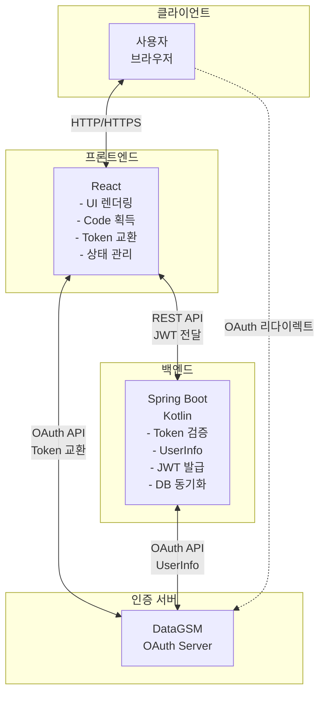
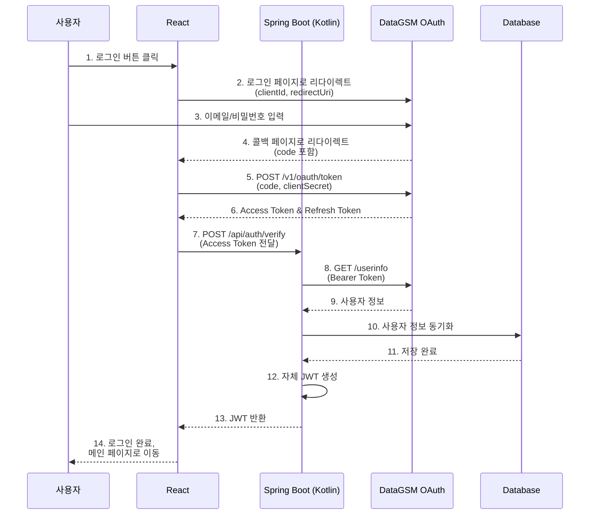

# React + Spring Boot (Kotlin) OAuth 구현

### 시나리오

프론트엔드(React)에서 Authorization Code 획득 후 Token 교환까지 수행하고, 서버(Spring Boot Kotlin)에서 Access Token을 검증하여 자체 JWT를 발급하는 OAuth 구현 예제입니다.

이 방식은 SPA(Single Page Application) 환경에서 프론트엔드가 OAuth 플로우를 주도하면서도, 서버에서 토큰 검증과 사용자 인증을 처리하는 하이브리드 방식입니다.

## 아키텍처 개요

### 시스템 구성도



### 데이터 플로우

전체 인증 프로세스는 다음 순서로 진행됩니다.



### 책임 분리

각 레이어의 명확한 책임 분리로 보안과 유지보수성을 확보합니다.

#### 프론트엔드 (React)

| 책임 | 설명 |
| --- | --- |
| **UI 렌더링** | 로그인 페이지, 로딩 상태, 에러 처리 UI |
| **리다이렉트 처리** | DataGSM 로그인 페이지로 이동 및 콜백 받기 |
| **Authorization Code 획득** | URL 파라미터에서 code 추출 |
| **토큰 교환** | Code를 Access Token으로 교환 |
| **백엔드 API 호출** | Access Token을 서버로 전달하고 JWT 받기 |
| **토큰 관리** | JWT를 sessionStorage에 저장 및 관리 |
| **인증 상태 관리** | 로그인 여부에 따른 UI 분기 처리 |

#### 백엔드 (Spring Boot - Kotlin)

| 책임 | 설명 |
| --- | --- |
| **Access Token 검증** | DataGSM에 토큰 유효성 확인 |
| **사용자 정보 조회** | DataGSM API에서 사용자 정보 획득 |
| **DB 동기화** | 사용자 정보를 자체 DB에 저장/업데이트 |
| **자체 JWT 발급** | 애플리케이션 인증용 JWT 생성 |
| **비즈니스 로직** | 사용자 권한 관리, 리소스 접근 제어 |

### 프론트엔드가 Token까지 교환하는 이유

이 아키텍처에서 프론트엔드가 토큰 교환을 직접 수행하는 이유는 다음과 같습니다.

| 이유 | 설명 |
| --- | --- |
| **SPA 특성** | Single Page Application에서 백엔드 의존성을 최소화 |
| **개발 효율성** | 프론트엔드 개발자가 OAuth 플로우를 직접 제어 가능 |
| **네트워크 최적화** | 백엔드를 거치지 않고 직접 DataGSM과 통신하여 응답 속도 향상 |
| **유연성** | Access Token을 다른 API 호출에도 재사용 가능 |

### 보안 고려사항

이 아키텍처에서 구현된 주요 보안 요소입니다.

| 보안 요소 | 구현 위치 | 설명 |
| --- | --- | --- |
| **Client Secret 관리** | React (환경 변수) | 프로덕션에서는 Backend For Frontend(BFF) 패턴 권장 |
| **HTTPS 강제** | 전체 시스템 | 프로덕션에서 모든 통신은 HTTPS 사용 |
| **State 파라미터** | React | CSRF 공격 방지를 위한 랜덤 토큰 생성 및 검증 |
| **토큰 분리** | 양쪽 | DataGSM Access Token은 임시 사용, JWT는 앱 인증용 |
| **Access Token 검증** | Spring Boot | 백엔드에서 DataGSM API로 토큰 유효성 재확인 |
| **JWT 검증** | Spring Boot | 모든 API 요청에서 JWT 서명 및 만료 검증 |

## Step 1: 프론트엔드 (React + TypeScript)

### 프로젝트 구조

```
src/
├── hooks/
│   └── useOAuthLogin.ts          # OAuth 로그인 커스텀 Hook
├── pages/
│   ├── LoginPage.tsx             # 로그인 페이지
│   ├── CallbackPage.tsx          # OAuth 콜백 페이지
│   └── HomePage.tsx              # 메인 페이지
├── services/
│   ├── oauthService.ts           # OAuth API 호출 서비스
│   └── authService.ts            # 인증 관련 서비스
├── types/
│   └── auth.ts                   # 타입 정의
└── utils/
    └── storage.ts                # 로컬 스토리지 유틸
```

### OAuth 로그인 Hook

OAuth 플로우를 관리하는 커스텀 Hook입니다.

<CodeTabs>
  <CodeTab label="hooks/useOAuthLogin.ts" language="typescript" code={`import { useState, useCallback } from 'react';
import { useNavigate } from 'react-router-dom';

interface OAuthConfig {
  clientId: string;
  clientSecret: string;
  redirectUri: string;
  authUrl: string;
  tokenUrl: string;
}

interface UseOAuthLoginReturn {
  login: () => void;
  isLoading: boolean;
  error: string | null;
}

export const useOAuthLogin = (config: OAuthConfig): UseOAuthLoginReturn => {
  const [isLoading, setIsLoading] = useState(false);
  const [error, setError] = useState<string | null>(null);
  const navigate = useNavigate();

  const login = useCallback(() => {
    setIsLoading(true);
    setError(null);

    try {
      // State 파라미터 생성 (CSRF 방지)
      const state = Math.random().toString(36).substring(2, 15) +
                    Math.random().toString(36).substring(2, 15);

      sessionStorage.setItem('oauth_state', state);

      // DataGSM 로그인 페이지로 리다이렉트
      const authUrl = new URL(config.authUrl);
      authUrl.searchParams.append('client_id', config.clientId);
      authUrl.searchParams.append('redirect_uri', config.redirectUri);
      authUrl.searchParams.append('state', state);

      window.location.href = authUrl.toString();
    } catch (err) {
      setError(err instanceof Error ? err.message : '알 수 없는 오류가 발생했습니다.');
      setIsLoading(false);
    }
  }, [config]);

  return { login, isLoading, error };
};`} />
</CodeTabs>

### OAuth 서비스

OAuth API 호출을 처리하는 서비스입니다.

<CodeTabs>
  <CodeTab label="services/oauthService.ts" language="typescript" code={`interface TokenResponse {
  accessToken: string;
  refreshToken: string;
  expiresIn: number;
}

interface UserInfo {
  email: string;
  name: string;
  grade: number;
  class: number;
  number: number;
  profileImage?: string;
}

interface AuthResponse {
  token: string;
  user: UserInfo;
}

class OAuthService {
  private readonly tokenUrl: string;
  private readonly clientId: string;
  private readonly clientSecret: string;
  private readonly backendUrl: string;

  constructor() {
    this.tokenUrl = process.env.REACT_APP_DATAGSM_TOKEN_URL ||
                    'https://oauth.datagsm.com/v1/oauth/token';
    this.clientId = process.env.REACT_APP_DATAGSM_CLIENT_ID || '';
    this.clientSecret = process.env.REACT_APP_DATAGSM_CLIENT_SECRET || '';
    this.backendUrl = process.env.REACT_APP_BACKEND_URL || 'http://localhost:8080';
  }

  /**
   * Authorization Code를 Access Token으로 교환
   */
  async exchangeCodeForToken(code: string): Promise<TokenResponse> {
    const response = await fetch(this.tokenUrl, {
      method: 'POST',
      headers: {
        'Content-Type': 'application/json',
      },
      body: JSON.stringify({
        code,
        clientSecret: this.clientSecret,
      }),
    });

    if (!response.ok) {
      const errorData = await response.json().catch(() => ({}));
      throw new Error(errorData.message || '토큰 교환에 실패했습니다.');
    }

    return response.json();
  }

  /**
   * Access Token을 서버에 전달하여 JWT 받기
   */
  async verifyAndGetJWT(accessToken: string): Promise<AuthResponse> {
    const response = await fetch(this.backendUrl + '/api/auth/verify', {
      method: 'POST',
      headers: {
        'Content-Type': 'application/json',
      },
      body: JSON.stringify({
        accessToken,
      }),
    });

    if (!response.ok) {
      const errorData = await response.json().catch(() => ({}));
      throw new Error(errorData.message || '서버 인증에 실패했습니다.');
    }

    return response.json();
  }

  /**
   * 전체 OAuth 플로우 처리
   */
  async handleOAuthCallback(code: string): Promise<AuthResponse> {
    // 1. Code를 Access Token으로 교환
    const tokenResponse = await this.exchangeCodeForToken(code);

    // 2. Access Token을 서버에 전달하여 JWT 받기
    const authResponse = await this.verifyAndGetJWT(tokenResponse.accessToken);

    return authResponse;
  }
}

export const oauthService = new OAuthService();`} />
</CodeTabs>

### 로그인 페이지

<CodeTabs>
  <CodeTab label="pages/LoginPage.tsx" language="typescript" code={`import React from 'react';
import { useOAuthLogin } from '../hooks/useOAuthLogin';

const LoginPage: React.FC = () => {
  const { login, isLoading, error } = useOAuthLogin({
    clientId: process.env.REACT_APP_DATAGSM_CLIENT_ID || '',
    clientSecret: process.env.REACT_APP_DATAGSM_CLIENT_SECRET || '',
    redirectUri: process.env.REACT_APP_REDIRECT_URI || 'http://localhost:3000/callback',
    authUrl: 'https://oauth.datagsm.com/login',
    tokenUrl: 'https://oauth.datagsm.com/v1/oauth/token',
  });

  return (
    <div className="min-h-screen flex items-center justify-center bg-gradient-to-br from-blue-50 to-indigo-100">
      <div className="max-w-md w-full space-y-8 p-10 bg-white rounded-2xl shadow-xl">
        <div className="text-center">
          <h1 className="text-4xl font-bold text-gray-900 mb-2">
            환영합니다
          </h1>
          <p className="text-gray-600">
            DataGSM 계정으로 로그인하세요
          </p>
        </div>

        {error && (
          <div className="bg-red-50 border border-red-200 rounded-lg p-4">
            <div className="flex">
              <div className="flex-shrink-0">
                <svg className="h-5 w-5 text-red-400" viewBox="0 0 20 20" fill="currentColor">
                  <path fillRule="evenodd" d="M10 18a8 8 0 100-16 8 8 0 000 16zM8.707 7.293a1 1 0 00-1.414 1.414L8.586 10l-1.293 1.293a1 1 0 101.414 1.414L10 11.414l1.293 1.293a1 1 0 001.414-1.414L11.414 10l1.293-1.293a1 1 0 00-1.414-1.414L10 8.586 8.707 7.293z" clipRule="evenodd" />
                </svg>
              </div>
              <div className="ml-3">
                <p className="text-sm text-red-800">{error}</p>
              </div>
            </div>
          </div>
        )}

        <div>
          <button
            onClick={login}
            disabled={isLoading}
            className="w-full flex justify-center items-center py-4 px-6 border border-transparent
                     rounded-xl shadow-md text-lg font-semibold text-white
                     bg-gradient-to-r from-blue-600 to-indigo-600
                     hover:from-blue-700 hover:to-indigo-700
                     focus:outline-none focus:ring-2 focus:ring-offset-2 focus:ring-blue-500
                     disabled:from-gray-400 disabled:to-gray-500 disabled:cursor-not-allowed
                     transition-all duration-200 transform hover:scale-105 active:scale-95"
          >
            {isLoading ? (
              <span className="flex items-center">
                <svg className="animate-spin -ml-1 mr-3 h-6 w-6 text-white"
                     xmlns="http://www.w3.org/2000/svg" fill="none"
                     viewBox="0 0 24 24">
                  <circle className="opacity-25" cx="12" cy="12" r="10"
                          stroke="currentColor" strokeWidth="4"></circle>
                  <path className="opacity-75" fill="currentColor"
                        d="M4 12a8 8 0 018-8V0C5.373 0 0 5.373 0 12h4zm2 5.291A7.962 7.962 0 014 12H0c0 3.042 1.135 5.824 3 7.938l3-2.647z">
                  </path>
                </svg>
                처리 중...
              </span>
            ) : (
              <span className="flex items-center">
                <svg className="w-6 h-6 mr-2" fill="currentColor" viewBox="0 0 20 20">
                  <path fillRule="evenodd" d="M10 9a3 3 0 100-6 3 3 0 000 6zm-7 9a7 7 0 1114 0H3z" clipRule="evenodd" />
                </svg>
                DataGSM으로 로그인
              </span>
            )}
          </button>
        </div>

        <div className="text-center">
          <p className="text-sm text-gray-600">
            로그인함으로써 <a href="/terms" className="text-blue-600 hover:underline">서비스 이용약관</a>과{' '}
            <a href="/privacy" className="text-blue-600 hover:underline">개인정보 처리방침</a>에 동의합니다.
          </p>
        </div>
      </div>
    </div>
  );
};

export default LoginPage;`} />
</CodeTabs>

### OAuth 콜백 페이지

DataGSM 인증 후 리다이렉트되는 페이지에서 Authorization Code를 처리합니다.

<CodeTabs>
  <CodeTab label="pages/CallbackPage.tsx" language="typescript" code={`import React, { useEffect, useState } from 'react';
import { useNavigate, useSearchParams } from 'react-router-dom';
import { oauthService } from '../services/oauthService';

const CallbackPage: React.FC = () => {
  const [searchParams] = useSearchParams();
  const navigate = useNavigate();
  const [error, setError] = useState<string | null>(null);
  const [progress, setProgress] = useState<string>('인증 정보 확인 중...');

  useEffect(() => {
    const handleCallback = async () => {
      try {
        // URL에서 code와 state 추출
        const code = searchParams.get('code');
        const state = searchParams.get('state');

        if (!code) {
          throw new Error('Authorization code가 없습니다.');
        }

        // State 검증 (CSRF 방지)
        const savedState = sessionStorage.getItem('oauth_state');
        if (!savedState || state !== savedState) {
          throw new Error('State 파라미터가 일치하지 않습니다. CSRF 공격이 의심됩니다.');
        }

        // State 제거 (일회용)
        sessionStorage.removeItem('oauth_state');

        // 1단계: 토큰 교환
        setProgress('DataGSM 서버에서 토큰을 발급받는 중...');
        const tokenResponse = await oauthService.exchangeCodeForToken(code);

        // 2단계: 서버 검증 및 JWT 받기
        setProgress('서버에서 인증 정보를 확인하는 중...');
        const authResponse = await oauthService.verifyAndGetJWT(tokenResponse.accessToken);

        // JWT를 sessionStorage에 저장
        sessionStorage.setItem('auth_token', authResponse.token);
        sessionStorage.setItem('user', JSON.stringify(authResponse.user));

        // 성공 메시지
        setProgress('로그인 완료! 메인 페이지로 이동합니다...');

        // 메인 페이지로 이동
        setTimeout(() => {
          navigate('/');
        }, 1000);
      } catch (err) {
        console.error('OAuth callback error:', err);
        setError(err instanceof Error ? err.message : '알 수 없는 오류가 발생했습니다.');

        // 3초 후 로그인 페이지로 이동
        setTimeout(() => {
          navigate('/login');
        }, 3000);
      }
    };

    handleCallback();
  }, [searchParams, navigate]);

  if (error) {
    return (
      <div className="min-h-screen flex items-center justify-center bg-gray-50">
        <div className="max-w-md w-full p-8 bg-white rounded-lg shadow-md">
          <div className="text-center">
            <div className="mx-auto flex items-center justify-center h-16 w-16 rounded-full bg-red-100 mb-4">
              <svg className="h-10 w-10 text-red-600" fill="none" viewBox="0 0 24 24" stroke="currentColor">
                <path strokeLinecap="round" strokeLinejoin="round" strokeWidth="2" d="M6 18L18 6M6 6l12 12" />
              </svg>
            </div>
            <h3 className="text-xl font-semibold text-gray-900 mb-2">로그인 실패</h3>
            <p className="text-base text-gray-600 mb-4">{error}</p>
            <p className="text-sm text-gray-400">잠시 후 로그인 페이지로 이동합니다...</p>
          </div>
        </div>
      </div>
    );
  }

  return (
    <div className="min-h-screen flex items-center justify-center bg-gray-50">
      <div className="max-w-md w-full p-8 bg-white rounded-lg shadow-md">
        <div className="text-center">
          <svg className="animate-spin mx-auto h-16 w-16 text-blue-600 mb-4"
               xmlns="http://www.w3.org/2000/svg" fill="none" viewBox="0 0 24 24">
            <circle className="opacity-25" cx="12" cy="12" r="10"
                    stroke="currentColor" strokeWidth="4"></circle>
            <path className="opacity-75" fill="currentColor"
                  d="M4 12a8 8 0 018-8V0C5.373 0 0 5.373 0 12h4zm2 5.291A7.962 7.962 0 014 12H0c0 3.042 1.135 5.824 3 7.938l3-2.647z">
            </path>
          </svg>
          <h3 className="text-xl font-semibold text-gray-900 mb-2">로그인 처리 중</h3>
          <p className="text-base text-gray-600">{progress}</p>
        </div>
      </div>
    </div>
  );
};

export default CallbackPage;`} />
</CodeTabs>

## Step 2: 백엔드 (Spring Boot - Kotlin)

### 프로젝트 구조

```
src/main/kotlin/com/example/app/
├── config/
│   ├── SecurityConfig.kt         # Spring Security 설정
│   └── CorsConfig.kt             # CORS 설정
├── controller/
│   └── AuthController.kt         # OAuth 인증 컨트롤러
├── service/
│   ├── OAuthService.kt           # OAuth 비즈니스 로직
│   ├── UserService.kt            # 사용자 관리 서비스
│   └── JwtService.kt             # JWT 발급/검증 서비스
├── dto/
│   ├── VerifyTokenRequest.kt     # 토큰 검증 요청 DTO
│   ├── AuthResponse.kt           # 인증 응답 DTO
│   └── UserInfoResponse.kt       # 사용자 정보 DTO
├── entity/
│   └── User.kt                   # 사용자 엔티티
└── repository/
    └── UserRepository.kt         # 사용자 레포지토리
```

### AuthController

Access Token 검증 및 JWT 발급을 처리하는 컨트롤러입니다.

<CodeTabs>
  <CodeTab label="controller/AuthController.kt" language="kotlin" code={`package com.example.app.controller

import com.example.app.dto.AuthResponse
import com.example.app.dto.VerifyTokenRequest
import com.example.app.service.OAuthService
import org.springframework.http.HttpStatus
import org.springframework.http.ResponseEntity
import org.springframework.web.bind.annotation.*

@RestController
@RequestMapping("/api/auth")
class AuthController(
    private val oAuthService: OAuthService
) {

    /**
     * Access Token 검증 및 JWT 발급
     *
     * @param request DataGSM Access Token을 포함한 요청
     * @return JWT 토큰 및 사용자 정보
     */
    @PostMapping("/verify")
    fun verifyAccessToken(
        @RequestBody request: VerifyTokenRequest
    ): ResponseEntity<AuthResponse> {
        return try {
            val response = oAuthService.verifyTokenAndIssueJWT(request.accessToken)
            ResponseEntity.ok(response)
        } catch (e: IllegalArgumentException) {
            ResponseEntity.status(HttpStatus.BAD_REQUEST).build()
        } catch (e: Exception) {
            ResponseEntity.status(HttpStatus.INTERNAL_SERVER_ERROR).build()
        }
    }

    /**
     * 현재 로그인한 사용자 정보 조회
     *
     * @param authHeader Authorization 헤더 (Bearer 토큰)
     * @return 사용자 정보
     */
    @GetMapping("/me")
    fun getCurrentUser(
        @RequestHeader("Authorization") authHeader: String
    ): ResponseEntity<*> {
        return try {
            if (!authHeader.startsWith("Bearer ")) {
                return ResponseEntity.status(HttpStatus.UNAUTHORIZED)
                    .body(mapOf("message" to "Invalid token format"))
            }

            val token = authHeader.substring(7)
            val user = oAuthService.getUserFromToken(token)

            ResponseEntity.ok(user)
        } catch (e: Exception) {
            ResponseEntity.status(HttpStatus.UNAUTHORIZED)
                .body(mapOf("message" to "Invalid or expired token"))
        }
    }

    /**
     * 로그아웃
     *
     * @param authHeader Authorization 헤더
     * @return 성공 메시지
     */
    @PostMapping("/logout")
    fun logout(
        @RequestHeader("Authorization") authHeader: String
    ): ResponseEntity<*> {
        return try {
            val token = authHeader.substring(7)
            oAuthService.invalidateToken(token)

            ResponseEntity.ok(mapOf("message" to "Logged out successfully"))
        } catch (e: Exception) {
            ResponseEntity.badRequest().build<Any>()
        }
    }
}`} />
</CodeTabs>

### OAuthService

Access Token 검증, 사용자 정보 조회, JWT 발급을 담당하는 핵심 서비스입니다.

<CodeTabs>
  <CodeTab label="service/OAuthService.kt" language="kotlin" code={`package com.example.app.service

import com.example.app.dto.AuthResponse
import com.example.app.dto.DataGsmUserInfo
import com.example.app.dto.UserInfoResponse
import com.fasterxml.jackson.databind.ObjectMapper
import org.slf4j.LoggerFactory
import org.springframework.beans.factory.annotation.Value
import org.springframework.stereotype.Service
import org.springframework.transaction.annotation.Transactional
import java.net.URI
import java.net.http.HttpClient
import java.net.http.HttpRequest
import java.net.http.HttpResponse

@Service
class OAuthService(
    private val userService: UserService,
    private val jwtService: JwtService,
    private val objectMapper: ObjectMapper
) {
    private val logger = LoggerFactory.getLogger(OAuthService::class.java)
    private val httpClient: HttpClient = HttpClient.newHttpClient()

    @Value("\\${'$'}{datagsm.oauth.userinfo-url:https://oauth.datagsm.com/userinfo}")
    private lateinit var userInfoUrl: String

    /**
     * Access Token 검증 및 JWT 발급
     *
     * 1. Access Token으로 DataGSM에서 사용자 정보 조회
     * 2. DB에 사용자 정보 동기화
     * 3. 자체 JWT 발급
     */
    @Transactional
    fun verifyTokenAndIssueJWT(accessToken: String): AuthResponse {
        // 1. Access Token으로 사용자 정보 조회 (토큰 검증 포함)
        val userInfo = fetchUserInfo(accessToken)

        // 2. DB에 사용자 정보 저장/업데이트
        val user = userService.syncUser(userInfo)

        // 3. 자체 JWT 발급
        val jwt = jwtService.generateToken(user)

        logger.info("Successfully verified token and issued JWT for user: {}", user.email)

        // 4. 응답 생성
        return AuthResponse(
            token = jwt,
            user = UserInfoResponse.from(user)
        )
    }

    /**
     * Access Token으로 DataGSM 사용자 정보 조회
     */
    private fun fetchUserInfo(accessToken: String): DataGsmUserInfo {
        val request = HttpRequest.newBuilder()
            .uri(URI.create(userInfoUrl))
            .header("Authorization", "Bearer $accessToken")
            .GET()
            .build()

        val response = httpClient.send(
            request,
            HttpResponse.BodyHandlers.ofString()
        )

        if (response.statusCode() != 200) {
            logger.error("Failed to fetch user info: {}", response.body())
            throw RuntimeException("Failed to fetch user info: " + response.body())
        }

        return objectMapper.readValue(response.body(), DataGsmUserInfo::class.java)
    }

    /**
     * JWT에서 사용자 정보 추출
     */
    fun getUserFromToken(token: String): UserInfoResponse {
        val userId = jwtService.extractUserId(token)
        val user = userService.findById(userId)
        return UserInfoResponse.from(user)
    }

    /**
     * 토큰 무효화 (로그아웃)
     */
    fun invalidateToken(token: String) {
        // JWT는 stateless하므로 블랙리스트에 추가하거나
        // Redis 같은 캐시에 만료 처리할 수 있습니다.
        logger.info("Token invalidated")
    }
}`} />
</CodeTabs>

### UserService

사용자 정보를 DB에 동기화하고 관리하는 서비스입니다.

<CodeTabs>
  <CodeTab label="service/UserService.kt" language="kotlin" code={`package com.example.app.service

import com.example.app.dto.DataGsmUserInfo
import com.example.app.entity.User
import com.example.app.repository.UserRepository
import org.slf4j.LoggerFactory
import org.springframework.stereotype.Service
import org.springframework.transaction.annotation.Transactional
import java.time.LocalDateTime

@Service
class UserService(
    private val userRepository: UserRepository
) {
    private val logger = LoggerFactory.getLogger(UserService::class.java)

    /**
     * DataGSM 사용자 정보를 DB에 동기화
     *
     * - 신규 사용자: 생성
     * - 기존 사용자: 정보 업데이트
     */
    @Transactional
    fun syncUser(userInfo: DataGsmUserInfo): User {
        return userRepository.findByEmail(userInfo.email)
            ?.let { updateUser(it, userInfo) }
            ?: createUser(userInfo)
    }

    /**
     * 신규 사용자 생성
     */
    private fun createUser(userInfo: DataGsmUserInfo): User {
        val user = User(
            email = userInfo.email,
            name = userInfo.name,
            grade = userInfo.grade,
            classNum = userInfo.classNum,
            number = userInfo.number,
            profileImage = userInfo.profileImage,
            createdAt = LocalDateTime.now(),
            updatedAt = LocalDateTime.now()
        )

        val saved = userRepository.save(user)
        logger.info("Created new user: {}", saved.email)
        return saved
    }

    /**
     * 기존 사용자 정보 업데이트
     */
    private fun updateUser(user: User, userInfo: DataGsmUserInfo): User {
        user.apply {
            name = userInfo.name
            grade = userInfo.grade
            classNum = userInfo.classNum
            number = userInfo.number
            profileImage = userInfo.profileImage
            updatedAt = LocalDateTime.now()
        }

        val updated = userRepository.save(user)
        logger.info("Updated user: {}", updated.email)
        return updated
    }

    /**
     * ID로 사용자 조회
     */
    fun findById(id: Long): User {
        return userRepository.findById(id)
            .orElseThrow { RuntimeException("User not found: $id") }
    }

    /**
     * 이메일로 사용자 조회
     */
    fun findByEmail(email: String): User {
        return userRepository.findByEmail(email)
            ?: throw RuntimeException("User not found: $email")
    }
}`} />
</CodeTabs>

### JwtService

자체 JWT 토큰을 발급하고 검증하는 서비스입니다.

<CodeTabs>
  <CodeTab label="service/JwtService.kt" language="kotlin" code={`package com.example.app.service

import com.example.app.entity.User
import io.jsonwebtoken.Claims
import io.jsonwebtoken.Jwts
import io.jsonwebtoken.SignatureAlgorithm
import io.jsonwebtoken.security.Keys
import org.slf4j.LoggerFactory
import org.springframework.beans.factory.annotation.Value
import org.springframework.stereotype.Service
import java.security.Key
import java.util.*

@Service
class JwtService {
    private val logger = LoggerFactory.getLogger(JwtService::class.java)

    @Value("\\${'$'}{jwt.secret}")
    private lateinit var secretKey: String

    @Value("\\${'$'}{jwt.expiration:3600000}")
    private lateinit var expirationTime: Long

    private fun getSigningKey(): Key {
        return Keys.hmacShaKeyFor(secretKey.toByteArray())
    }

    /**
     * JWT 토큰 생성
     */
    fun generateToken(user: User): String {
        val claims = mutableMapOf<String, Any>()
        claims["userId"] = user.id!!
        claims["email"] = user.email
        claims["name"] = user.name
        claims["grade"] = user.grade
        claims["classNum"] = user.classNum
        claims["number"] = user.number

        val now = Date()
        val expiryDate = Date(now.time + expirationTime)

        return Jwts.builder()
            .setClaims(claims)
            .setSubject(user.email)
            .setIssuedAt(now)
            .setExpiration(expiryDate)
            .signWith(getSigningKey(), SignatureAlgorithm.HS256)
            .compact()
    }

    /**
     * JWT에서 사용자 ID 추출
     */
    fun extractUserId(token: String): Long {
        val claims = extractAllClaims(token)
        return claims["userId"].toString().toLong()
    }

    /**
     * JWT에서 이메일 추출
     */
    fun extractEmail(token: String): String {
        return extractAllClaims(token).subject
    }

    /**
     * JWT 유효성 검증
     */
    fun validateToken(token: String): Boolean {
        return try {
            extractAllClaims(token)
            !isTokenExpired(token)
        } catch (e: Exception) {
            logger.error("Invalid JWT token: {}", e.message)
            false
        }
    }

    /**
     * JWT에서 모든 클레임 추출
     */
    private fun extractAllClaims(token: String): Claims {
        return Jwts.parserBuilder()
            .setSigningKey(getSigningKey())
            .build()
            .parseClaimsJws(token)
            .body
    }

    /**
     * JWT 만료 여부 확인
     */
    private fun isTokenExpired(token: String): Boolean {
        return extractAllClaims(token).expiration.before(Date())
    }
}`} />
</CodeTabs>

### DTO 클래스들

데이터 전송을 위한 DTO 클래스입니다.

<CodeTabs>
  <CodeTab label="dto/DTOs.kt" language="kotlin" code={`package com.example.app.dto

import com.example.app.entity.User
import com.fasterxml.jackson.annotation.JsonProperty

// Access Token 검증 요청
data class VerifyTokenRequest(
    val accessToken: String
)

// DataGSM 사용자 정보
data class DataGsmUserInfo(
    val email: String,
    val name: String,
    val grade: Int,
    @JsonProperty("class")
    val classNum: Int,
    val number: Int,
    val profileImage: String?
)

// 인증 응답 (JWT + 사용자 정보)
data class AuthResponse(
    val token: String,
    val user: UserInfoResponse
)

// 사용자 정보 응답
data class UserInfoResponse(
    val id: Long,
    val email: String,
    val name: String,
    val grade: Int,
    val classNum: Int,
    val number: Int,
    val profileImage: String?
) {
    companion object {
        fun from(user: User): UserInfoResponse {
            return UserInfoResponse(
                id = user.id!!,
                email = user.email,
                name = user.name,
                grade = user.grade,
                classNum = user.classNum,
                number = user.number,
                profileImage = user.profileImage
            )
        }
    }
}`} />
</CodeTabs>

### Entity & Repository

사용자 엔티티와 레포지토리입니다.

<CodeTabs>
  <CodeTab label="entity/User.kt" language="kotlin" code={`package com.example.app.entity

import jakarta.persistence.*
import java.time.LocalDateTime

@Entity
@Table(name = "users")
data class User(
    @Id
    @GeneratedValue(strategy = GenerationType.IDENTITY)
    val id: Long? = null,

    @Column(nullable = false, unique = true)
    var email: String,

    @Column(nullable = false)
    var name: String,

    var grade: Int,

    var classNum: Int,

    var number: Int,

    var profileImage: String? = null,

    @Column(nullable = false, updatable = false)
    val createdAt: LocalDateTime = LocalDateTime.now(),

    @Column(nullable = false)
    var updatedAt: LocalDateTime = LocalDateTime.now()
)`} />

  <CodeTab label="repository/UserRepository.kt" language="kotlin" code={`package com.example.app.repository

import com.example.app.entity.User
import org.springframework.data.jpa.repository.JpaRepository
import org.springframework.stereotype.Repository

@Repository
interface UserRepository : JpaRepository<User, Long> {

    /**
     * 이메일로 사용자 조회
     */
    fun findByEmail(email: String): User?

    /**
     * 이메일 존재 여부 확인
     */
    fun existsByEmail(email: String): Boolean
}`} />
</CodeTabs>

## 환경 설정

### React 환경 변수

<CodeTabs>
  <CodeTab label=".env" language="bash" code={`# DataGSM OAuth 설정
REACT_APP_DATAGSM_CLIENT_ID=your-client-id-here
REACT_APP_DATAGSM_CLIENT_SECRET=your-client-secret-here
REACT_APP_REDIRECT_URI=http://localhost:3000/callback

# DataGSM API URLs
REACT_APP_DATAGSM_AUTH_URL=https://oauth.datagsm.com/login
REACT_APP_DATAGSM_TOKEN_URL=https://oauth.datagsm.com/v1/oauth/token

# 백엔드 API URL
REACT_APP_BACKEND_URL=http://localhost:8080`} />
</CodeTabs>

### Spring Boot 환경 변수

<CodeTabs>
  <CodeTab label="application.yml" language="yaml" code={`spring:
  datasource:
    url: jdbc:mysql://localhost:3306/myapp
    username: root
    password: password
    driver-class-name: com.mysql.cj.jdbc.Driver

  jpa:
    hibernate:
      ddl-auto: update
    show-sql: true
    properties:
      hibernate:
        format_sql: true

# DataGSM OAuth 설정
datagsm:
  oauth:
    userinfo-url: https://oauth.datagsm.com/userinfo

# JWT 설정
jwt:
  secret: ${'$'}{JWT_SECRET:default-value}
  expiration: 3600000  # 1시간 (밀리초)

# CORS 설정
cors:
  allowed-origins: http://localhost:3000
  allowed-methods: GET,POST,PUT,DELETE,OPTIONS
  allowed-headers: "*"
  allow-credentials: true`} />
</CodeTabs>

### 의존성 설정

<CodeTabs>
  <CodeTab label="package.json" language="json" code={`{
  "name": "react-oauth-app",
  "version": "1.0.0",
  "scripts": {
    "start": "react-scripts start",
    "build": "react-scripts build",
    "test": "react-scripts test"
  },
  "dependencies": {
    "react": "^18.2.0",
    "react-dom": "^18.2.0",
    "react-router-dom": "^6.20.0"
  },
  "devDependencies": {
    "@types/react": "^18.2.0",
    "@types/react-dom": "^18.2.0",
    "typescript": "^5.0.0",
    "tailwindcss": "^3.3.0"
  }
}`} />

  <CodeTab label="build.gradle.kts" language="kotlin" code={`import org.jetbrains.kotlin.gradle.tasks.KotlinCompile

plugins {
    id("org.springframework.boot") version "3.2.0"
    id("io.spring.dependency-management") version "1.1.4"
    kotlin("jvm") version "1.9.21"
    kotlin("plugin.spring") version "1.9.21"
    kotlin("plugin.jpa") version "1.9.21"
}

group = "com.example"
version = "1.0.0"
java.sourceCompatibility = JavaVersion.VERSION_17

repositories {
    mavenCentral()
}

dependencies {
    // Spring Boot
    implementation("org.springframework.boot:spring-boot-starter-web")
    implementation("org.springframework.boot:spring-boot-starter-data-jpa")

    // Kotlin
    implementation("com.fasterxml.jackson.module:jackson-module-kotlin")
    implementation("org.jetbrains.kotlin:kotlin-reflect")

    // Database
    runtimeOnly("com.mysql:mysql-connector-j")

    // JWT
    implementation("io.jsonwebtoken:jjwt-api:0.11.5")
    runtimeOnly("io.jsonwebtoken:jjwt-impl:0.11.5")
    runtimeOnly("io.jsonwebtoken:jjwt-jackson:0.11.5")

    // Validation
    implementation("org.springframework.boot:spring-boot-starter-validation")

    // Test
    testImplementation("org.springframework.boot:spring-boot-starter-test")
}

tasks.withType<KotlinCompile> {
    kotlinOptions {
        freeCompilerArgs = listOf("-Xjsr305=strict")
        jvmTarget = "17"
    }
}

tasks.withType<Test> {
    useJUnitPlatform()
}`} />
</CodeTabs>

## 보안 고려사항

### 1. Client Secret 관리

프론트엔드에서 Client Secret을 사용하는 경우 특별한 주의가 필요합니다.

| 위험 요소 | 대응 방안 |
| --- | --- |
| **브라우저 노출** | 프로덕션에서는 BFF(Backend For Frontend) 패턴 사용 권장 |
| **코드에 하드코딩** | 환경 변수로 관리하고 .gitignore에 추가 |
| **빌드 파일 포함** | 빌드된 JavaScript에 포함되므로 주의 필요 |
| **버전 관리 시스템** | .env 파일을 Git에 커밋하지 않음 |

### 2. Access Token 유효기간 확인

Access Token의 만료 시간을 클라이언트에서 관리합니다.

```typescript
interface TokenData {
  accessToken: string;
  expiresIn: number;  // 초 단위
  issuedAt: number;   // Unix timestamp
}

function isTokenExpired(tokenData: TokenData): boolean {
  const now = Date.now() / 1000;
  const expiryTime = tokenData.issuedAt + tokenData.expiresIn;
  return now >= expiryTime;
}

// 사용 예시
if (isTokenExpired(tokenData)) {
  // 재로그인 필요
  redirectToLogin();
}
```

### 3. CORS 설정

백엔드에서 적절한 CORS 설정이 필요합니다.

<CodeTabs>
  <CodeTab label="config/CorsConfig.kt" language="kotlin" code={`package com.example.app.config

import org.springframework.beans.factory.annotation.Value
import org.springframework.context.annotation.Bean
import org.springframework.context.annotation.Configuration
import org.springframework.web.cors.CorsConfiguration
import org.springframework.web.cors.UrlBasedCorsConfigurationSource
import org.springframework.web.filter.CorsFilter

@Configuration
class CorsConfig {

    @Value("\\${'$'}{cors.allowed-origins}")
    private lateinit var allowedOriginsConfig: String

    @Bean
    fun corsFilter(): CorsFilter {
        val config = CorsConfiguration().apply {
            allowedOrigins = allowedOriginsConfig.split(",")
            allowedMethods = listOf("GET", "POST", "PUT", "DELETE", "OPTIONS")
            allowedHeaders = listOf("*")
            allowCredentials = true
            maxAge = 3600L
        }

        val source = UrlBasedCorsConfigurationSource().apply {
            registerCorsConfiguration("/api/**", config)
        }

        return CorsFilter(source)
    }
}`} />
</CodeTabs>

### 4. HTTPS 사용

프로덕션 환경에서는 반드시 HTTPS를 사용해야 합니다.

| 프로토콜 | 환경 | 사용 여부 | 이유 |
| --- | --- | --- | --- |
| **HTTP** | 로컬 개발 | 허용 | localhost는 안전한 컨텍스트 |
| **HTTP** | 프로덕션 | 금지 | Client Secret 및 토큰 탈취 위험 |
| **HTTPS** | 프로덕션 | 필수 | 데이터 암호화 및 보안 |

## 완전한 코드 예제

### 통합 플로우 예제

전체 OAuth 플로우를 하나의 서비스로 통합한 예제입니다.

<CodeTabs>
  <CodeTab label="services/authFlow.ts" language="typescript" code={`import { oauthService } from './oauthService';

interface AuthFlowResult {
  success: boolean;
  token?: string;
  user?: any;
  error?: string;
}

/**
 * 전체 OAuth 플로우를 처리하는 통합 함수
 */
export async function completeOAuthFlow(code: string, state: string): Promise<AuthFlowResult> {
  try {
    // 1. State 검증
    const savedState = sessionStorage.getItem('oauth_state');
    if (!savedState || state !== savedState) {
      throw new Error('State 파라미터가 일치하지 않습니다.');
    }
    sessionStorage.removeItem('oauth_state');

    // 2. 전체 OAuth 플로우 실행
    const authResponse = await oauthService.handleOAuthCallback(code);

    // 3. 토큰 저장
    sessionStorage.setItem('auth_token', authResponse.token);
    sessionStorage.setItem('user', JSON.stringify(authResponse.user));

    return {
      success: true,
      token: authResponse.token,
      user: authResponse.user
    };
  } catch (error) {
    return {
      success: false,
      error: error instanceof Error ? error.message : '알 수 없는 오류가 발생했습니다.'
    };
  }
}`} />
</CodeTabs>

### 인증된 API 호출 예제

JWT를 사용하여 보호된 API를 호출하는 예제입니다.

<CodeTabs>
  <CodeTab label="services/apiClient.ts" language="typescript" code={`const API_BASE_URL = process.env.REACT_APP_BACKEND_URL || 'http://localhost:8080';

/**
 * 인증이 필요한 API 호출
 */
async function authenticatedFetch(
  endpoint: string,
  options: RequestInit = {}
): Promise<Response> {
  const token = sessionStorage.getItem('auth_token');

  if (!token) {
    throw new Error('인증 토큰이 없습니다.');
  }

  const response = await fetch(API_BASE_URL + endpoint, {
    ...options,
    headers: {
      ...options.headers,
      'Authorization': 'Bearer ' + token,
      'Content-Type': 'application/json',
    },
  });

  // 401 Unauthorized: 토큰 만료
  if (response.status === 401) {
    sessionStorage.removeItem('auth_token');
    sessionStorage.removeItem('user');
    window.location.href = '/login';
    throw new Error('인증이 만료되었습니다.');
  }

  return response;
}

// 사용 예시
export async function getUserProfile() {
  const response = await authenticatedFetch('/api/auth/me');
  return response.json();
}`} />
</CodeTabs>

## 다음 단계

### 기능 확장

구현을 완료한 후 다음 기능들을 추가로 고려해보세요.

| 기능 | 설명 | 우선순위 |
| --- | --- | --- |
| **Token Refresh** | Access Token 만료 시 Refresh Token으로 자동 갱신 | 높음 |
| **자동 로그아웃** | JWT 만료 시 자동 로그아웃 처리 | 높음 |
| **BFF 패턴** | Client Secret을 서버에서만 관리하도록 개선 | 높음 |
| **Remember Me** | 로그인 상태 유지 기능 | 중간 |
| **다중 기기 로그인** | 여러 기기에서 동시 로그인 지원 | 중간 |

### 모니터링 및 로깅

프로덕션 환경에서는 다음 항목들을 모니터링하세요.

```kotlin
// 로그 예시
logger.info("OAuth verification started for token")
logger.info("Successfully verified token and issued JWT for user: $email")
logger.warn("Failed to verify access token: $errorMessage")
logger.error("User info fetch failed: $errorMessage")
```

### 성능 최적화

- Redis를 사용한 JWT 블랙리스트 캐싱
- DB 쿼리 최적화 (인덱스 추가)
- Connection Pool 설정
- React 컴포넌트 메모이제이션

### 추가 리소스

- [DataGSM OAuth HTTP API 문서](/docs/oauth/http)
- [Spring Boot Kotlin 공식 문서](https://spring.io/guides/tutorials/spring-boot-kotlin/)
- [React Router 공식 문서](https://reactrouter.com/home)
- [JWT 베스트 프랙티스](https://tools.ietf.org/html/rfc8725)
