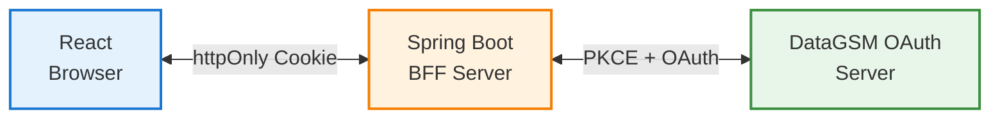
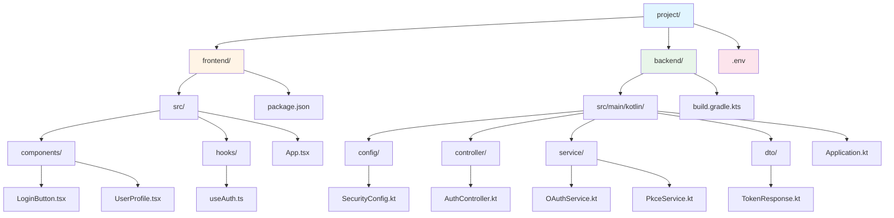

import { Shield, CheckCircle2 } from 'lucide-react'

# React + Spring Boot Kotlin OAuth 구현 (BFF 패턴)

## 개요

이 가이드는 **BFF (Backend For Frontend)** 패턴을 사용하여 React와 Spring Boot Kotlin으로 안전한 OAuth 인증을 구현하는 방법을 설명합니다.

  

    <Shield className="h-5 w-5 text-blue-600 dark:text-blue-500 shrink-0 mt-0.5" />
    

      

        BFF 패턴 사용
      

      

        이 예제는 보안을 위해 BFF(Backend For Frontend) 패턴을 사용합니다.
        프론트엔드에서 직접 OAuth 플로우를 처리하는 것보다 BFF 패턴을 사용하면 더 안전합니다.
        PKCE를 사용하시는 경우에도 백엔드를 통한 인증 처리를 고려해보세요.
      

    

  

### 아키텍처

### 주요 특징

- ✅ **PKCE 구현**: Authorization Code 탈취 방지
- ✅ **httpOnly 쿠키**: XSS 공격으로부터 토큰 보호
- ✅ **client_secret 미사용**: 클라이언트 노출 위험 제거
- ✅ **서버 사이드 검증**: 안전한 토큰 관리
- ✅ **자동 토큰 갱신**: Refresh Token 자동 처리

## 프로젝트 구조

## 백엔드 구현 (Spring Boot Kotlin)

### 1. 의존성 추가

<CodeTabs>
  <CodeTab label="build.gradle.kts" language="kotlin" code={`dependencies {
    implementation("org.springframework.boot:spring-boot-starter-web")
    implementation("org.springframework.boot:spring-boot-starter-security")
    implementation("org.jetbrains.kotlin:kotlin-reflect")
    implementation("org.jetbrains.kotlin:kotlin-stdlib-jdk8")
    implementation("com.fasterxml.jackson.module:jackson-module-kotlin")
    implementation("io.github.microutils:kotlin-logging-jvm:3.0.5")

    // HTTP 클라이언트
    implementation("org.springframework.boot:spring-boot-starter-webflux")
}`} />
</CodeTabs>

### 2. PKCE 서비스

PKCE code_verifier 및 code_challenge 생성을 담당합니다.

<CodeTabs>
  <CodeTab label="service/PkceService.kt" language="kotlin" code={`package com.example.oauth.service

import org.springframework.stereotype.Service
import java.security.MessageDigest
import java.security.SecureRandom
import java.util.Base64

@Service
class PkceService {

    /**
     * PKCE Code Verifier 생성
     * - 43-128자 길이의 랜덤 문자열
     * - Base64URL 인코딩
     */
    fun generateCodeVerifier(): String {
        val bytes = ByteArray(32) // 256 bits
        SecureRandom().nextBytes(bytes)
        return base64UrlEncode(bytes)
    }

    /**
     * PKCE Code Challenge 생성
     * - Code Verifier의 SHA-256 해시
     * - Base64URL 인코딩
     */
    fun generateCodeChallenge(verifier: String): String {
        val digest = MessageDigest.getInstance("SHA-256")
        val hash = digest.digest(verifier.toByteArray(Charsets.UTF_8))
        return base64UrlEncode(hash)
    }

    /**
     * Base64URL 인코딩
     * - RFC 7636 표준 준수
     * - padding 제거
     */
    private fun base64UrlEncode(bytes: ByteArray): String {
        return Base64.getUrlEncoder()
            .withoutPadding()
            .encodeToString(bytes)
    }
}`} />
</CodeTabs>

### 3. OAuth 서비스

DataGSM OAuth API와 통신합니다.

<CodeTabs>
  <CodeTab label="service/OAuthService.kt" language="kotlin" code={`package com.example.oauth.service

import com.example.oauth.dto.TokenResponse
import com.example.oauth.dto.UserInfo
import mu.KotlinLogging
import org.springframework.beans.factory.annotation.Value
import org.springframework.stereotype.Service
import org.springframework.web.reactive.function.client.WebClient
import org.springframework.web.reactive.function.client.bodyToMono
import org.springframework.web.util.UriComponentsBuilder

private val logger = KotlinLogging.logger {}

@Service
class OAuthService(
    @Value("\\\${'$'}{oauth.client-id}") private val clientId: String,
    @Value("\\\${'$'}{oauth.callback-uri}") private val callbackUri: String,
    private val webClient: WebClient = WebClient.create()
) {

    private val oauthBaseUrl = "https://oauth.data.hellogsm.kr"
    private val userinfoBaseUrl = "https://oauth-userinfo.data.hellogsm.kr"

    /**
     * DataGSM OAuth 인가 URL 생성
     * - GET /v1/oauth/authorize 엔드포인트로 리다이렉트할 URL 반환
     *
     * @param state CSRF 방지용 랜덤 문자열
     * @param codeChallenge PKCE code_challenge (SHA-256 해시)
     * @return DataGSM OAuth 인가 URL
     */
    fun buildAuthorizeUrl(state: String, codeChallenge: String): String {
        return UriComponentsBuilder
            .fromHttpUrl(oauthBaseUrl)
            .path("/v1/oauth/authorize")
            .queryParam("client_id", clientId)
            .queryParam("redirect_uri", callbackUri)
            .queryParam("state", state)
            .queryParam("code_challenge", codeChallenge)
            .queryParam("code_challenge_method", "S256")
            .build()
            .encode()
            .toUriString()
    }

    /**
     * Authorization Code를 Access Token으로 교환 (PKCE)
     *
     * @param code Authorization Code
     * @param codeVerifier PKCE code_verifier
     * @return TokenResponse (accessToken, refreshToken, expiresIn)
     */
    fun exchangeToken(code: String, codeVerifier: String): TokenResponse {
        logger.info { "Exchanging authorization code for tokens" }

        val response = webClient.post()
            .uri("$oauthBaseUrl/v1/oauth/token")
            .bodyValue(
                mapOf(
                    "grant_type" to "authorization_code",
                    "code" to code,
                    "client_id" to clientId,
                    "redirect_uri" to callbackUri,
                    "code_verifier" to codeVerifier
                )
            )
            .retrieve()
            .bodyToMono<TokenResponse>()
            .block() ?: throw RuntimeException("Failed to exchange token")

        logger.info { "Successfully exchanged tokens" }
        return response
    }

    /**
     * Refresh Token으로 새로운 Access Token 발급
     *
     * @param refreshToken Refresh Token
     * @return TokenResponse (새로운 accessToken, refreshToken)
     */
    fun refreshToken(refreshToken: String): TokenResponse {
        logger.info { "Refreshing access token" }

        val response = webClient.post()
            .uri("$oauthBaseUrl/v1/oauth/token")
            .bodyValue(
                mapOf(
                    "grant_type" to "refresh_token",
                    "client_id" to clientId,
                    "refresh_token" to refreshToken
                )
            )
            .retrieve()
            .bodyToMono<TokenResponse>()
            .block() ?: throw RuntimeException("Failed to refresh token")

        logger.info { "Successfully refreshed token" }
        return response
    }

    /**
     * Access Token으로 사용자 정보 조회
     *
     * @param accessToken Access Token
     * @return UserInfo (사용자 정보)
     */
    fun getUserInfo(accessToken: String): UserInfo {
        logger.info { "Fetching user info" }

        val userInfo = webClient.get()
            .uri("$userinfoBaseUrl/userinfo")
            .header("Authorization", "Bearer $accessToken")
            .retrieve()
            .bodyToMono<UserInfo>()
            .block() ?: throw RuntimeException("Failed to get user info")

        logger.info { "Successfully fetched user info for: \\\${userInfo.email}" }
        return userInfo
    }
}`} />
</CodeTabs>

### 4. DTO 클래스

<CodeTabs>
  <CodeTab label="dto/TokenResponse.kt" language="kotlin" code={`package com.example.oauth.dto

import com.fasterxml.jackson.annotation.JsonProperty

data class TokenResponse(
    @JsonProperty("access_token")
    val accessToken: String,

    @JsonProperty("refresh_token")
    val refreshToken: String,

    @JsonProperty("expires_in")
    val expiresIn: Int
)

// DataGSM /userinfo 응답 구조
data class UserInfo(
    val id: Long,
    val email: String,
    val role: String,
    val isStudent: Boolean,
    val student: StudentInfo?
)

data class StudentInfo(
    val id: Long,
    val name: String,
    val grade: Int,
    val classNum: Int,
    val number: Int,
    val major: String
)`} />
</CodeTabs>

### 5. Auth Controller

프론트엔드와 통신하는 API 엔드포인트를 제공합니다.

<CodeTabs>
  <CodeTab label="controller/AuthController.kt" language="kotlin" code={`package com.example.oauth.controller

import com.example.oauth.dto.UserInfo
import com.example.oauth.service.OAuthService
import com.example.oauth.service.PkceService
import jakarta.servlet.http.Cookie
import jakarta.servlet.http.HttpServletRequest
import jakarta.servlet.http.HttpServletResponse
import jakarta.servlet.http.HttpSession
import mu.KotlinLogging
import org.springframework.beans.factory.annotation.Value
import org.springframework.http.HttpStatus
import org.springframework.http.ResponseEntity
import org.springframework.web.bind.annotation.*
import java.util.UUID

private val logger = KotlinLogging.logger {}

@RestController
@RequestMapping("/api/auth")
class AuthController(
    private val oauthService: OAuthService,
    private val pkceService: PkceService,
    @Value("\\\${'$'}{oauth.frontend-url}") private val frontendUrl: String
) {

    /**
     * GET /api/auth/initiate
     * OAuth 인가 시작 - 사용자를 DataGSM OAuth 서버로 리다이렉트
     *
     * BFF 패턴: code_verifier와 state를 서버 세션에 저장하고
     * 사용자를 DataGSM 인가 엔드포인트로 리다이렉트합니다.
     */
    @GetMapping("/initiate")
    fun initiateOAuth(
        session: HttpSession,
        httpResponse: HttpServletResponse
    ) {
        logger.info { "OAuth initiation started" }

        // PKCE 생성 (서버에서 관리)
        val codeVerifier = pkceService.generateCodeVerifier()
        val codeChallenge = pkceService.generateCodeChallenge(codeVerifier)
        val state = UUID.randomUUID().toString()

        // 세션에 저장 (콜백에서 검증용)
        session.setAttribute("code_verifier", codeVerifier)
        session.setAttribute("oauth_state", state)

        // DataGSM OAuth 인가 URL로 리다이렉트
        val authorizeUrl = oauthService.buildAuthorizeUrl(state, codeChallenge)
        logger.info { "Redirecting to DataGSM OAuth: $authorizeUrl" }
        httpResponse.sendRedirect(authorizeUrl)
    }

    /**
     * GET /api/auth/callback
     * DataGSM OAuth 서버 콜백 처리 및 토큰 발급
     *
     * DataGSM 로그인 성공 후 redirect_uri로 돌아오는 엔드포인트입니다.
     */
    @GetMapping("/callback")
    fun handleCallback(
        @RequestParam(required = false) code: String?,
        @RequestParam state: String,
        session: HttpSession,
        httpResponse: HttpServletResponse
    ) {
        try {
            // State 검증 (CSRF 방지)
            val savedState = session.getAttribute("oauth_state") as? String
                ?: throw IllegalStateException("No state in session")
            if (state != savedState) throw SecurityException("State mismatch - possible CSRF attack")

            // 사용자가 로그인을 취소하거나 인증 서버 에러로 code가 없는 경우 처리
            if (code == null) throw IllegalArgumentException("Authorization code is missing")

            // code_verifier 조회
            val codeVerifier = session.getAttribute("code_verifier") as? String
                ?: throw IllegalStateException("No code_verifier in session")

            // 세션 정리 (일회용)
            session.removeAttribute("oauth_state")
            session.removeAttribute("code_verifier")

            // Token 교환 (PKCE)
            val tokens = oauthService.exchangeToken(code, codeVerifier)

            // httpOnly 쿠키에 토큰 저장
            setTokenCookies(httpResponse, tokens.accessToken, tokens.refreshToken)

            logger.info { "OAuth callback successful, redirecting to frontend" }
            httpResponse.sendRedirect(frontendUrl)

        } catch (e: Exception) {
            logger.error(e) { "OAuth callback failed" }
            httpResponse.sendRedirect("$frontendUrl/login?error=auth_failed")
        }
    }

    /**
     * POST /api/auth/refresh
     * Access Token 갱신
     */
    @PostMapping("/refresh")
    fun refresh(
        request: HttpServletRequest,
        httpResponse: HttpServletResponse
    ): ResponseEntity<Map<String, String>> {
        return try {
            val refreshToken = getRefreshTokenFromCookie(request)
                ?: return ResponseEntity.status(HttpStatus.UNAUTHORIZED)
                    .body(mapOf("error" to "No refresh token"))

            logger.info { "Refreshing access token" }

            val tokens = oauthService.refreshToken(refreshToken)
            setTokenCookies(httpResponse, tokens.accessToken, tokens.refreshToken)

            ResponseEntity.ok(mapOf("message" to "Token refreshed"))

        } catch (e: Exception) {
            logger.error(e) { "Token refresh failed" }
            ResponseEntity.status(HttpStatus.UNAUTHORIZED)
                .body(mapOf("error" to "Token refresh failed"))
        }
    }

    /**
     * POST /api/auth/logout
     * 로그아웃 (쿠키 삭제)
     */
    @PostMapping("/logout")
    fun logout(httpResponse: HttpServletResponse): ResponseEntity<Map<String, String>> {
        logger.info { "Logout request" }
        clearTokenCookies(httpResponse)
        return ResponseEntity.ok(mapOf("message" to "Logout successful"))
    }

    /**
     * GET /api/auth/me
     * 현재 로그인한 사용자 정보 조회
     */
    @GetMapping("/me")
    fun getCurrentUser(request: HttpServletRequest): ResponseEntity<Any> {
        return try {
            val accessToken = getAccessTokenFromCookie(request)
                ?: return ResponseEntity.status(HttpStatus.UNAUTHORIZED)
                    .body(mapOf("error" to "Not authenticated"))

            val userInfo = oauthService.getUserInfo(accessToken)
            ResponseEntity.ok(userInfo)

        } catch (e: Exception) {
            logger.error(e) { "Failed to get user info" }
            ResponseEntity.status(HttpStatus.UNAUTHORIZED)
                .body(mapOf("error" to "Failed to get user info"))
        }
    }

    /**
     * 토큰을 httpOnly 쿠키에 저장
     */
    private fun setTokenCookies(
        httpResponse: HttpServletResponse,
        accessToken: String,
        refreshToken: String
    ) {
        val accessTokenCookie = Cookie("access_token", accessToken).apply {
            isHttpOnly = true
            secure = true
            path = "/"
            maxAge = 3600 // 1시간
        }
        val refreshTokenCookie = Cookie("refresh_token", refreshToken).apply {
            isHttpOnly = true
            secure = true
            path = "/"
            maxAge = 30 * 24 * 3600 // 30일
        }
        httpResponse.addCookie(accessTokenCookie)
        httpResponse.addCookie(refreshTokenCookie)
    }

    /**
     * 쿠키 삭제
     */
    private fun clearTokenCookies(httpResponse: HttpServletResponse) {
        listOf("access_token", "refresh_token").forEach { name ->
            httpResponse.addCookie(Cookie(name, "").apply {
                isHttpOnly = true; secure = true; path = "/"; maxAge = 0
            })
        }
    }

    private fun getAccessTokenFromCookie(request: HttpServletRequest): String? =
        request.cookies?.firstOrNull { it.name == "access_token" }?.value

    private fun getRefreshTokenFromCookie(request: HttpServletRequest): String? =
        request.cookies?.firstOrNull { it.name == "refresh_token" }?.value
}`} />
</CodeTabs>

### 6. Security 설정

<CodeTabs>
  <CodeTab label="config/SecurityConfig.kt" language="kotlin" code={`package com.example.oauth.config

import org.springframework.context.annotation.Bean
import org.springframework.context.annotation.Configuration
import org.springframework.security.config.annotation.web.builders.HttpSecurity
import org.springframework.security.config.annotation.web.configuration.EnableWebSecurity
import org.springframework.security.web.SecurityFilterChain

@Configuration
@EnableWebSecurity
class SecurityConfig {

    @Bean
    fun securityFilterChain(http: HttpSecurity): SecurityFilterChain {
        http
            .csrf { it.disable() } // API이므로 CSRF 비활성화 (프로덕션에서는 고려 필요)
            .cors { it.disable() } // CORS는 @CrossOrigin으로 처리
            .authorizeHttpRequests { auth ->
                auth
                    .requestMatchers("/api/auth/**").permitAll()
                    .anyRequest().authenticated()
            }

        return http.build()
    }
}`} />
</CodeTabs>

### 7. 환경 변수 설정

<CodeTabs>
  <CodeTab label="application.properties" language="properties" code={`oauth.client-id=\\\${OAUTH_CLIENT_ID}
oauth.callback-uri=\\\${OAUTH_CALLBACK_URI:http://localhost:8080/api/auth/callback}
oauth.frontend-url=\\\${OAUTH_FRONTEND_URL:http://localhost:3000}

server.port=8080
logging.level.com.example.oauth=DEBUG`} />
  <CodeTab label=".env" language="bash" code={`OAUTH_CLIENT_ID=your-client-id
OAUTH_CALLBACK_URI=http://localhost:8080/api/auth/callback
OAUTH_FRONTEND_URL=http://localhost:3000`} />
</CodeTabs>

## 프론트엔드 구현 (React + TypeScript)

### 1. 인증 Hook

<CodeTabs>
  <CodeTab label="hooks/useAuth.ts" language="typescript" code={`import { useState, useEffect, useCallback } from 'react';

interface StudentInfo {
  id: number;
  name: string;
  grade: number;
  classNum: number;
  number: number;
  major: string;
}

interface UserInfo {
  id: number;
  email: string;
  role: string;
  isStudent: boolean;
  student?: StudentInfo;
}

export function useAuth() {
  const [user, setUser] = useState<UserInfo | null>(null);
  const [loading, setLoading] = useState(true);

  const API_BASE_URL = 'http://localhost:8080/api/auth';

  /**
   * 현재 로그인한 사용자 정보 가져오기
   */
  const fetchUser = useCallback(async () => {
    try {
      const response = await fetch(\`\${API_BASE_URL}/me\`, {
        credentials: 'include', // httpOnly 쿠키 포함
      });

      if (response.ok) {
        const userData = await response.json();
        setUser(userData);
      } else {
        setUser(null);
      }
    } catch (err) {
      console.error('Failed to fetch user:', err);
      setUser(null);
    } finally {
      setLoading(false);
    }
  }, []);

  /**
   * 로그인 시작
   * BFF 패턴: 직접 BFF의 /initiate 엔드포인트로 리다이렉트
   * BFF 서버가 PKCE 생성 + DataGSM OAuth 서버로 리다이렉트 처리
   */
  const login = () => {
    window.location.href = \`\${API_BASE_URL}/initiate\`;
  };

  /**
   * 로그아웃
   */
  const logout = async () => {
    try {
      await fetch(\`\${API_BASE_URL}/logout\`, {
        method: 'POST',
        credentials: 'include',
      });
      setUser(null);
    } catch (err) {
      console.error('Logout failed:', err);
    }
  };

  /**
   * 토큰 자동 갱신
   */
  const refreshToken = async () => {
    try {
      const response = await fetch(\`\${API_BASE_URL}/refresh\`, {
        method: 'POST',
        credentials: 'include',
      });

      if (!response.ok) {
        setUser(null);
        return false;
      }

      return true;
    } catch (err) {
      console.error('Token refresh failed:', err);
      setUser(null);
      return false;
    }
  };

  /**
   * 초기 로드 시 사용자 정보 가져오기
   */
  useEffect(() => {
    fetchUser();
  }, [fetchUser]);

  /**
   * 50분마다 자동 토큰 갱신 (Access Token 만료 10분 전)
   */
  useEffect(() => {
    if (!user) return;

    const interval = setInterval(() => {
      refreshToken();
    }, 50 * 60 * 1000);

    return () => clearInterval(interval);
  }, [user]);

  return {
    user,
    loading,
    login,
    logout,
    isAuthenticated: !!user,
  };
}`} />
</CodeTabs>

### 2. 로그인 컴포넌트

<CodeTabs>
  <CodeTab label="components/LoginButton.tsx" language="typescript" code={`import React from 'react';
import { useAuth } from '../hooks/useAuth';

export function LoginButton() {
  const { login, loading } = useAuth();

  return (
    

      <h2 className="text-2xl font-bold mb-6 text-center">DataGSM 로그인</h2>

      

        DataGSM 계정으로 안전하게 로그인하세요.
      

      <button
        onClick={login}
        disabled={loading}
        className="w-full flex justify-center py-2 px-4 border border-transparent rounded-md shadow-sm text-sm font-medium text-white bg-indigo-600 hover:bg-indigo-700 focus:outline-none focus:ring-2 focus:ring-offset-2 focus:ring-indigo-500 disabled:opacity-50 disabled:cursor-not-allowed"
      >
        {loading ? '로딩 중...' : 'DataGSM으로 로그인'}
      </button>
    

  );
}`} />
</CodeTabs>

### 3. 사용자 프로필 컴포넌트

<CodeTabs>
  <CodeTab label="components/UserProfile.tsx" language="typescript" code={`import React from 'react';
import { useAuth } from '../hooks/useAuth';

export function UserProfile() {
  const { user, logout, loading } = useAuth();

  if (loading) {
    return 
로딩 중...
;
  }

  if (!user) {
    return null;
  }

  const student = user.student;

  return (
    

      

        

          {student?.name?.charAt(0) ?? user.email.charAt(0)}
        

        

          <h2 className="text-xl font-bold">{student?.name ?? '사용자'}</h2>
          
{user.email}

        

      

      {student && (
        

          

            학년: {student.grade}학년
          

          

            반: {student.classNum}반
          

          

            번호: {student.number}번
          

          

            전공: {student.major}
          

        

      )}

      <button
        onClick={logout}
        className="w-full py-2 px-4 border border-transparent rounded-md shadow-sm text-sm font-medium text-white bg-red-600 hover:bg-red-700 focus:outline-none focus:ring-2 focus:ring-offset-2 focus:ring-red-500"
      >
        로그아웃
      </button>
    

  );
}`} />
</CodeTabs>

### 4. App 컴포넌트

<CodeTabs>
  <CodeTab label="App.tsx" language="typescript" code={`import React from 'react';
import { LoginButton } from './components/LoginButton';
import { UserProfile } from './components/UserProfile';
import { useAuth } from './hooks/useAuth';

function App() {
  const { isAuthenticated, loading } = useAuth();

  if (loading) {
    return (
      

        
로딩 중...

      

    );
  }

  return (
    

      

        <h1 className="text-4xl font-bold text-center mb-12">
          DataGSM OAuth Demo
        </h1>

        {isAuthenticated ? <UserProfile /> : <LoginButton />}
      

    

  );
}

export default App;`} />
</CodeTabs>

## 보안 체크리스트

  

    <CheckCircle2 className="h-5 w-5 text-green-600 dark:text-green-500 shrink-0 mt-0.5" />
    

      

        구현된 보안 기능
      

      <ul className="text-green-800 dark:text-green-200 text-sm space-y-1">
        <li>✅ PKCE 사용 (Authorization Code 탈취 방지)</li>
        <li>✅ httpOnly 쿠키 (XSS 공격 방지)</li>
        <li>✅ Secure 플래그 (HTTPS에서만 쿠키 전송)</li>
        <li>✅ SameSite=Lax (CSRF 공격 방지)</li>
        <li>✅ client_secret 미사용 (클라이언트 노출 위험 제거)</li>
        <li>✅ 서버 사이드 검증 (토큰 관리)</li>
        <li>✅ 자동 토큰 갱신 (사용자 경험 개선)</li>
      </ul>
    

  

### 추가 권장 사항

1. **HTTPS 사용**
   - 프로덕션 환경에서 반드시 HTTPS 사용
   - 개발 환경에서도 localhost가 아닌 경우 HTTPS 권장

2. **CORS 설정**
   - 프로덕션 환경에서는 정확한 origin 지정
   - 와일드카드(`*`) 사용 금지

3. **Rate Limiting**
   - 로그인 시도 횟수 제한 (Brute Force 공격 방지)
   - IP 기반 또는 사용자 기반 제한

4. **로깅**
   - 인증 시도, 성공, 실패 로깅
   - 민감한 정보 (비밀번호, 토큰) 로깅 금지

5. **에러 메시지**
   - 사용자에게 노출되는 에러는 최소한의 정보만 제공
   - 상세 에러는 서버 로그에만 기록

## 테스트

### 백엔드 테스트

<CodeTabs>
  <CodeTab label="test/service/PkceServiceTest.kt" language="kotlin" code={`package com.example.oauth.service

import org.junit.jupiter.api.Test
import org.junit.jupiter.api.Assertions.*

class PkceServiceTest {

    private val pkceService = PkceService()

    @Test
    fun \`code_verifier 생성 테스트\`() {
        val verifier = pkceService.generateCodeVerifier()

        // 길이 검증 (43-128자)
        assertTrue(verifier.length in 43..128)

        // Base64URL 문자만 포함 확인
        assertTrue(verifier.matches(Regex("^[A-Za-z0-9_-]+$")))
    }

    @Test
    fun \`code_challenge 생성 테스트\`() {
        val verifier = "dBjftJeZ4CVP-mB92K27uhbUJU1p1r_wW1gFWFOEjXk"
        val challenge = pkceService.generateCodeChallenge(verifier)

        // SHA-256 해시는 항상 43자 (Base64URL)
        assertEquals(43, challenge.length)

        // 예상 값과 일치 확인
        assertEquals("E9Melhoa2OwvFrEMTJguCHaoeK1t8URWbuGJSstw-cM", challenge)
    }

    @Test
    fun \`동일한 verifier는 동일한 challenge 생성\`() {
        val verifier = pkceService.generateCodeVerifier()
        val challenge1 = pkceService.generateCodeChallenge(verifier)
        val challenge2 = pkceService.generateCodeChallenge(verifier)

        assertEquals(challenge1, challenge2)
    }

    @Test
    fun \`다른 verifier는 다른 challenge 생성\`() {
        val verifier1 = pkceService.generateCodeVerifier()
        val verifier2 = pkceService.generateCodeVerifier()

        val challenge1 = pkceService.generateCodeChallenge(verifier1)
        val challenge2 = pkceService.generateCodeChallenge(verifier2)

        assertNotEquals(challenge1, challenge2)
    }
}`} />
</CodeTabs>

### 프론트엔드 테스트

<CodeTabs>
  <CodeTab label="hooks/__tests__/useAuth.test.ts" language="typescript" code={`import { renderHook, act, waitFor } from '@testing-library/react';
import { useAuth } from '../useAuth';

// Mock fetch
global.fetch = jest.fn();

// Mock window.location
const mockLocationHref = jest.fn();
Object.defineProperty(window, 'location', {
  value: { ...window.location, set href(url: string) { mockLocationHref(url); } },
  writable: true,
});

describe('useAuth', () => {
  beforeEach(() => {
    jest.clearAllMocks();
  });

  it('should redirect to /initiate on login', () => {
    const { result } = renderHook(() => useAuth());

    act(() => {
      result.current.login();
    });

    expect(mockLocationHref).toHaveBeenCalledWith(
      'http://localhost:8080/api/auth/initiate'
    );
  });

  it('should fetch user on mount', async () => {
    (global.fetch as jest.Mock).mockResolvedValueOnce({
      ok: true,
      json: async () => ({
        id: 1,
        email: 'test@gsm.hs.kr',
        role: 'USER',
        isStudent: true,
        student: { id: 1, name: '홍길동', grade: 1, classNum: 1, number: 1, major: 'SW' },
      }),
    });

    const { result } = renderHook(() => useAuth());

    await waitFor(() => {
      expect(result.current.isAuthenticated).toBe(true);
      expect(result.current.user?.email).toBe('test@gsm.hs.kr');
      expect(result.current.user?.student?.name).toBe('홍길동');
    });
  });

  it('should logout successfully', async () => {
    (global.fetch as jest.Mock)
      .mockResolvedValueOnce({
        ok: true,
        json: async () => ({
          id: 1, email: 'test@gsm.hs.kr', role: 'USER', isStudent: true,
          student: { id: 1, name: '홍길동', grade: 1, classNum: 1, number: 1, major: 'SW' },
        }),
      })
      .mockResolvedValueOnce({
        ok: true,
        json: async () => ({}),
      });

    const { result } = renderHook(() => useAuth());

    await waitFor(() => {
      expect(result.current.isAuthenticated).toBe(true);
    });

    await act(async () => {
      await result.current.logout();
    });

    await waitFor(() => {
      expect(result.current.isAuthenticated).toBe(false);
      expect(result.current.user).toBeNull();
    });
  });
});`} />
</CodeTabs>

## 실행 방법

### 백엔드 실행

<CodeTabs>
  <CodeTab label="terminal" language="bash" code={`cd backend
./gradlew bootRun`} />
</CodeTabs>

### 프론트엔드 실행

<CodeTabs>
  <CodeTab label="terminal" language="bash" code={`cd frontend
npm install
npm start`} />
</CodeTabs>

애플리케이션이 다음 주소에서 실행됩니다:
- 프론트엔드: http://localhost:3000
- 백엔드: http://localhost:8080

## 다음 단계

- [PKCE 가이드](/docs/oauth/pkce) - PKCE 개념 및 구현 상세 설명
- [HTTP API 문서](/docs/oauth/http/code) - OAuth API 명세
- [토큰 관리](/docs/oauth/http/token-exchange) - 토큰 교환 및 갱신

## 참고 자료

- [RFC 7636 - PKCE](https://datatracker.ietf.org/doc/html/rfc7636)
- [Spring Security Documentation](https://docs.spring.io/spring-security/reference/index.html)
- [React Authentication Best Practices](https://react.dev/learn/you-might-not-need-an-effect#authenticating-a-user)
