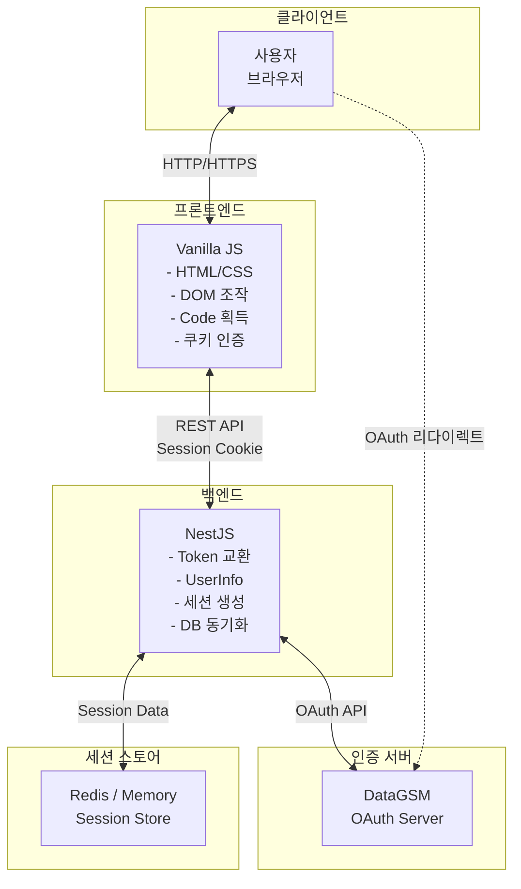
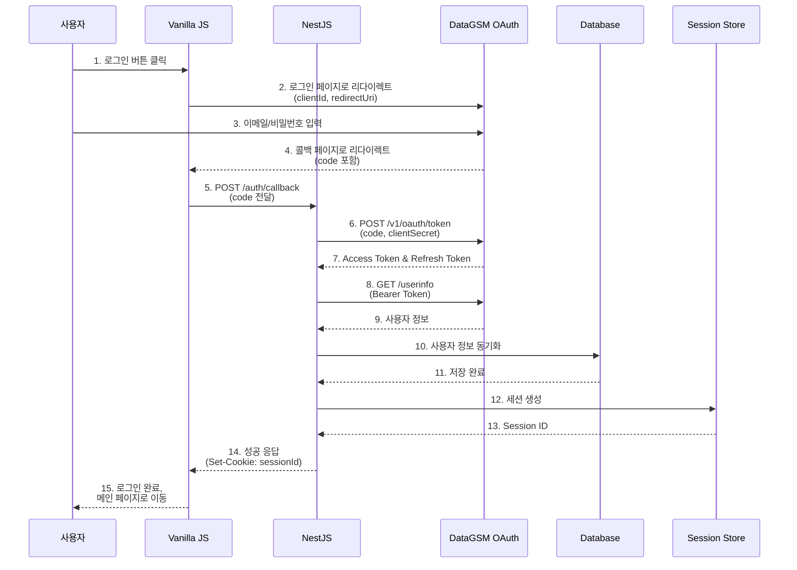
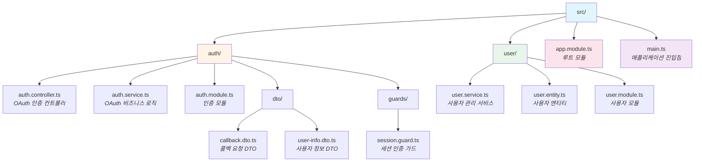

import { Shield } from 'lucide-react'

# Vanilla JavaScript + NestJS OAuth 구현

<div className="border-l-4 border-blue-500 bg-blue-50 dark:bg-blue-900/20 p-4 rounded my-6">
  <div className="flex items-start gap-3">
    <Shield className="h-5 w-5 text-blue-600 dark:text-blue-500 shrink-0 mt-0.5" />
    <div>
      <div className="font-semibold text-blue-900 dark:text-blue-100 mb-1">
        client_secret 방식 예제
      </div>
      <div className="text-blue-800 dark:text-blue-200 text-sm">
        이 예제는 <code className="mx-1 px-1.5 py-0.5 bg-blue-100 dark:bg-blue-800 rounded">client_secret</code> 방식을 사용합니다.
        서버에서 <code className="mx-1 px-1.5 py-0.5 bg-blue-100 dark:bg-blue-800 rounded">client_secret</code>을 사용하는 것도 가능하며,
        새로운 프로젝트에서는 <strong>PKCE</strong> 방식도 고려해보시면 좋습니다.
        자세한 내용은 <a href="/docs/oauth/pkce" className="underline font-medium">PKCE 가이드</a>를 참고하세요.
      </div>
    </div>
  </div>
</div>

### 시나리오

프론트엔드(Vanilla JavaScript)에서 Authorization Code까지 획득하고, 서버(NestJS)에서 Token 교환 및 사용자 정보 조회 후 세션 기반 인증을 구현하는 OAuth 예제입니다.

이 방식은 프레임워크 없이 순수 JavaScript로 프론트엔드를 구현하면서, 서버 측에서 세션 스토어를 활용한 전통적인 인증 방식을 사용합니다.

## 아키텍처 개요

### 시스템 구성도



### 세션 기반 인증의 장점

세션 기반 인증 방식은 다음과 같은 장점을 제공합니다.

| 장점 | 설명 |
| --- | --- |
| **보안성** | 세션 ID만 클라이언트에 전달되므로 사용자 정보 노출 최소화 |
| **서버 제어** | 서버에서 세션을 직접 관리하여 즉시 무효화 가능 |
| **단순성** | JWT 서명 검증 등의 복잡한 로직 불필요 |
| **상태 관리** | 서버에서 사용자 상태를 중앙 집중식으로 관리 |
| **확장성** | Redis 등의 세션 스토어를 사용하여 분산 환경 지원 |

### 데이터 플로우

전체 인증 프로세스는 다음 순서로 진행됩니다.



### 책임 분리

각 레이어의 명확한 책임 분리로 보안과 유지보수성을 확보합니다.

#### 프론트엔드 (Vanilla JavaScript)

| 책임 | 설명 |
| --- | --- |
| **UI 렌더링** | DOM 조작을 통한 동적 UI 구성 |
| **리다이렉트 처리** | DataGSM 로그인 페이지로 이동 및 콜백 받기 |
| **Authorization Code 획득** | URL 파라미터에서 code 추출 |
| **백엔드 API 호출** | Code를 서버로 전달 |
| **쿠키 기반 인증** | Session ID 쿠키를 자동으로 전송 |
| **이벤트 처리** | 버튼 클릭, 폼 제출 등의 사용자 이벤트 관리 |

#### 백엔드 (NestJS)

| 책임 | 설명 |
| --- | --- |
| **Client Secret 보호** | 환경 변수로 안전하게 관리 |
| **토큰 교환** | Authorization Code → Access Token 변환 |
| **사용자 정보 조회** | DataGSM API에서 사용자 정보 획득 |
| **DB 동기화** | 사용자 정보를 자체 DB에 저장/업데이트 |
| **세션 관리** | 세션 생성, 갱신, 무효화 |
| **인증 미들웨어** | 세션 기반 API 접근 제어 |
| **비즈니스 로직** | 사용자 권한 관리, 리소스 접근 제어 |

## Step 1: 프론트엔드 (Vanilla JavaScript)

### HTML 구조

#### 로그인 페이지

<CodeTabs>
  <CodeTab label="index.html" language="html" code={`<!DOCTYPE html>
<html lang="ko">
<head>
    <meta charset="UTF-8">
    <meta name="viewport" content="width=device-width, initial-scale=1.0">
    <title>로그인 - DataGSM OAuth</title>
    <style>
        * {
            margin: 0;
            padding: 0;
            box-sizing: border-box;
        }

        body {
            font-family: -apple-system, BlinkMacSystemFont, 'Segoe UI', 'Roboto', sans-serif;
            background: linear-gradient(135deg, #667eea 0%, #764ba2 100%);
            min-height: 100vh;
            display: flex;
            align-items: center;
            justify-content: center;
        }

        .login-container {
            background: white;
            border-radius: 16px;
            box-shadow: 0 20px 60px rgba(0, 0, 0, 0.3);
            padding: 48px;
            max-width: 400px;
            width: 100%;
        }

        .login-header {
            text-align: center;
            margin-bottom: 32px;
        }

        .login-header h1 {
            font-size: 32px;
            color: #1a202c;
            margin-bottom: 8px;
        }

        .login-header p {
            color: #718096;
            font-size: 16px;
        }

        .login-btn {
            width: 100%;
            padding: 16px 24px;
            background: linear-gradient(135deg, #667eea 0%, #764ba2 100%);
            color: white;
            border: none;
            border-radius: 8px;
            font-size: 16px;
            font-weight: 600;
            cursor: pointer;
            transition: all 0.3s ease;
            display: flex;
            align-items: center;
            justify-content: center;
            gap: 8px;
        }

        .login-btn:hover {
            transform: translateY(-2px);
            box-shadow: 0 8px 16px rgba(102, 126, 234, 0.4);
        }

        .login-btn:active {
            transform: translateY(0);
        }

        .login-btn:disabled {
            background: #cbd5e0;
            cursor: not-allowed;
            transform: none;
        }

        .spinner {
            width: 20px;
            height: 20px;
            border: 3px solid rgba(255, 255, 255, 0.3);
            border-top-color: white;
            border-radius: 50%;
            animation: spin 0.6s linear infinite;
        }

        @keyframes spin {
            to { transform: rotate(360deg); }
        }

        .error-message {
            background: #fed7d7;
            color: #c53030;
            padding: 12px 16px;
            border-radius: 8px;
            margin-bottom: 16px;
            font-size: 14px;
            display: none;
        }

        .error-message.show {
            display: block;
        }

        .footer {
            text-align: center;
            margin-top: 24px;
            color: #718096;
            font-size: 14px;
        }

        .footer a {
            color: #667eea;
            text-decoration: none;
        }

        .footer a:hover {
            text-decoration: underline;
        }
    </style>
</head>
<body>
    <div class="login-container">
        <div class="login-header">
            <h1>환영합니다</h1>
            <p>DataGSM 계정으로 로그인하세요</p>
        </div>

        <div id="errorMessage" class="error-message"></div>

        <button id="loginBtn" class="login-btn">
            <svg width="20" height="20" viewBox="0 0 20 20" fill="currentColor">
                <path fill-rule="evenodd" d="M10 9a3 3 0 100-6 3 3 0 000 6zm-7 9a7 7 0 1114 0H3z" clip-rule="evenodd" />
            </svg>
            <span id="loginBtnText">DataGSM으로 로그인</span>
        </button>

        <div class="footer">
            <p>로그인함으로써 <a href="/terms">서비스 이용약관</a>과 <a href="/privacy">개인정보 처리방침</a>에 동의합니다.</p>
        </div>
    </div>

    <script src="auth.js"></script>
</body>
</html>`} />
</CodeTabs>

#### 콜백 페이지

<CodeTabs>
  <CodeTab label="callback.html" language="html" code={`<!DOCTYPE html>
<html lang="ko">
<head>
    <meta charset="UTF-8">
    <meta name="viewport" content="width=device-width, initial-scale=1.0">
    <title>로그인 처리 중...</title>
    <style>
        * {
            margin: 0;
            padding: 0;
            box-sizing: border-box;
        }

        body {
            font-family: -apple-system, BlinkMacSystemFont, 'Segoe UI', 'Roboto', sans-serif;
            background: linear-gradient(135deg, #667eea 0%, #764ba2 100%);
            min-height: 100vh;
            display: flex;
            align-items: center;
            justify-content: center;
        }

        .callback-container {
            background: white;
            border-radius: 16px;
            box-shadow: 0 20px 60px rgba(0, 0, 0, 0.3);
            padding: 48px;
            max-width: 400px;
            width: 100%;
            text-align: center;
        }

        .loading-container {
            display: flex;
            flex-direction: column;
            align-items: center;
            gap: 24px;
        }

        .spinner {
            width: 64px;
            height: 64px;
            border: 6px solid rgba(102, 126, 234, 0.2);
            border-top-color: #667eea;
            border-radius: 50%;
            animation: spin 0.8s linear infinite;
        }

        @keyframes spin {
            to { transform: rotate(360deg); }
        }

        .loading-text h2 {
            font-size: 24px;
            color: #1a202c;
            margin-bottom: 8px;
        }

        .loading-text p {
            color: #718096;
            font-size: 16px;
        }

        .error-container {
            display: none;
            flex-direction: column;
            align-items: center;
            gap: 24px;
        }

        .error-container.show {
            display: flex;
        }

        .error-icon {
            width: 64px;
            height: 64px;
            background: #fed7d7;
            border-radius: 50%;
            display: flex;
            align-items: center;
            justify-content: center;
        }

        .error-icon svg {
            width: 32px;
            height: 32px;
            color: #c53030;
        }

        .error-text h2 {
            font-size: 24px;
            color: #1a202c;
            margin-bottom: 8px;
        }

        .error-text p {
            color: #718096;
            font-size: 16px;
        }

        .error-details {
            background: #fed7d7;
            color: #c53030;
            padding: 12px 16px;
            border-radius: 8px;
            font-size: 14px;
            margin-top: 16px;
            width: 100%;
        }
    </style>
</head>
<body>
    <div class="callback-container">
        <div id="loadingContainer" class="loading-container">
            <div class="spinner"></div>
            <div class="loading-text">
                <h2>로그인 처리 중</h2>
                <p id="progressText">인증 정보를 확인하는 중입니다...</p>
            </div>
        </div>

        <div id="errorContainer" class="error-container">
            <div class="error-icon">
                <svg fill="none" viewBox="0 0 24 24" stroke="currentColor">
                    <path stroke-linecap="round" stroke-linejoin="round" stroke-width="2" d="M6 18L18 6M6 6l12 12" />
                </svg>
            </div>
            <div class="error-text">
                <h2>로그인 실패</h2>
                <p>잠시 후 로그인 페이지로 이동합니다...</p>
            </div>
            <div id="errorDetails" class="error-details"></div>
        </div>
    </div>

    <script src="callback.js"></script>
</body>
</html>`} />
</CodeTabs>

### JavaScript 코드

#### 로그인 처리

<CodeTabs>
  <CodeTab label="auth.js" language="javascript" code={`// 환경 설정
const CONFIG = {
    CLIENT_ID: 'your-client-id-here',
    REDIRECT_URI: 'http://localhost:3000/callback.html',
    AUTH_URL: 'https://oauth.data.hellogsm.kr/v1/oauth/authorize',
};

// DOM 요소
const loginBtn = document.getElementById('loginBtn');
const loginBtnText = document.getElementById('loginBtnText');
const errorMessage = document.getElementById('errorMessage');

/**
 * State 파라미터 생성 (CSRF 방지)
 */
function generateState() {
    const array = new Uint8Array(16);
    crypto.getRandomValues(array);
    return Array.from(array, byte => byte.toString(16).padStart(2, '0')).join('');
}

/**
 * 로딩 상태 설정
 */
function setLoading(isLoading) {
    loginBtn.disabled = isLoading;

    if (isLoading) {
        loginBtnText.textContent = '처리 중...';
        loginBtn.innerHTML = \`
            <div class="spinner"></div>
            <span>\${loginBtnText.textContent}</span>
        \`;
    } else {
        loginBtn.innerHTML = \`
            <svg width="20" height="20" viewBox="0 0 20 20" fill="currentColor">
                <path fill-rule="evenodd" d="M10 9a3 3 0 100-6 3 3 0 000 6zm-7 9a7 7 0 1114 0H3z" clip-rule="evenodd" />
            </svg>
            <span>DataGSM으로 로그인</span>
        \`;
    }
}

/**
 * 에러 메시지 표시
 */
function showError(message) {
    errorMessage.textContent = message;
    errorMessage.classList.add('show');

    setTimeout(() => {
        errorMessage.classList.remove('show');
    }, 5000);
}

/**
 * OAuth 로그인 시작
 */
function startOAuthLogin() {
    try {
        setLoading(true);

        // State 생성 및 저장
        const state = generateState();
        sessionStorage.setItem('oauth_state', state);

        // DataGSM 로그인 페이지로 리다이렉트
        const authUrl = new URL(CONFIG.AUTH_URL);
        authUrl.searchParams.append('client_id', CONFIG.CLIENT_ID);
        authUrl.searchParams.append('redirect_uri', CONFIG.REDIRECT_URI);
        authUrl.searchParams.append('state', state);

        // 리다이렉트 시간 기록 (디버깅용)
        sessionStorage.setItem('oauth_started_at', Date.now().toString());

        window.location.href = authUrl.toString();
    } catch (error) {
        console.error('OAuth login error:', error);
        showError('로그인 시작 중 오류가 발생했습니다.');
        setLoading(false);
    }
}

/**
 * 로그인 상태 확인
 */
async function checkLoginStatus() {
    try {
        const response = await fetch('http://localhost:4000/api/auth/me', {
            method: 'GET',
            credentials: 'include', // 쿠키 포함
        });

        if (response.ok) {
            // 이미 로그인되어 있으면 메인 페이지로 이동
            const user = await response.json();
            console.log('Already logged in:', user);
            window.location.href = '/dashboard.html';
        }
    } catch (error) {
        // 로그인되어 있지 않음 (정상)
        console.log('Not logged in yet');
    }
}

// 이벤트 리스너
loginBtn.addEventListener('click', startOAuthLogin);

// 페이지 로드 시 로그인 상태 확인
checkLoginStatus();`} />
</CodeTabs>

#### 콜백 처리

<CodeTabs>
  <CodeTab label="callback.js" language="javascript" code={`// 환경 설정
const CONFIG = {
    API_URL: 'http://localhost:4000',
};

// DOM 요소
const loadingContainer = document.getElementById('loadingContainer');
const errorContainer = document.getElementById('errorContainer');
const progressText = document.getElementById('progressText');
const errorDetails = document.getElementById('errorDetails');

/**
 * 진행 상태 업데이트
 */
function updateProgress(message) {
    progressText.textContent = message;
}

/**
 * 에러 표시
 */
function showError(message) {
    loadingContainer.style.display = 'none';
    errorContainer.classList.add('show');
    errorDetails.textContent = message;

    // 3초 후 로그인 페이지로 이동
    setTimeout(() => {
        window.location.href = '/index.html';
    }, 3000);
}

/**
 * URL 파라미터 추출
 */
function getUrlParams() {
    const params = new URLSearchParams(window.location.search);
    return {
        code: params.get('code'),
        state: params.get('state'),
        error: params.get('error'),
    };
}

/**
 * State 파라미터 검증
 */
function validateState(state) {
    const savedState = sessionStorage.getItem('oauth_state');

    if (!savedState) {
        throw new Error('저장된 State가 없습니다.');
    }

    if (state !== savedState) {
        throw new Error('State 파라미터가 일치하지 않습니다. CSRF 공격이 의심됩니다.');
    }

    // State 제거 (일회용)
    sessionStorage.removeItem('oauth_state');
}

/**
 * 백엔드에 Authorization Code 전달
 */
async function exchangeCodeForSession(code) {
    updateProgress('서버에서 인증 정보를 처리하는 중...');

    const response = await fetch(CONFIG.API_URL + '/api/auth/callback', {
        method: 'POST',
        headers: {
            'Content-Type': 'application/json',
        },
        credentials: 'include', // 쿠키 포함
        body: JSON.stringify({ code }),
    });

    if (!response.ok) {
        const errorData = await response.json().catch(() => ({}));
        throw new Error(errorData.message || '서버 인증 처리에 실패했습니다.');
    }

    return response.json();
}

/**
 * OAuth 콜백 처리
 */
async function handleOAuthCallback() {
    try {
        // URL 파라미터 추출
        const { code, state, error } = getUrlParams();

        // OAuth 에러 확인
        if (error) {
            throw new Error(\`OAuth 인증 실패: \${error}\`);
        }

        // Code 확인
        if (!code) {
            throw new Error('Authorization code가 없습니다.');
        }

        // State 검증
        updateProgress('보안 검증 중...');
        validateState(state);

        // 백엔드에 Code 전달하여 세션 생성
        updateProgress('사용자 정보를 가져오는 중...');
        const result = await exchangeCodeForSession(code);

        // 성공 메시지
        updateProgress('로그인 완료! 메인 페이지로 이동합니다...');
        console.log('Login successful:', result);

        // 메인 페이지로 이동
        setTimeout(() => {
            window.location.href = '/dashboard.html';
        }, 1000);
    } catch (error) {
        console.error('OAuth callback error:', error);
        showError(error.message || '알 수 없는 오류가 발생했습니다.');
    }
}

// 페이지 로드 시 콜백 처리
handleOAuthCallback();`} />
</CodeTabs>

#### 대시보드 (인증 필요)

<CodeTabs>
  <CodeTab label="dashboard.js" language="javascript" code={`// 환경 설정
const CONFIG = {
    API_URL: 'http://localhost:4000',
};

/**
 * 현재 사용자 정보 조회
 */
async function getCurrentUser() {
    const response = await fetch(CONFIG.API_URL + '/api/auth/me', {
        method: 'GET',
        credentials: 'include', // 세션 쿠키 포함
    });

    if (response.status === 401) {
        // 인증되지 않음 - 로그인 페이지로 이동
        window.location.href = '/index.html';
        return null;
    }

    if (!response.ok) {
        throw new Error('사용자 정보를 가져올 수 없습니다.');
    }

    return response.json();
}

/**
 * 로그아웃
 */
async function logout() {
    try {
        const response = await fetch(CONFIG.API_URL + '/api/auth/logout', {
            method: 'POST',
            credentials: 'include',
        });

        if (response.ok) {
            window.location.href = '/index.html';
        } else {
            alert('로그아웃에 실패했습니다.');
        }
    } catch (error) {
        console.error('Logout error:', error);
        alert('로그아웃 중 오류가 발생했습니다.');
    }
}

/**
 * 사용자 프로필 렌더링
 */
function renderUserProfile(user) {
    const profileContainer = document.getElementById('userProfile');

    profileContainer.innerHTML = \`
        <div class="profile-card">
            
            <h2>\${user.name}</h2>
            <p class="email">\${user.email}</p>
            <p class="info">\${user.grade}학년 \${user.classNum}반 \${user.number}번</p>
            <button id="logoutBtn" class="logout-btn">로그아웃</button>
        </div>
    \`;

    // 로그아웃 버튼 이벤트
    document.getElementById('logoutBtn').addEventListener('click', logout);
}

/**
 * 페이지 초기화
 */
async function initDashboard() {
    try {
        const user = await getCurrentUser();

        if (user) {
            renderUserProfile(user);
        }
    } catch (error) {
        console.error('Dashboard initialization error:', error);
        alert('페이지를 불러오는 중 오류가 발생했습니다.');
    }
}

// 페이지 로드 시 초기화
initDashboard();`} />
</CodeTabs>

## Step 2: 백엔드 (NestJS + TypeScript)

### 프로젝트 구조



### AuthController

OAuth 인증 플로우를 처리하는 컨트롤러입니다.

<CodeTabs>
  <CodeTab label="auth/auth.controller.ts" language="typescript" code={`import {
  Controller,
  Post,
  Get,
  Body,
  Session,
  HttpCode,
  HttpStatus,
  UnauthorizedException,
  UseGuards,
} from '@nestjs/common';
import { AuthService } from './auth.service';
import { CallbackDto } from './dto/callback.dto';
import { SessionGuard } from './guards/session.guard';

@Controller('api/auth')
export class AuthController {
  constructor(private readonly authService: AuthService) {}

  /**
   * OAuth 콜백 처리 및 세션 생성
   *
   * @param callbackDto Authorization Code를 포함한 요청
   * @param session Express Session 객체
   * @returns 사용자 정보
   */
  @Post('callback')
  @HttpCode(HttpStatus.OK)
  async handleCallback(
    @Body() callbackDto: CallbackDto,
    @Session() session: Record<string, any>,
  ) {
    try {
      // Authorization Code로 사용자 정보 조회 및 DB 동기화
      const user = await this.authService.processOAuthCallback(
        callbackDto.code,
      );

      // 세션에 사용자 정보 저장
      session.userId = user.id;
      session.email = user.email;

      return {
        message: 'Login successful',
        user: {
          id: user.id,
          email: user.email,
          name: user.name,
          grade: user.grade,
          classNum: user.classNum,
          number: user.number,
          profileImage: user.profileImage,
        },
      };
    } catch (error) {
      throw new UnauthorizedException(
        error.message || 'OAuth callback processing failed',
      );
    }
  }

  /**
   * 현재 로그인한 사용자 정보 조회
   *
   * @param session Express Session 객체
   * @returns 사용자 정보
   */
  @Get('me')
  @UseGuards(SessionGuard)
  async getCurrentUser(@Session() session: Record<string, any>) {
    const userId = session.userId;

    if (!userId) {
      throw new UnauthorizedException('Not authenticated');
    }

    const user = await this.authService.getUserById(userId);

    return {
      id: user.id,
      email: user.email,
      name: user.name,
      grade: user.grade,
      classNum: user.classNum,
      number: user.number,
      profileImage: user.profileImage,
    };
  }

  /**
   * 로그아웃
   *
   * @param session Express Session 객체
   * @returns 성공 메시지
   */
  @Post('logout')
  @HttpCode(HttpStatus.OK)
  async logout(@Session() session: Record<string, any>) {
    return new Promise((resolve, reject) => {
      session.destroy((err: any) => {
        if (err) {
          reject(new Error('Failed to destroy session'));
        } else {
          resolve({ message: 'Logged out successfully' });
        }
      });
    });
  }
}`} />
</CodeTabs>

### AuthService

OAuth 토큰 교환 및 사용자 정보 조회를 담당하는 핵심 서비스입니다.

<CodeTabs>
  <CodeTab label="auth/auth.service.ts" language="typescript" code={`import { Injectable, HttpException, HttpStatus, Logger } from '@nestjs/common';
import { ConfigService } from '@nestjs/config';
import { HttpService } from '@nestjs/axios';
import { firstValueFrom } from 'rxjs';
import { UserService } from '../user/user.service';

interface TokenResponse {
  accessToken: string;
  refreshToken: string;
  expiresIn: number;
}

interface StudentInfo {
  id: number;
  name: string;
  grade: number;
  classNum: number;
  number: number;
  major: string;
}

interface DataGsmUserInfo {
  id: number;
  email: string;
  role: string;
  isStudent: boolean;
  student?: StudentInfo;
}

@Injectable()
export class AuthService {
  private readonly logger = new Logger(AuthService.name);

  constructor(
    private readonly configService: ConfigService,
    private readonly httpService: HttpService,
    private readonly userService: UserService,
  ) {}

  /**
   * OAuth 콜백 처리: Code → Token → UserInfo → DB 동기화
   */
  async processOAuthCallback(code: string, redirectUri: string) {
    try {
      // 1. Authorization Code를 Access Token으로 교환
      this.logger.log('Exchanging authorization code for tokens');
      const tokenResponse = await this.exchangeCodeForToken(code, redirectUri);

      // 2. Access Token으로 사용자 정보 조회
      this.logger.log('Fetching user info with access token');
      const userInfo = await this.fetchUserInfo(tokenResponse.accessToken);

      // 3. DB에 사용자 정보 저장/업데이트
      this.logger.log(\`Syncing user: \${userInfo.email}\`);
      const user = await this.userService.syncUser(userInfo);

      this.logger.log(\`OAuth callback processed successfully for user: \${user.email}\`);
      return user;
    } catch (error) {
      this.logger.error(\`OAuth callback processing failed: \${error.message}\`);
      throw error;
    }
  }

  /**
   * Authorization Code를 Access Token으로 교환
   */
  private async exchangeCodeForToken(code: string, redirectUri: string): Promise<TokenResponse> {
    const tokenUrl = this.configService.get<string>(
      'DATAGSM_TOKEN_URL',
      'https://oauth.data.hellogsm.kr/v1/oauth/token',
    );
    const clientId = this.configService.get<string>('DATAGSM_CLIENT_ID');
    const clientSecret = this.configService.get<string>('DATAGSM_CLIENT_SECRET');

    if (!clientSecret) {
      throw new HttpException(
        'Client secret not configured',
        HttpStatus.INTERNAL_SERVER_ERROR,
      );
    }

    try {
      const response = await firstValueFrom(
        this.httpService.post(tokenUrl, {
          grant_type: 'authorization_code',
          code,
          client_id: clientId,
          redirect_uri: redirectUri,
          client_secret: clientSecret,
        }),
      );

      return response.data;
    } catch (error) {
      this.logger.error(\`Token exchange failed: \${error.message}\`);
      throw new HttpException(
        'Failed to exchange authorization code for tokens',
        HttpStatus.BAD_REQUEST,
      );
    }
  }

  /**
   * Access Token으로 DataGSM 사용자 정보 조회
   */
  private async fetchUserInfo(accessToken: string): Promise<DataGsmUserInfo> {
    const userInfoUrl = this.configService.get<string>(
      'DATAGSM_USERINFO_URL',
      'https://oauth-userinfo.data.hellogsm.kr/userinfo',
    );

    try {
      const response = await firstValueFrom(
        this.httpService.get(userInfoUrl, {
          headers: {
            Authorization: \`Bearer \${accessToken}\`,
          },
        }),
      );

      return response.data;
    } catch (error) {
      this.logger.error(\`Failed to fetch user info: \${error.message}\`);
      throw new HttpException(
        'Failed to fetch user information',
        HttpStatus.BAD_REQUEST,
      );
    }
  }

  /**
   * ID로 사용자 조회
   */
  async getUserById(id: number) {
    return this.userService.findById(id);
  }
}`} />
</CodeTabs>

### UserService

사용자 정보를 DB에 동기화하고 관리하는 서비스입니다.

<CodeTabs>
  <CodeTab label="user/user.service.ts" language="typescript" code={`import { Injectable, NotFoundException, Logger } from '@nestjs/common';
import { InjectRepository } from '@nestjs/typeorm';
import { Repository } from 'typeorm';
import { User } from './user.entity';

interface StudentInfo {
  id: number;
  name: string;
  grade: number;
  classNum: number;
  number: number;
  major: string;
}

interface DataGsmUserInfo {
  id: number;
  email: string;
  role: string;
  isStudent: boolean;
  student?: StudentInfo;
}

@Injectable()
export class UserService {
  private readonly logger = new Logger(UserService.name);

  constructor(
    @InjectRepository(User)
    private readonly userRepository: Repository<User>,
  ) {}

  /**
   * DataGSM 사용자 정보를 DB에 동기화
   *
   * - 신규 사용자: 생성
   * - 기존 사용자: 정보 업데이트
   */
  async syncUser(userInfo: DataGsmUserInfo): Promise<User> {
    const existingUser = await this.userRepository.findOne({
      where: { email: userInfo.email },  // email은 최상위 필드
    });

    if (existingUser) {
      return this.updateUser(existingUser, userInfo);
    } else {
      return this.createUser(userInfo);
    }
  }

  /**
   * 신규 사용자 생성
   */
  private async createUser(userInfo: DataGsmUserInfo): Promise<User> {
    const user = this.userRepository.create({
      email: userInfo.email,
      name: userInfo.student?.name ?? '',
      grade: userInfo.student?.grade ?? 0,
      classNum: userInfo.student?.classNum ?? 0,
      number: userInfo.student?.number ?? 0,
    });

    const saved = await this.userRepository.save(user);
    this.logger.log(\`Created new user: \${saved.email}\`);
    return saved;
  }

  /**
   * 기존 사용자 정보 업데이트
   */
  private async updateUser(
    user: User,
    userInfo: DataGsmUserInfo,
  ): Promise<User> {
    if (userInfo.student) {
      user.name = userInfo.student.name;
      user.grade = userInfo.student.grade;
      user.classNum = userInfo.student.classNum;
      user.number = userInfo.student.number;
    }
    user.updatedAt = new Date();

    const updated = await this.userRepository.save(user);
    this.logger.log(\`Updated user: \${updated.email}\`);
    return updated;
  }

  /**
   * ID로 사용자 조회
   */
  async findById(id: number): Promise<User> {
    const user = await this.userRepository.findOne({ where: { id } });

    if (!user) {
      throw new NotFoundException(\`User not found: \${id}\`);
    }

    return user;
  }

  /**
   * 이메일로 사용자 조회
   */
  async findByEmail(email: string): Promise<User | null> {
    return this.userRepository.findOne({ where: { email } });
  }
}`} />
</CodeTabs>

### User Entity & Guards

<CodeTabs>
  <CodeTab label="user/user.entity.ts" language="typescript" code={`import {
  Entity,
  PrimaryGeneratedColumn,
  Column,
  CreateDateColumn,
  UpdateDateColumn,
} from 'typeorm';

@Entity('users')
export class User {
  @PrimaryGeneratedColumn()
  id: number;

  @Column({ unique: true })
  email: string;

  @Column()
  name: string;

  @Column()
  grade: number;

  @Column({ name: 'class_num' })
  classNum: number;

  @Column()
  number: number;

  @Column({ nullable: true })
  profileImage?: string;

  @CreateDateColumn({ name: 'created_at' })
  createdAt: Date;

  @UpdateDateColumn({ name: 'updated_at' })
  updatedAt: Date;
}`} />

  <CodeTab label="auth/guards/session.guard.ts" language="typescript" code={`import {
  Injectable,
  CanActivate,
  ExecutionContext,
  UnauthorizedException,
} from '@nestjs/common';

@Injectable()
export class SessionGuard implements CanActivate {
  canActivate(context: ExecutionContext): boolean {
    const request = context.switchToHttp().getRequest();
    const session = request.session;

    // 세션에 userId가 있는지 확인
    if (!session || !session.userId) {
      throw new UnauthorizedException('Not authenticated');
    }

    return true;
  }
}`} />
</CodeTabs>

## 세션 설정

### main.ts에서 express-session 설정

<CodeTabs>
  <CodeTab label="main.ts" language="typescript" code={`import { NestFactory } from '@nestjs/core';
import { ValidationPipe } from '@nestjs/common';
import { AppModule } from './app.module';
import * as session from 'express-session';

async function bootstrap() {
  const app = await NestFactory.create(AppModule);

  // CORS 설정
  app.enableCors({
    origin: process.env.FRONTEND_URL || 'http://localhost:3000',
    credentials: true,
    methods: ['GET', 'POST', 'PUT', 'DELETE', 'OPTIONS'],
    allowedHeaders: ['Content-Type', 'Authorization'],
  });

  // Validation Pipe 설정
  app.useGlobalPipes(
    new ValidationPipe({
      whitelist: true,
      forbidNonWhitelisted: true,
      transform: true,
    }),
  );

  // Session 설정
  app.use(
    session({
      secret: process.env.SESSION_SECRET || 'your-secret-key-here',
      resave: false,
      saveUninitialized: false,
      cookie: {
        maxAge: 1000 * 60 * 60 * 24 * 7, // 7일
        httpOnly: true,
        secure: process.env.NODE_ENV === 'production',
        sameSite: process.env.NODE_ENV === 'production' ? 'strict' : 'lax',
      },
      name: 'session.id',
    }),
  );

  const port = process.env.PORT || 4000;
  await app.listen(port);
  console.log(\`Application is running on: http://localhost:\${port}\`);
}

bootstrap();`} />
</CodeTabs>

### Redis를 사용한 세션 스토어

<CodeTabs>
  <CodeTab label="main.ts (Redis)" language="typescript" code={`import { NestFactory } from '@nestjs/core';
import { AppModule } from './app.module';
import * as session from 'express-session';
import * as Redis from 'ioredis';
import * as connectRedis from 'connect-redis';

async function bootstrap() {
  const app = await NestFactory.create(AppModule);

  const redisClient = new Redis({
    host: process.env.REDIS_HOST || 'localhost',
    port: parseInt(process.env.REDIS_PORT || '6379', 10),
    password: process.env.REDIS_PASSWORD,
  });

  const RedisStore = connectRedis(session);

  app.use(
    session({
      store: new RedisStore({
        client: redisClient,
        prefix: 'sess:',
        ttl: 60 * 60 * 24 * 7,
      }),
      secret: process.env.SESSION_SECRET || 'your-secret-key-here',
      resave: false,
      saveUninitialized: false,
      cookie: {
        maxAge: 1000 * 60 * 60 * 24 * 7,
        httpOnly: true,
        secure: process.env.NODE_ENV === 'production',
        sameSite: process.env.NODE_ENV === 'production' ? 'strict' : 'lax',
      },
    }),
  );

  app.enableCors({
    origin: process.env.FRONTEND_URL || 'http://localhost:3000',
    credentials: true,
  });

  await app.listen(process.env.PORT || 4000);
}

bootstrap();`} />
</CodeTabs>

### 쿠키 보안 설정

| 옵션 | 설명 | 권장값 |
| --- | --- | --- |
| **httpOnly** | JavaScript에서 쿠키 접근 차단 | true |
| **secure** | HTTPS에서만 쿠키 전송 | 프로덕션: true |
| **sameSite** | CSRF 공격 방지 | 'strict' 또는 'lax' |
| **maxAge** | 쿠키 유효 기간 (밀리초) | 604800000 (7일) |

## 보안 고려사항

### 1. HttpOnly 쿠키

세션 ID는 HttpOnly 쿠키로 전달되어 XSS 공격으로부터 보호됩니다.

```typescript
cookie: {
  httpOnly: true, // JavaScript 접근 불가
  secure: true,   // HTTPS only
  sameSite: 'strict',
}
```

### 2. CSRF 토큰

추가적인 CSRF 보호를 위해 토큰을 사용할 수 있습니다.

<CodeTabs>
  <CodeTab label="csrf-protection.ts" language="typescript" code={`import * as csurf from 'csurf';

// main.ts
app.use(csurf({
  cookie: {
    httpOnly: true,
    secure: process.env.NODE_ENV === 'production',
  },
}));`} />
</CodeTabs>

### 3. Session Timeout

<CodeTabs>
  <CodeTab label="session-timeout.ts" language="typescript" code={`export function sessionTimeout(timeoutMs: number) {
  return (req: any, res: any, next: any) => {
    const now = Date.now();
    const lastActivity = req.session.lastActivity || now;

    if (now - lastActivity > timeoutMs) {
      req.session.destroy();
      return res.status(401).json({ message: 'Session expired' });
    }

    req.session.lastActivity = now;
    next();
  };
}`} />
</CodeTabs>

## 완전한 코드 예제

### package.json

<CodeTabs>
  <CodeTab label="package.json" language="json" code={`{
  "name": "nestjs-oauth-session",
  "version": "1.0.0",
  "scripts": {
    "start": "nest start",
    "start:dev": "nest start --watch",
    "build": "nest build"
  },
  "dependencies": {
    "@nestjs/common": "^10.0.0",
    "@nestjs/core": "^10.0.0",
    "@nestjs/platform-express": "^10.0.0",
    "@nestjs/config": "^3.1.1",
    "@nestjs/typeorm": "^10.0.0",
    "@nestjs/axios": "^3.0.1",
    "typeorm": "^0.3.17",
    "pg": "^8.11.3",
    "express-session": "^1.17.3",
    "connect-redis": "^7.1.0",
    "ioredis": "^5.3.2",
    "class-validator": "^0.14.0",
    "class-transformer": "^0.5.1"
  }
}`} />

  <CodeTab label=".env" language="bash" code={`# DataGSM OAuth
DATAGSM_CLIENT_ID=your-client-id
DATAGSM_CLIENT_SECRET=your-client-secret
DATAGSM_REDIRECT_URI=http://localhost:3000/callback.html
DATAGSM_TOKEN_URL=https://oauth.data.hellogsm.kr/v1/oauth/token
DATAGSM_USERINFO_URL=https://oauth-userinfo.data.hellogsm.kr/userinfo

# Session
SESSION_SECRET=your-session-secret-minimum-32-chars
SESSION_MAX_AGE=604800000

# Database
DATABASE_HOST=localhost
DATABASE_PORT=5432
DATABASE_USERNAME=postgres
DATABASE_PASSWORD=your-password
DATABASE_NAME=myapp

# Server
NODE_ENV=development
PORT=4000
FRONTEND_URL=http://localhost:3000`} />
</CodeTabs>

## 다음 단계

### 기능 확장

| 기능 | 설명 | 우선순위 |
| --- | --- | --- |
| **Remember Me** | 로그인 상태 장기 유지 | 높음 |
| **Redis 클러스터** | 고가용성 세션 스토어 | 높음 |
| **세션 모니터링** | 활성 세션 추적 | 중간 |
| **Rate Limiting** | API 요청 제한 | 높음 |

### 추가 리소스

- [DataGSM OAuth HTTP API 문서](/docs/oauth/http)
- [NestJS 공식 문서](https://docs.nestjs.com/)
- [Express Session 문서](https://github.com/expressjs/session)
- [Redis 세션 스토어](https://github.com/tj/connect-redis)
