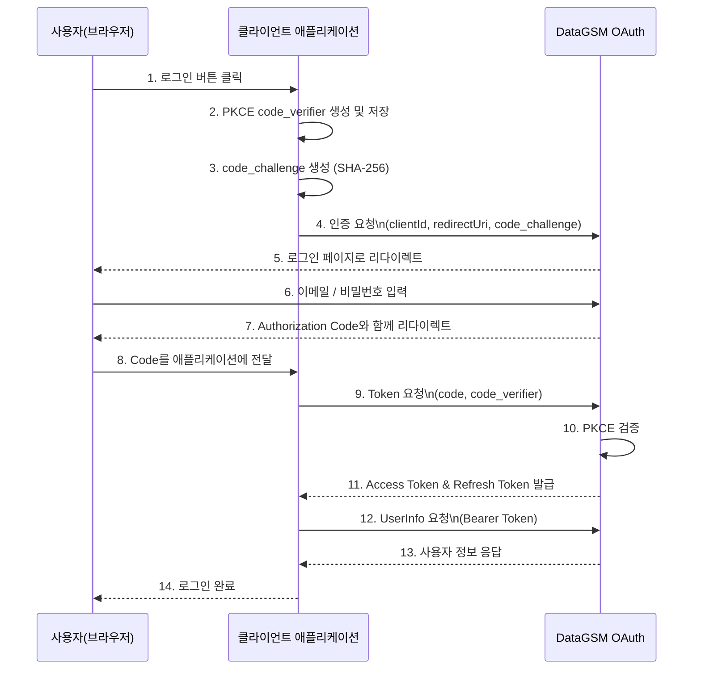

import { Shield } from 'lucide-react'

# OAuth

### 개요

DataGSM OAuth는 OAuth 2.0 Authorization Code Grant 플로우를 기반으로 한 인증 시스템입니다. 사용자는 DataGSM 계정으로 서드파티 애플리케이션에 안전하게 로그인할 수 있으며, 애플리케이션은 사용자의 동의 하에 사용자 정보에 접근할 수 있습니다. OAuth 2.0은 업계 표준 인증 프로토콜로, 사용자 비밀번호를 직접 공유하지 않고도 안전하게 리소스 접근 권한을 부여할 수 있습니다.

<div className="border-l-4 border-blue-500 bg-blue-50 dark:bg-blue-900/20 p-4 rounded my-6">
  <div className="flex items-start gap-3">
    <Shield className="h-5 w-5 text-blue-600 dark:text-blue-500 shrink-0 mt-0.5" />
    <div>
      <div className="font-semibold text-blue-900 dark:text-blue-100 mb-1">
        PKCE 방식 소개
      </div>
      <div className="text-blue-800 dark:text-blue-200 text-sm">
        보안을 한 단계 높이고 싶으시다면 PKCE (Proof Key for Code Exchange)를 사용해보시는 것도 좋습니다.
        <code className="mx-1 px-1.5 py-0.5 bg-blue-100 dark:bg-blue-800 rounded">client_secret</code> 방식도 여전히 사용 가능하며, 두 방식 모두 지원됩니다.
        자세한 내용은 <a href="/docs/oauth/pkce" className="underline font-medium">PKCE 가이드</a>를 참고하세요.
      </div>
    </div>
  </div>
</div>

### PKCE 도입 배경

PKCE (Proof Key for Code Exchange, RFC 7636)는 OAuth 2.0의 보안 확장 표준입니다. 전통적인 Authorization Code Flow에서는 `client_secret`을 사용하여 클라이언트를 인증했지만, 이는 다음과 같은 한계가 있습니다:

- **클라이언트 사이드 노출 위험**: 브라우저나 모바일 앱에서 `client_secret`을 안전하게 보관하기 어려움
- **Authorization Code 탈취 공격**: 악의적인 앱이 가로챈 Authorization Code를 자신의 `client_secret`으로 교환 가능
- **Public Client 보안 취약**: SPA, 모바일 앱 등 Public Client에서는 secret 관리가 사실상 불가능

PKCE는 `client_secret` 대신 **동적으로 생성되는 일회성 검증자**(`code_verifier`)를 사용하여 이러한 문제를 해결합니다. 각 인증 요청마다 새로운 `code_verifier`를 생성하므로, Authorization Code를 탈취하더라도 원본 `code_verifier` 없이는 토큰 교환이 불가능합니다.

### 주요 특징

| 특징            | 설명                                                                      |
|---------------|-------------------------------------------------------------------------|
| **JWT 기반 토큰** | 모든 Access Token은 JWT(JSON Web Token) 형식으로 발급되어 서명 검증이 가능합니다.            |
| **PKCE 지원**   | Authorization Code 탈취 방지를 위해 PKCE (RFC 7636) 표준을 지원합니다.                 |
| **Redis 캐싱**  | Redis를 활용하여 토큰 정보를 캐싱하고 빠른 검증을 제공합니다.                                   |
| **토큰 유효기간**   | Access Token 1시간, Refresh Token 30일, Authorization Code 5분의 유효기간을 가집니다. |
| **보안 강화**     | HTTPS 필수, Client Secret 기반 인증, State 파라미터를 통한 CSRF 방지를 지원합니다.           |
| **표준 준수**     | OAuth 2.0 RFC 6749 및 PKCE RFC 7636 표준을 준수합니다.                           |

### 시스템 요구사항

| 항목            | 요구사항                                      |
|---------------|-------------------------------------------|
| **프로토콜**      | HTTPS 필수 (개발 환경 제외)                       |
| **리다이렉트 URI** | 사전 등록된 리다이렉트 URI만 허용                      |
| **Client 등록** | DataGSM에서 Client ID 및 Client Secret 발급 필요 |

### 기본 개념

#### Authorization Code

사용자 로그인 성공 시 발급되는 일회성 코드입니다. Access Token으로 교환되며, **5분의 유효기간**을 가집니다.

#### Access Token

사용자 리소스에 접근하기 위한 JWT 토큰입니다. **1시간의 유효기간**을 가지며, API 요청 시 `Authorization: Bearer` 헤더에 포함하여 사용합니다.

#### Refresh Token

Access Token 만료 시 새로운 Access Token을 발급받기 위한 토큰입니다. **30일의 유효기간**을 가집니다.

#### Client Credentials

- **Client ID**: 애플리케이션을 식별하는 공개 식별자 (프론트엔드 사용 가능)
- **Client Secret**: 애플리케이션의 비밀 키 (기존 방식, PKCE도 선택 가능)

### 인증 플로우

DataGSM OAuth의 Authorization Code Grant 플로우는 다음과 같이 동작합니다.



인증 플로우는 다음 단계로 진행됩니다:

1. 사용자가 로그인 버튼 클릭
2. 클라이언트가 PKCE `code_verifier` 생성 및 저장 (43-128자 랜덤 문자열)
3. `code_verifier`를 SHA-256 해싱하여 `code_challenge` 생성
4. OAuth 서버로 인증 요청 (client_id, redirect_uri, code_challenge 포함)
5. 사용자가 로그인 페이지에서 이메일/비밀번호 입력
6. 인증 성공 시 Authorization Code 발급 및 리다이렉트
7. 클라이언트가 Token 교환 요청 (code, code_verifier 포함)
8. OAuth 서버가 PKCE 검증 (code_verifier 해싱 후 code_challenge와 비교)
9. 검증 성공 시 Access Token 및 Refresh Token 발급
10. Access Token으로 사용자 정보 요청 및 로그인 완료

### 보안 가이드라인

OAuth 인증을 안전하게 구현하기 위한 주요 가이드라인입니다.

#### HTTPS 필수

모든 OAuth 통신은 **반드시 HTTPS**를 사용해야 합니다. HTTP는 토큰 탈취 위험이 있으므로 프로덕션 환경에서 사용 금지입니다. (개발 환경 localhost 예외)

#### PKCE 방식

PKCE는 Authorization Code 탈취 공격을 방지하는 보안 강화 방법 중 하나입니다. 사용하시는 경우 다음 사항을 참고하세요:

- **code_verifier 생성**: 43-128자의 안전한 랜덤 문자열 생성 (암호학적으로 안전한 난수 생성기 사용)
- **code_challenge_method**: 항상 `S256` (SHA-256) 사용, `plain`은 보안상 취약
- **안전한 저장**: `code_verifier`는 httpOnly 쿠키나 서버 세션에 저장 (localStorage/sessionStorage 지양)
- **일회성 사용**: 각 인증 요청마다 새로운 `code_verifier` 생성

자세한 구현 방법은 [PKCE 가이드](/docs/oauth/pkce)를 참고하세요.

#### State 파라미터

CSRF 공격 방지를 위해 `state` 파라미터를 사용하세요. 랜덤 문자열을 생성하여 요청 시 전송하고, 콜백에서 검증합니다.

```javascript
// State 생성 및 저장
const state = crypto.randomUUID();
sessionStorage.setItem('oauth_state', state);

// 인증 요청 시 포함
const authUrl = `https://oauth.data.hellogsm.kr/v1/oauth/authorize?client_id=${clientId}&redirect_uri=${redirectUri}&state=${state}`;
window.location.href = authUrl;

// 콜백에서 검증
const urlParams = new URLSearchParams(window.location.search);
const returnedState = urlParams.get('state');
const savedState = sessionStorage.getItem('oauth_state');

if (returnedState !== savedState) {
  throw new Error('State mismatch - possible CSRF attack');
}

// 검증 후 state 삭제
sessionStorage.removeItem('oauth_state');
```

#### 토큰 저장

Access Token은 메모리나 sessionStorage에, Refresh Token은 서버 측 세션이나 HttpOnly 쿠키에 저장하세요. localStorage는 XSS 공격에 취약하므로 사용을 지양합니다.

### 레거시 방식 (client_secret)

<div className="border-l-4 border-blue-500 bg-blue-50 dark:bg-blue-900/20 p-4 rounded my-6">
  <div className="flex items-start gap-3">
    <Shield className="h-5 w-5 text-blue-500 shrink-0 mt-0.5" />
    <div>
      <div className="font-semibold text-blue-900 dark:text-blue-100 mb-1">
        client_secret 방식 안내
      </div>
      <div className="text-blue-800 dark:text-blue-200 text-sm">
        <code className="mx-1 px-1.5 py-0.5 bg-blue-100 dark:bg-blue-800 rounded">client_secret</code> 방식도 계속 지원됩니다.
        다만 PKCE 방식이 몇 가지 보안상 이점이 있어 새로운 프로젝트에서는 고려해보시면 좋을 것 같습니다.
      </div>
    </div>
  </div>
</div>

기존 애플리케이션의 하위 호환성을 위해 `client_secret` 방식을 지원하지만, 다음과 같은 보안 위험이 있습니다:

- **노출 위험**: 프론트엔드 코드에 포함 시 쉽게 노출됨
- **관리 어려움**: 주기적인 로테이션 및 안전한 저장이 어려움
- **Public Client 부적합**: SPA, 모바일 앱 등에서 사용 권장하지 않음

`client_secret`을 사용해야 하는 경우, 다음 사항을 반드시 준수하세요:

- **절대 프론트엔드 코드에 포함하거나 공개 저장소에 커밋하지 마세요**
- 환경 변수나 보안 볼트에 안전하게 저장
- 주기적으로 로테이션
- 가능한 빠른 시일 내에 PKCE로 마이그레이션

### 시작하기

DataGSM OAuth를 사용하는 방법입니다.

#### PKCE 가이드 (권장)

PKCE를 사용한 안전한 OAuth 구현 방법을 배웁니다. 신규 애플리케이션은 여기서 시작하세요. [PKCE 가이드](/docs/oauth/pkce)

#### HTTP API

REST API를 직접 호출하여 구현합니다. 가장 유연하지만 구현 복잡도가 높습니다. [HTTP API 문서](/docs/oauth/http), [인증 코드 발급](/docs/oauth/http/authorize), [토큰 교환](/docs/oauth/http/token), [토큰 갱신](/docs/oauth/http/token/refresh), [사용자 정보 조회](/docs/oauth/http/userinfo)

#### SDK

공식 SDK를 사용하면 OAuth 플로우를 간단하게 구현할 수 있습니다. [React SDK](/docs/oauth/sdk/react), [Java/Kotlin SDK](/docs/oauth/sdk/java)

#### 실전 예제

프레임워크별 완전한 구현 예제를 제공합니다. [React + Spring Boot (Kotlin)](/docs/oauth/example/react-spring)

### API 엔드포인트

```
https://oauth.data.hellogsm.kr          # OAuth 인증 서버
https://oauth-userinfo.data.hellogsm.kr # 사용자 정보 서버
```

### 지원

OAuth 관련 문의는 GitHub Issues를 이용하세요. [DataGSM Front Issues](https://github.com/themoment-team/datagsm-front/issues), [DataGSM Server Issues](https://github.com/themoment-team/datagsm-server/issues)
