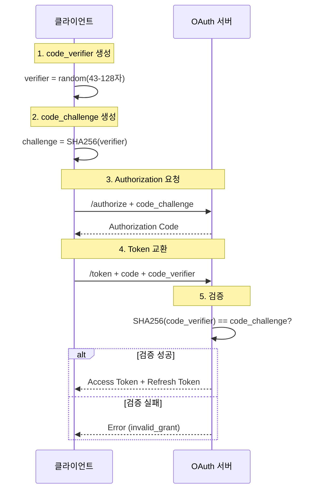

import { Shield, AlertTriangle } from 'lucide-react'

# PKCE (Proof Key for Code Exchange)

## PKCE란?

PKCE (Proof Key for Code Exchange, RFC 7636)는 OAuth 2.0 Authorization Code Flow의 보안을 강화하는 확장 표준입니다. 원래는 모바일 앱과 같은 Public Client를 보호하기 위해 설계되었지만, 현재는 **모든 OAuth 클라이언트**에서 사용이 권장됩니다.

### 도입 배경

전통적인 Authorization Code Flow에서는 `client_secret`을 사용하여 클라이언트를 인증합니다. 그러나 이 방식은 다음과 같은 한계가 있습니다:

#### client_secret 방식의 문제점

1. **클라이언트 사이드 노출 위험**
   - 브라우저나 모바일 앱에서 `client_secret`을 안전하게 보관하기 어려움
   - 디컴파일이나 소스 코드 분석으로 쉽게 추출 가능

2. **Authorization Code Injection 공격**
   - 악의적인 앱이 가로챈 Authorization Code를 자신의 `client_secret`으로 교환 가능
   - 사용자 계정 탈취 위험

3. **Public Client의 보안 취약성**
   - SPA, 모바일 앱 등에서는 secret 관리가 사실상 불가능
   - 모든 사용자가 동일한 `client_secret`을 공유하게 됨

### PKCE의 해결 방법

PKCE는 `client_secret` 대신 **동적으로 생성되는 일회성 검증자**를 사용합니다:

- 각 인증 요청마다 새로운 `code_verifier` 생성
- Authorization Code를 탈취하더라도 원본 `code_verifier` 없이는 토큰 교환 불가능
- 클라이언트에 하드코딩된 secret이 없으므로 노출 위험 없음

<div className="border-l-4 border-blue-500 bg-blue-50 dark:bg-blue-900/20 p-4 rounded my-6">
  <div className="flex items-start gap-3">
    <Shield className="h-5 w-5 text-blue-500 shrink-0 mt-0.5" />
    <div>
      <div className="font-semibold text-blue-900 dark:text-blue-100 mb-1">
        PKCE vs client_secret
      </div>
      <div className="text-blue-800 dark:text-blue-200 text-sm space-y-2">
        <div><strong>PKCE:</strong> 각 요청마다 새로운 검증자 생성 → 일회성, 동적, 안전</div>
        <div><strong>client_secret:</strong> 모든 요청에 동일한 secret 사용 → 영구적, 정적, 노출 위험</div>
      </div>
    </div>
  </div>
</div>

## PKCE 플로우

PKCE는 Authorization Code Flow에 두 가지 파라미터를 추가합니다:

- **code_verifier**: 43-128자의 랜덤 문자열 (클라이언트가 안전하게 저장)
- **code_challenge**: `code_verifier`의 SHA-256 해시 (서버로 전송)

### 플로우 다이어그램



### 단계별 상세 설명

#### 1단계: code_verifier 생성

클라이언트가 43-128자 길이의 안전한 랜덤 문자열을 생성합니다.

- **허용 문자**: `A-Z`, `a-z`, `0-9`, `-`, `.`, `_`, `~` (unreserved characters)
- **권장 길이**: 43자 이상
- **생성 방법**: 암호학적으로 안전한 난수 생성기(CSPRNG) 사용 필수

```javascript
// 올바른 예시
const array = new Uint8Array(32);
crypto.getRandomValues(array); // CSPRNG
const codeVerifier = base64UrlEncode(array);

// 잘못된 예시 (사용 금지)
const codeVerifier = Math.random().toString(36); // 예측 가능
```

#### 2단계: code_challenge 생성

`code_verifier`를 SHA-256 해싱하고 Base64URL 인코딩합니다.

```javascript
async function generateCodeChallenge(verifier) {
  const encoder = new TextEncoder();
  const data = encoder.encode(verifier);
  const hash = await crypto.subtle.digest('SHA-256', data);
  return base64UrlEncode(new Uint8Array(hash));
}
```

**중요**: `code_challenge_method`는 반드시 `S256` (SHA-256)을 사용하세요. `plain` 방식은 보안상 취약합니다.

#### 3단계: Authorization 요청

생성한 `code_challenge`를 Authorization 요청에 포함합니다.

```http
POST /v1/oauth/code
Content-Type: application/json

{
  "email": "user@example.com",
  "password": "password",
  "client_id": "your-client-id",
  "redirect_uri": "https://your-app.com/callback",
  "code_challenge": "E9Melhoa2OwvFrEMTJguCHaoeK1t8URWbuGJSstw-cM",
  "code_challenge_method": "S256"
}
```

서버는 `code_challenge`를 Authorization Code와 함께 저장합니다.

#### 4단계: Token 교환

Authorization Code와 함께 원본 `code_verifier`를 전송합니다.

```http
POST /v1/oauth/token
Content-Type: application/json

{
  "grant_type": "authorization_code",
  "code": "abc123def456",
  "client_id": "your-client-id",
  "redirect_uri": "https://your-app.com/callback",
  "code_verifier": "dBjftJeZ4CVP-mB92K27uhbUJU1p1r_wW1gFWFOEjXk"
}
```

#### 5단계: 서버 측 검증

서버가 다음을 검증합니다:

1. `code_verifier`를 SHA-256 해싱
2. 결과를 저장된 `code_challenge`와 비교
3. 일치하면 토큰 발급, 불일치하면 거부

```
SHA256(code_verifier) == stored_code_challenge ?
  → 토큰 발급 : 401 Unauthorized
```

## 구현 가이드

### JavaScript/TypeScript 구현

완전한 PKCE 구현 예제입니다.

```typescript
// Base64URL 인코딩 함수
function base64UrlEncode(array: Uint8Array): string {
  const base64 = btoa(String.fromCharCode(...array));
  return base64
    .replace(/\+/g, '-')
    .replace(/\//g, '_')
    .replace(/=+$/, '');
}

// code_verifier 생성 (43-128자)
function generateCodeVerifier(): string {
  const array = new Uint8Array(32); // 32 bytes = 256 bits
  crypto.getRandomValues(array);
  return base64UrlEncode(array);
}

// code_challenge 생성 (SHA-256)
async function generateCodeChallenge(verifier: string): Promise<string> {
  const encoder = new TextEncoder();
  const data = encoder.encode(verifier);
  const hash = await crypto.subtle.digest('SHA-256', data);
  return base64UrlEncode(new Uint8Array(hash));
}

// 전체 플로우
async function initiateOAuthWithPKCE() {
  // 1. code_verifier 생성 및 저장
  const codeVerifier = generateCodeVerifier();
  const codeChallenge = await generateCodeChallenge(codeVerifier);

  // 안전한 저장소에 저장 (예: httpOnly 쿠키)
  sessionStorage.setItem('oauth_code_verifier', codeVerifier);

  // 2. Authorization 요청
  const response = await fetch('https://oauth.data.hellogsm.kr/v1/oauth/code', {
    method: 'POST',
    headers: { 'Content-Type': 'application/json' },
    body: JSON.stringify({
      email: 'user@example.com',
      password: 'password',
      client_id: 'your-client-id',
      redirect_uri: 'https://your-app.com/callback',
      code_challenge: codeChallenge,
      code_challenge_method: 'S256',
    }),
  });

  const { code } = await response.json();

  // 3. Token 교환
  const storedVerifier = sessionStorage.getItem('oauth_code_verifier');
  const tokenResponse = await fetch('https://oauth.data.hellogsm.kr/v1/oauth/token', {
    method: 'POST',
    headers: { 'Content-Type': 'application/json' },
    body: JSON.stringify({
      grant_type: 'authorization_code',
      code,
      client_id: 'your-client-id',
      redirect_uri: 'https://your-app.com/callback',
      code_verifier: storedVerifier,
    }),
  });

  const tokens = await tokenResponse.json();

  // 4. code_verifier 삭제 (일회성)
  sessionStorage.removeItem('oauth_code_verifier');

  return tokens;
}
```

### Next.js Middleware 예제

Next.js 환경에서 PKCE를 구현하는 방법입니다. 서버 측에서 `code_verifier`를 관리하여 보안을 강화합니다.

```typescript
// app/api/auth/login/route.ts
import { cookies } from 'next/headers';
import { NextRequest, NextResponse } from 'next/server';

export async function POST(request: NextRequest) {
  const { email, password } = await request.json();

  // 1. code_verifier 생성
  const codeVerifier = generateCodeVerifier();
  const codeChallenge = await generateCodeChallenge(codeVerifier);

  // 2. httpOnly 쿠키에 저장 (XSS 방지)
  cookies().set('oauth_code_verifier', codeVerifier, {
    httpOnly: true,
    secure: true,
    sameSite: 'lax',
    maxAge: 600, // 10분
  });

  // 3. Authorization Code 요청
  const response = await fetch('https://oauth.data.hellogsm.kr/v1/oauth/code', {
    method: 'POST',
    headers: { 'Content-Type': 'application/json' },
    body: JSON.stringify({
      email,
      password,
      client_id: process.env.OAUTH_CLIENT_ID,
      redirect_uri: `${process.env.NEXT_PUBLIC_BASE_URL}/api/auth/callback`,
      code_challenge: codeChallenge,
      code_challenge_method: 'S256',
    }),
  });

  const { code } = await response.json();
  return NextResponse.json({ code });
}
```

```typescript
// app/api/auth/callback/route.ts
import { cookies } from 'next/headers';
import { NextRequest, NextResponse } from 'next/server';

export async function GET(request: NextRequest) {
  const code = request.nextUrl.searchParams.get('code');

  // 1. 저장된 code_verifier 가져오기
  const codeVerifier = cookies().get('oauth_code_verifier')?.value;

  if (!codeVerifier) {
    return NextResponse.json(
      { error: 'code_verifier not found' },
      { status: 400 }
    );
  }

  // 2. Token 교환
  const response = await fetch('https://oauth.data.hellogsm.kr/v1/oauth/token', {
    method: 'POST',
    headers: { 'Content-Type': 'application/json' },
    body: JSON.stringify({
      grant_type: 'authorization_code',
      code,
      client_id: process.env.OAUTH_CLIENT_ID,
      redirect_uri: `${process.env.NEXT_PUBLIC_BASE_URL}/api/auth/callback`,
      code_verifier: codeVerifier,
    }),
  });

  const tokens = await response.json();

  // 3. code_verifier 삭제 (일회성)
  cookies().delete('oauth_code_verifier');

  // 4. 토큰을 httpOnly 쿠키에 저장
  cookies().set('access_token', tokens.accessToken, {
    httpOnly: true,
    secure: true,
    sameSite: 'lax',
    maxAge: 3600, // 1시간
  });

  cookies().set('refresh_token', tokens.refreshToken, {
    httpOnly: true,
    secure: true,
    sameSite: 'lax',
    maxAge: 30 * 24 * 3600, // 30일
  });

  return NextResponse.redirect(new URL('/dashboard', request.url));
}
```

## 보안 고려사항

### code_verifier 저장 방법

<div className="border-l-4 border-yellow-500 bg-yellow-50 dark:bg-yellow-900/20 p-4 rounded my-6">
  <div className="flex items-start gap-3">
    <AlertTriangle className="h-5 w-5 text-yellow-600 dark:text-yellow-500 shrink-0 mt-0.5" />
    <div>
      <div className="font-semibold text-yellow-900 dark:text-yellow-100 mb-1">
        code_verifier 보안
      </div>
      <div className="text-yellow-800 dark:text-yellow-200 text-sm">
        <code className="mx-1 px-1.5 py-0.5 bg-yellow-100 dark:bg-yellow-800 rounded">code_verifier</code>는 안전하게 저장되어야 합니다.
        브라우저 환경에서는 httpOnly 쿠키 사용을 권장합니다.
        localStorage나 sessionStorage는 XSS 공격에 취약합니다.
      </div>
    </div>
  </div>
</div>

#### 저장 방법 비교

| 방법 | 보안성 | XSS 방어 | 권장 여부 | 비고 |
|------|--------|----------|-----------|------|
| **httpOnly 쿠키** | ⭐⭐⭐⭐⭐ | ✅ | ✅ 강력 권장 | JavaScript에서 접근 불가, 가장 안전 |
| **서버 세션** | ⭐⭐⭐⭐⭐ | ✅ | ✅ 강력 권장 | 서버 메모리/DB에 저장, 매우 안전 |
| **sessionStorage** | ⭐⭐⭐ | ❌ | ⚠️ 주의 필요 | XSS 취약, 단기 저장에만 사용 |
| **localStorage** | ⭐⭐ | ❌ | ❌ 권장하지 않음 | XSS 취약, 영구 저장으로 위험 증가 |
| **메모리** | ⭐⭐⭐⭐ | ✅ | ✅ 권장 | 새로고침 시 손실, SPA에 적합 |

#### BFF 패턴 권장

가장 안전한 방법은 **BFF (Backend For Frontend)** 패턴을 사용하는 것입니다:

1. 프론트엔드는 OAuth 플로우를 직접 처리하지 않음
2. 백엔드가 PKCE 플로우를 대신 수행
3. `code_verifier`는 서버 세션에 저장
4. 토큰도 httpOnly 쿠키로 관리

자세한 구현 방법은 [React + Spring Boot 예제](/docs/oauth/example/react-spring)를 참고하세요.

### code_challenge_method 설정

반드시 `S256` (SHA-256)을 사용하세요:

```javascript
// ✅ 올바른 방법
{
  code_challenge_method: "S256"
}

// ❌ 잘못된 방법 (보안 취약)
{
  code_challenge_method: "plain"
}
```

`plain` 방식은 `code_verifier`를 그대로 전송하므로, 중간자 공격에 취약합니다. OAuth 2.0 스펙에서도 `S256` 사용을 강력히 권장합니다.

### 일회성 사용 (Replay Attack 방지)

`code_verifier`는 **한 번만 사용**해야 합니다:

```javascript
// ✅ 올바른 방법
const codeVerifier = sessionStorage.getItem('oauth_code_verifier');
await exchangeToken(code, codeVerifier);
sessionStorage.removeItem('oauth_code_verifier'); // 즉시 삭제

// ❌ 잘못된 방법
const codeVerifier = sessionStorage.getItem('oauth_code_verifier');
await exchangeToken(code, codeVerifier);
// 삭제하지 않음 → Replay Attack 위험
```

서버도 사용된 Authorization Code를 무효화하므로, 동일한 Code를 두 번 사용할 수 없습니다.

### code_verifier 길이

RFC 7636 표준에 따르면:

- **최소 길이**: 43자
- **최대 길이**: 128자
- **권장 길이**: 43-128자 (엔트로피 128비트 이상)

```javascript
// ✅ 올바른 길이 (43자)
const array = new Uint8Array(32); // 32 bytes = 256 bits → 43자 Base64URL
crypto.getRandomValues(array);
const codeVerifier = base64UrlEncode(array);

// ❌ 너무 짧음 (보안 취약)
const codeVerifier = "short"; // 5자 → 예측 가능
```

## FAQ

### Q1. PKCE와 client_secret을 함께 사용할 수 있나요?

**A.** 기술적으로는 가능하지만, 권장하지 않습니다.

- PKCE만으로도 충분한 보안을 제공합니다
- `client_secret`을 함께 사용하면 관리 복잡도만 증가합니다
- 대부분의 OAuth 제공자는 PKCE를 사용할 때 `client_secret`을 선택 사항으로 만듭니다

**권장**: PKCE만 사용하고, `client_secret`은 생략하세요.

### Q2. 모바일 앱에서 PKCE를 사용하는 방법은?

**A.** 모바일 앱은 PKCE의 주요 사용 사례입니다.

#### iOS (Swift)

```swift
import CryptoKit

func generateCodeVerifier() -> String {
    var bytes = [UInt8](repeating: 0, count: 32)
    _ = SecRandomCopyBytes(kSecRandomDefault, bytes.count, &bytes)
    return Data(bytes).base64EncodedString()
        .replacingOccurrences(of: "+", with: "-")
        .replacingOccurrences(of: "/", with: "_")
        .replacingOccurrences(of: "=", with: "")
}

func generateCodeChallenge(verifier: String) -> String {
    let data = verifier.data(using: .utf8)!
    let hash = SHA256.hash(data: data)
    return Data(hash).base64EncodedString()
        .replacingOccurrences(of: "+", with: "-")
        .replacingOccurrences(of: "/", with: "_")
        .replacingOccurrences(of: "=", with: "")
}
```

#### Android (Kotlin)

```kotlin
import java.security.MessageDigest
import java.security.SecureRandom
import java.util.Base64

fun generateCodeVerifier(): String {
    val bytes = ByteArray(32)
    SecureRandom().nextBytes(bytes)
    return Base64.getUrlEncoder()
        .withoutPadding()
        .encodeToString(bytes)
}

fun generateCodeChallenge(verifier: String): String {
    val digest = MessageDigest.getInstance("SHA-256")
    val hash = digest.digest(verifier.toByteArray())
    return Base64.getUrlEncoder()
        .withoutPadding()
        .encodeToString(hash)
}
```

**저장 방법**:
- iOS: Keychain에 저장
- Android: EncryptedSharedPreferences에 저장

### Q3. SPA에서 PKCE를 사용할 때 주의사항은?

**A.** SPA (Single Page Application)에서 PKCE를 안전하게 사용하려면:

#### 1. BFF 패턴 사용 (강력 권장)

```
Browser → BFF (Next.js/Express) → OAuth Server
```

BFF가 PKCE 플로우를 대신 수행하고, 토큰을 httpOnly 쿠키로 관리합니다.

#### 2. code_verifier 저장 주의

SPA에서 직접 PKCE를 구현하는 경우:

```javascript
// ⚠️ sessionStorage 사용 시 (XSS 주의)
sessionStorage.setItem('oauth_code_verifier', codeVerifier);

// ✅ 더 안전한 방법: 메모리에만 저장
class OAuthManager {
  private codeVerifier: string | null = null;

  async initiateOAuth() {
    this.codeVerifier = generateCodeVerifier();
    // ... PKCE 플로우 진행
  }

  async exchangeToken(code: string) {
    if (!this.codeVerifier) throw new Error('No verifier');
    await exchangeToken(code, this.codeVerifier);
    this.codeVerifier = null; // 즉시 삭제
  }
}
```

#### 3. CSP (Content Security Policy) 설정

XSS 공격을 방지하기 위해 CSP를 설정하세요:

```html
<meta http-equiv="Content-Security-Policy"
      content="default-src 'self'; script-src 'self' 'unsafe-inline'; ...">
```

#### 4. HTTPS 필수

개발 환경에서도 HTTPS를 사용하세요 (localhost 제외).

### Q4. PKCE 검증 실패 시 어떻게 디버깅하나요?

**A.** 다음 사항을 확인하세요:

#### 1. code_challenge 생성 확인

```javascript
const verifier = "dBjftJeZ4CVP-mB92K27uhbUJU1p1r_wW1gFWFOEjXk";
const challenge = await generateCodeChallenge(verifier);
console.log('Verifier:', verifier);
console.log('Challenge:', challenge);
// Challenge 값이 예상과 일치하는지 확인
```

#### 2. Base64URL 인코딩 확인

일반 Base64가 아닌 **Base64URL** 인코딩을 사용해야 합니다:

```javascript
// ✅ 올바른 Base64URL
const base64url = base64
  .replace(/\+/g, '-')
  .replace(/\//g, '_')
  .replace(/=+$/, ''); // padding 제거

// ❌ 일반 Base64 (PKCE에서 사용 불가)
const base64 = btoa(data);
```

#### 3. code_verifier 저장/복원 확인

```javascript
// 저장
console.log('Storing verifier:', codeVerifier);
sessionStorage.setItem('oauth_code_verifier', codeVerifier);

// 복원
const storedVerifier = sessionStorage.getItem('oauth_code_verifier');
console.log('Retrieved verifier:', storedVerifier);
console.log('Verifiers match:', codeVerifier === storedVerifier);
```

#### 4. SHA-256 해시 확인

```javascript
// 수동으로 검증
async function verifySHA256(verifier, expectedChallenge) {
  const encoder = new TextEncoder();
  const data = encoder.encode(verifier);
  const hash = await crypto.subtle.digest('SHA-256', data);
  const actualChallenge = base64UrlEncode(new Uint8Array(hash));

  console.log('Expected:', expectedChallenge);
  console.log('Actual:', actualChallenge);
  console.log('Match:', expectedChallenge === actualChallenge);
}
```

#### 5. 서버 에러 로그 확인

서버가 반환하는 에러 메시지를 확인하세요:

```json
{
  "error": "invalid_grant",
  "error_description": "PKCE verification failed: code_challenge mismatch"
}
```

### Q5. PKCE는 Authorization Code Flow에서만 사용하나요?

**A.** 네, PKCE는 **Authorization Code Flow 전용**입니다.

다른 OAuth 플로우에서는 사용되지 않습니다:

- **Implicit Flow**: 사용 불가 (Authorization Code가 없음)
- **Client Credentials Flow**: 사용 불가 (서버 간 통신, `client_secret` 사용)
- **Resource Owner Password Flow**: 사용 불가 (사용자 credential 직접 전송)

**참고**: Implicit Flow는 보안상 권장하지 않으며, 현대적인 OAuth 구현에서는 **PKCE를 사용한 Authorization Code Flow**로 대체되었습니다.

## 다음 단계

PKCE에 대해 이해했다면, 실제 구현 예제를 참고하세요:

- [React + Spring Boot 예제](/docs/oauth/example/react-spring) - BFF 패턴 기반 PKCE 구현
- [HTTP API 문서](/docs/oauth/http/code) - PKCE 파라미터 상세 설명
- [토큰 교환](/docs/oauth/http/token) - code_verifier 사용 방법

## 참고 자료

- [RFC 7636 - Proof Key for Code Exchange](https://datatracker.ietf.org/doc/html/rfc7636)
- [OAuth 2.0 Security Best Current Practice](https://datatracker.ietf.org/doc/html/draft-ietf-oauth-security-topics)
- [OAuth 2.0 for Browser-Based Apps](https://datatracker.ietf.org/doc/html/draft-ietf-oauth-browser-based-apps)
