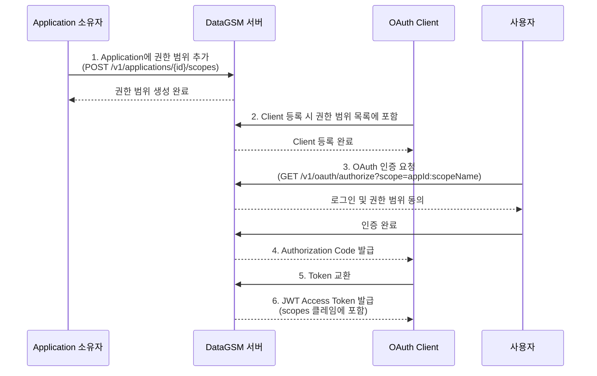

import { Shield, Key, AlertCircle } from 'lucide-react'

export const metadata = { title: '서드파티 권한 범위' }

# 서드파티 권한 범위

### 개요

서드파티 권한 범위(ThirdPartyScope)는 서드파티 애플리케이션이 자체적인 OAuth 권한 범위를 정의할 수 있는 기능입니다. 애플리케이션은 고유한 권한 범위를 생성하고, OAuth Client가 해당 권한 범위를 허용 목록에 등록하면 OAuth 인증 플로우에서 해당 권한 범위를 요청할 수 있습니다. 발급된 JWT Access Token에는 인증 시 요청된 권한 범위가 포함되어, 외부 서비스가 토큰을 검증하고 권한을 판단할 수 있습니다.

<div className="border-l-4 border-blue-500 bg-blue-50 dark:bg-blue-900/20 p-4 rounded my-6">
  <div className="flex items-start gap-3">
    <Key className="h-5 w-5 text-blue-600 dark:text-blue-500 shrink-0 mt-0.5" />
    <div>
      <div className="font-semibold text-blue-900 dark:text-blue-100 mb-1">
        JWT 서명 검증
      </div>
      <div className="text-blue-800 dark:text-blue-200 text-sm">
        DataGSM OAuth의 JWT는 RSA으로 서명됩니다. 외부 서비스는
        <code className="mx-1 px-1.5 py-0.5 bg-blue-100 dark:bg-blue-800 rounded">/v1/oauth/jwk-set</code>
        엔드포인트에서 공개 키를 가져와 토큰의 서명과 권한 범위를 직접 검증할 수 있습니다.
      </div>
    </div>
  </div>
</div>

### 권한 범위 형식

서드파티 권한 범위는 `{applicationId}:{scopeName}` 형식의 문자열로 표현됩니다.

```
a1b2c3d4-e5f6-7890-abcd-ef1234567890:profile
```

위 예시에서 `a1b2c3d4-e5f6-7890-abcd-ef1234567890`은 Application ID이고, `profile`은 해당 Application에서 정의한 권한 범위 이름입니다.

#### scopeName 제약 조건

| 항목         | 규칙                                                       |
|------------|----------------------------------------------------------|
| **허용 문자**  | 소문자 영문(`a-z`), 숫자(`0-9`), 언더스코어(`_`), 하이픈(`-`)          |
| **최대 길이**  | 100자                                                     |
| **금지 문자**  | 콜론(`:`) — 권한 범위 형식의 구분자로 사용되므로 scopeName에 포함할 수 없습니다     |
| **유일성**    | 동일 Application 내에서 scopeName은 고유해야 합니다                    |

#### description 제약 조건

| 항목        | 규칙       |
|-----------|----------|
| **최대 길이** | 255자     |
| **필수 여부** | 필수 (빈 값 불가) |

### 권한 범위 생명주기

서드파티 권한 범위가 OAuth 인증에 사용되기까지의 전체 흐름은 다음과 같습니다.



1. **권한 범위 정의**: Application 소유자가 Application에 서드파티 권한 범위를 추가합니다.
2. **Client 등록**: OAuth Client 생성 시 허용할 권한 범위 목록에 해당 권한 범위를 포함합니다.
3. **인증 요청**: 사용자가 OAuth 인증을 시작할 때 `scope` 파라미터로 필요한 권한 범위를 지정합니다.
4. **Authorization Code 발급**: 인증 성공 시 요청된 권한 범위 정보가 Authorization Code에 포함됩니다.
5. **Token 교환**: Authorization Code를 Access Token으로 교환합니다.
6. **JWT 발급**: 발급된 JWT Access Token의 `scopes` 클레임에 요청된 권한 범위가 포함됩니다.

### OAuth 인증에서의 권한 범위 사용

OAuth 인증 요청 시 `scope` 파라미터를 통해 필요한 권한 범위를 지정할 수 있습니다. RFC 6749 표준에 따라 여러 권한범위는 **공백으로 구분**합니다.

```js
GET /v1/oauth/authorize?client_id=your-client-id&redirect_uri=https://your-app.com/callback&scope=a1b2c3d4:profile a1b2c3d4:email

// URL 인코딩시 공백은 아래와 같이 %20으로 표현됩니다.

GET /v1/oauth/authorize?client_id=your-client-id&redirect_uri=https://your-app.com/callback&scope=a1b2c3d4:profile%20a1b2c3d4:email
```

- `scope` 파라미터를 지정하지 않으면 Client에 등록된 **모든 권한 범위**가 사용됩니다.
- 요청한 권한범위가  Client의 허용 목록에 포함되지 않으면 `400 Bad Request` 오류가 발생합니다.
- 권한 범위 정보는 Authorization Code → Access Token까지 전파되며, Refresh Token 갱신 시에도 원래 권한 범위가 유지됩니다.

#### 인증 세션 응답

인증 세션 조회(`GET /v1/oauth/authorize/session`) 시 요청된 권한 범위 정보가 함께 반환됩니다.

```json
{
  "serviceName": "My Service",
  "expiresAt": 1712000000,
  "requestedScopes": [
    {
      "scope": "a1b2c3d4-e5f6-7890-abcd-ef1234567890:profile",
      "description": "사용자 프로필 정보 조회",
      "applicationName": "My Application"
    }
  ]
}
```

#### JWT Access Token의 권한 범위

발급된 JWT Access Token에는 `scopes` 클레임에 인증 시 요청된 권한 범위 목록이 포함됩니다.

```json
{
  "sub": "user@example.com",
  "role": "USER",
  "clientId": "your-client-id",
  "scopes": ["a1b2c3d4-e5f6-7890-abcd-ef1234567890:profile"],
  "kid": "key-id"
}
```

외부 서비스는 `/v1/oauth/jwk-set` 엔드포인트에서 공개 키를 가져와 JWT 서명을 검증한 뒤, `scopes` 클레임을 확인하여 접근 권한을 판단할 수 있습니다.

### 오류 응답

| 상태 코드              | 설명                     | 원인                                                  |
|--------------------|------------------------|-----------------------------------------------------|
| `400 Bad Request`  | 잘못된 요청                 | 검증 실패 (scopeName 형식 불일치, 필수 필드 누락 등)                |
| `401 Unauthorized` | 인증되지 않은 요청             | 유효하지 않은 세션                                          |
| `403 Forbidden`    | 권한이 없는 요청              | Application 소유자가 아니거나 관리자 권한 없음                      |
| `404 Not Found`    | 리소스를 찾을 수 없음           | 존재하지 않는 Application ID 또는 권한 범위 ID                   |
| `409 Conflict`     | 리소스 충돌                 | 동일 Application 내에 이미 같은 scopeName이 존재                |

### 주의사항

<div className="border-l-4 border-purple-500 bg-purple-50 dark:bg-purple-900/20 p-4 rounded my-6">
  <div className="flex items-start gap-3">
    <AlertCircle className="h-5 w-5 text-purple-600 dark:text-purple-500 shrink-0 mt-0.5" />
    <div>
      <div className="font-semibold text-purple-900 dark:text-purple-100 mb-1">
        권한 범위 삭제 시 주의
      </div>
      <div className="text-purple-800 dark:text-purple-200 text-sm">
        Application을 삭제하면 해당 Application에 정의된 <strong>모든 권한 범위가 함께 삭제</strong>됩니다.
        이미 해당 권한 범위를 사용 중인 OAuth Client가 있다면 영향을 받을 수 있으므로 신중하게 진행하세요.
      </div>
    </div>
  </div>
</div>

<div className="border-l-4 border-blue-500 bg-blue-50 dark:bg-blue-900/20 p-4 rounded my-6">
  <div className="flex items-start gap-3">
    <Shield className="h-5 w-5 text-blue-600 dark:text-blue-500 shrink-0 mt-0.5" />
    <div>
      <div className="font-semibold text-blue-900 dark:text-blue-100 mb-1">
        scopeName 형식 규칙
      </div>
      <div className="text-blue-800 dark:text-blue-200 text-sm">
        <code className="mx-1 px-1.5 py-0.5 bg-blue-100 dark:bg-blue-800 rounded">scopeName</code>에는
        콜론(<code className="mx-1 px-1.5 py-0.5 bg-blue-100 dark:bg-blue-800 rounded">:</code>)을 사용할 수 없습니다.
        콜론은 권한 범위 형식에서 Application ID와 scopeName의 구분자로 사용되기 때문입니다.
        허용 패턴: <code className="mx-1 px-1.5 py-0.5 bg-blue-100 dark:bg-blue-800 rounded">^[a-z0-9_-]+$</code>
      </div>
    </div>
  </div>
</div>

### 사용 예제

다음은 서드파티 권한 범위를 OAuth 인증에서 활용하는 예제입니다. 권한 범위 등록은 웹 UI를 통해 진행합니다.

#### 권한 범위를 포함한 인증 요청

<CodeTabs>
  <CodeTab label="JavaScript" language="javascript" code={`const params = new URLSearchParams({
  client_id: 'your-client-id',
  redirect_uri: 'https://your-app.com/callback',
  response_type: 'code',
  scope: 'a1b2c3d4-e5f6-7890-abcd-ef1234567890:profile',
});

window.location.href =
  \`https://oauth.authorization.datagsm.kr/v1/oauth/authorize?\${params}\`;`} />
  <CodeTab label="Python" language="python" code={`import urllib.parse

params = urllib.parse.urlencode({
    'client_id': 'your-client-id',
    'redirect_uri': 'https://your-app.com/callback',
    'response_type': 'code',
    'scope': 'a1b2c3d4-e5f6-7890-abcd-ef1234567890:profile',
})
auth_url = f'https://oauth.authorization.datagsm.kr/v1/oauth/authorize?{params}'
# auth_url로 사용자를 리다이렉트`} />
  <CodeTab label="Java" language="java" code={`String authUrl = "https://oauth.authorization.datagsm.kr/v1/oauth/authorize"
    + "?client_id=" + clientId
    + "&redirect_uri=https://your-app.com/callback"
    + "&response_type=code"
    + "&scope=a1b2c3d4-e5f6-7890-abcd-ef1234567890:profile";
// authUrl로 사용자를 리다이렉트`} />
  <CodeTab label="Kotlin" language="kotlin" code={`val authUrl = "https://oauth.authorization.datagsm.kr/v1/oauth/authorize" +
    "?client_id=${'$'}clientId" +
    "&redirect_uri=https://your-app.com/callback" +
    "&response_type=code" +
    "&scope=a1b2c3d4-e5f6-7890-abcd-ef1234567890:profile"
// authUrl로 사용자를 리다이렉트`} />
</CodeTabs>

#### 발급되는 JWT Access Token 예시

인증이 완료되면 발급되는 JWT Access Token의 페이로드에는 요청한 권한 범위가 포함됩니다.

```json
{
  "sub": "user@example.com",
  "role": "USER",
  "clientId": "your-client-id",
  "scopes": ["a1b2c3d4-e5f6-7890-abcd-ef1234567890:profile"],
  "iat": 1712000000,
  "exp": 1712003600,
  "kid": "key-id"
}
```

#### JWK Set을 사용한 JWT 검증

외부 서비스는 `/v1/oauth/jwk-set` 엔드포인트에서 공개 키를 가져와 JWT 서명을 검증하고, `scopes` 클레임을 확인하여 접근 권한을 판단할 수 있습니다.

<CodeTabs>
  <CodeTab label="JavaScript" language="javascript" code={`import jwt from 'jsonwebtoken';
import jwksClient from 'jwks-rsa';

const client = jwksClient({
  jwksUri: 'https://oauth.authorization.datagsm.kr/v1/oauth/jwk-set',
});

function getKey(header, callback) {
  client.getSigningKey(header.kid, (err, key) => {
    const signingKey = key.getPublicKey();
    callback(null, signingKey);
  });
}

// JWT 검증
jwt.verify(accessToken, getKey, { algorithms: ['RS256'] }, (err, decoded) => {
  if (err) throw new Error('토큰 검증 실패: ' + err.message);

  // 권한 범위 확인
  const scopes = decoded.scopes;
  if (scopes.includes('a1b2c3d4-e5f6-7890-abcd-ef1234567890:profile')) {
    console.log('profile 권한 범위가 포함되어 있습니다.');
  }
});`} />
  <CodeTab label="Python" language="python" code={`import jwt
import requests

# JWK Set에서 공개 키 가져오기
jwks = requests.get(
    'https://oauth.authorization.datagsm.kr/v1/oauth/jwk-set'
).json()

from jwt.algorithms import RSAAlgorithm
public_key = RSAAlgorithm.from_jwk(jwks['keys'][0])

# JWT 검증
decoded = jwt.decode(
    access_token,
    public_key,
    algorithms=['RS256'],
)

# 권한 범위 확인
scopes = decoded['scopes']
if 'a1b2c3d4-e5f6-7890-abcd-ef1234567890:profile' in scopes:
    print('profile 권한 범위가 포함되어 있습니다.')`} />
  <CodeTab label="Java" language="java" code={`import com.auth0.jwk.*;
import com.auth0.jwt.JWT;
import com.auth0.jwt.algorithms.Algorithm;
import com.auth0.jwt.interfaces.DecodedJWT;
import java.net.URL;
import java.security.interfaces.RSAPublicKey;

JwkProvider provider = new UrlJwkProvider(
    new URL("https://oauth.authorization.datagsm.kr/v1/oauth/jwk-set"));

// JWT 검증
DecodedJWT jwt = JWT.decode(accessToken);
Jwk jwk = provider.get(jwt.getKeyId());
RSAPublicKey publicKey = (RSAPublicKey) jwk.getPublicKey();

Algorithm algorithm = Algorithm.RSA256(publicKey, null);
JWT.require(algorithm).build().verify(accessToken);

// 권한 범위 확인
List<String> scopes = jwt.getClaim("scopes").asList(String.class);
if (scopes.contains("a1b2c3d4-e5f6-7890-abcd-ef1234567890:profile")) {
    System.out.println("profile 권한 범위가 포함되어 있습니다.");
}`} />
  <CodeTab label="Kotlin" language="kotlin" code={`import com.auth0.jwk.UrlJwkProvider
import com.auth0.jwt.JWT
import com.auth0.jwt.algorithms.Algorithm
import java.net.URL
import java.security.interfaces.RSAPublicKey

val provider = UrlJwkProvider(
    URL("https://oauth.authorization.datagsm.kr/v1/oauth/jwk-set"))

// JWT 검증
val jwt = JWT.decode(accessToken)
val jwk = provider.get(jwt.keyId)
val publicKey = jwk.publicKey as RSAPublicKey

val algorithm = Algorithm.RSA256(publicKey, null)
JWT.require(algorithm).build().verify(accessToken)

// 권한 범위 확인
val scopes = jwt.getClaim("scopes").asList(String::class.java)
if ("a1b2c3d4-e5f6-7890-abcd-ef1234567890:profile" in scopes) {
    println("profile 권한 범위가 포함되어 있습니다.")
}`} />
</CodeTabs>
